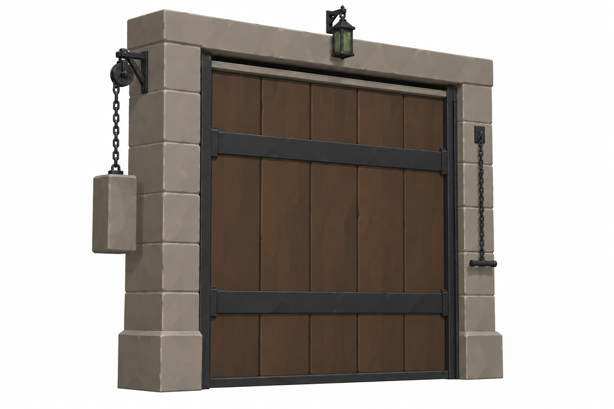
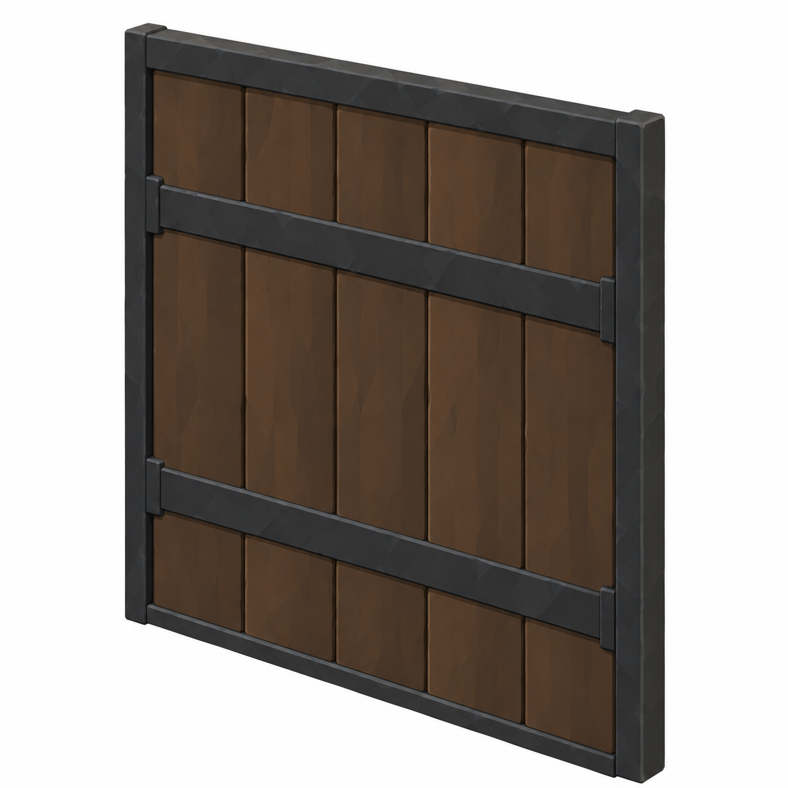
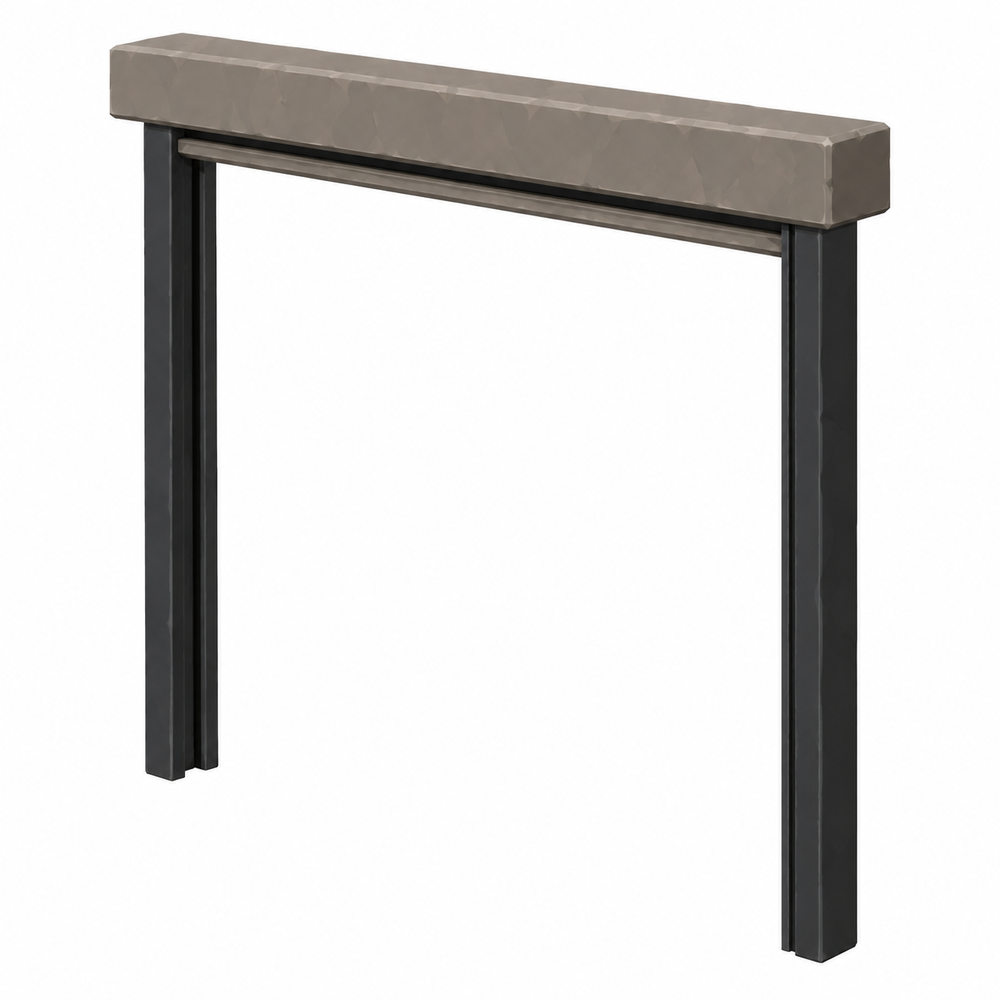
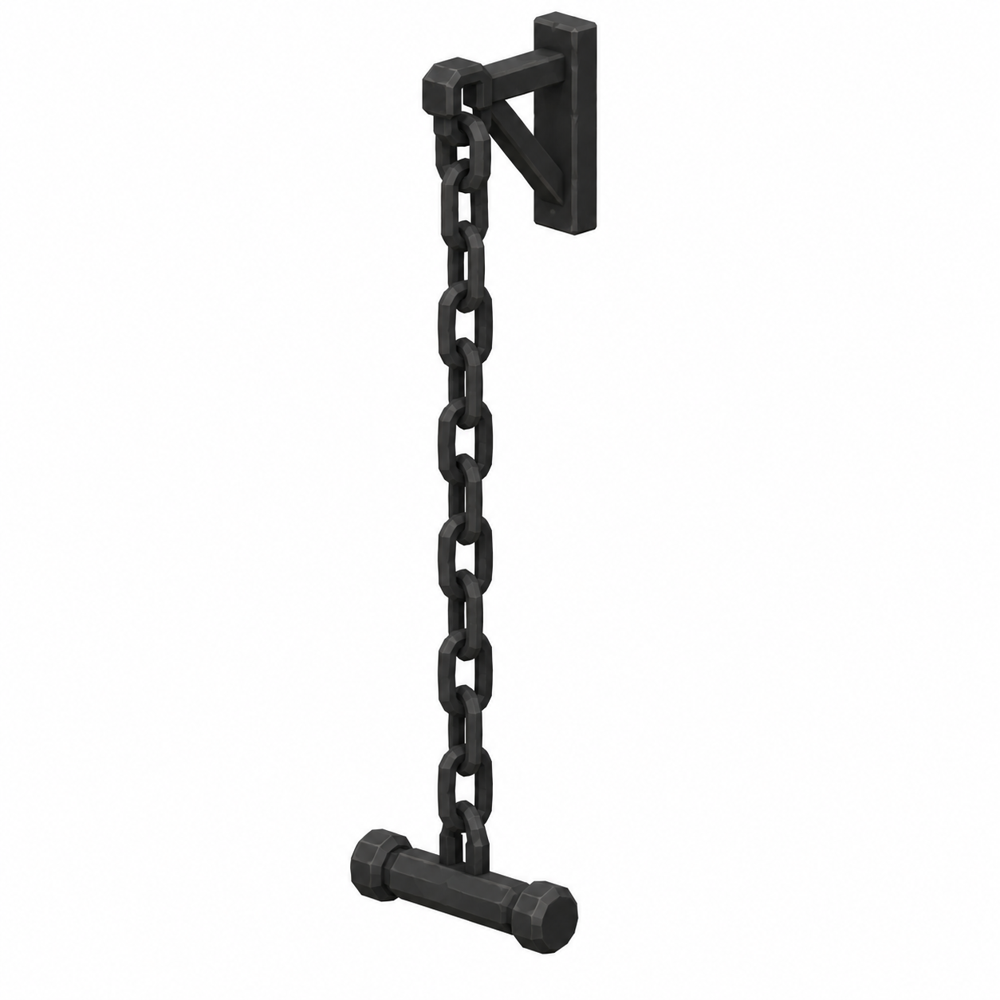
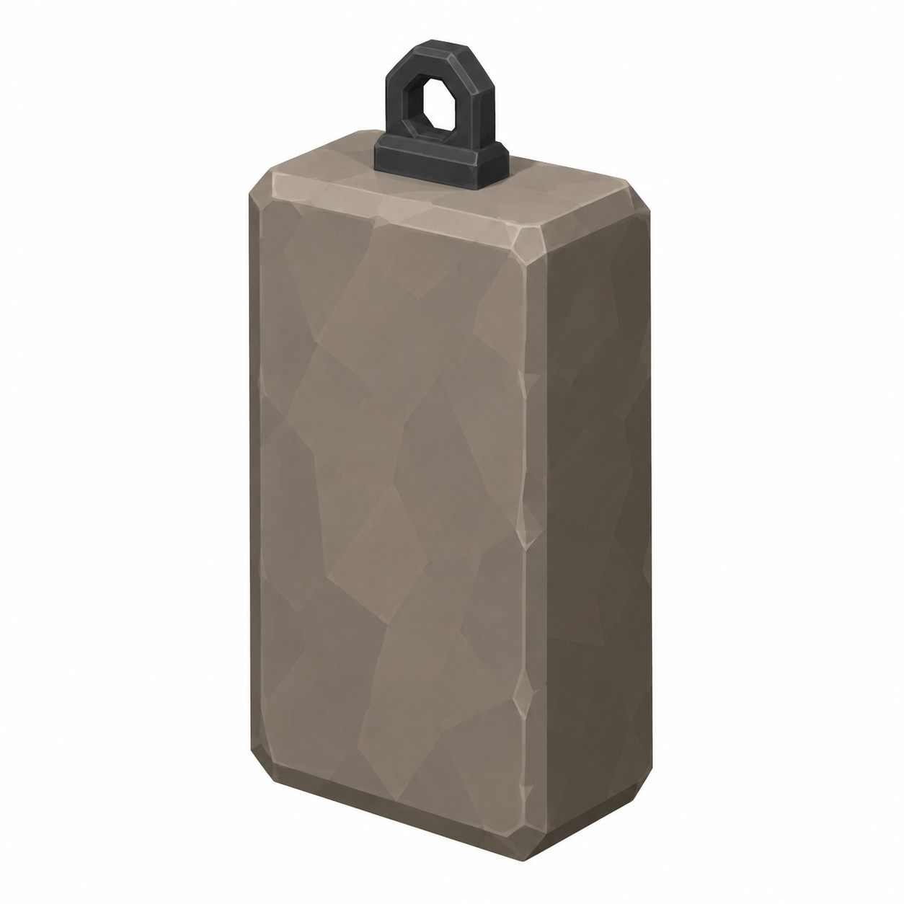
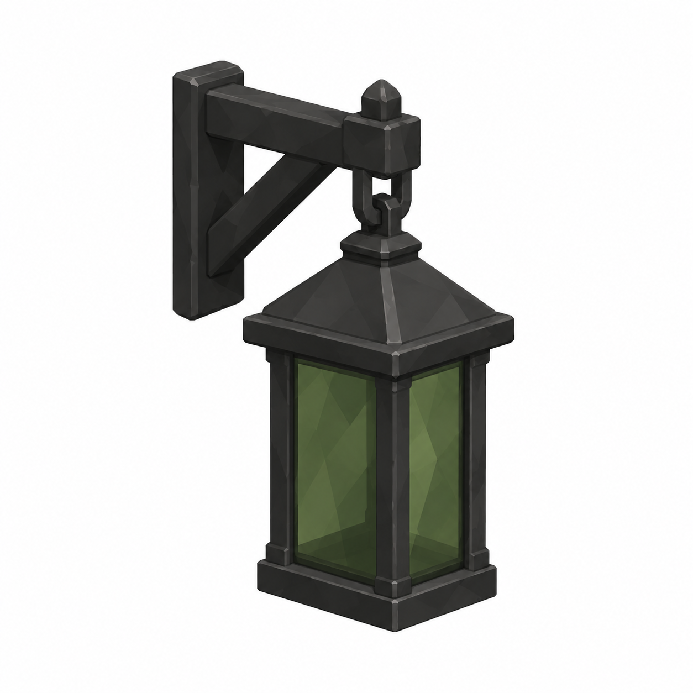

# BRAV-124 — user-approved visual references

User visual approval: 2026-10-02. Mustafa design approval: pending.

Jira: https://blbrn-team.atlassian.net/browse/BRAV-124?focusedCommentId=10693

Reference archive only. No Tripo generation or Unity integration. Technical fit remains pending.

## QuarantineShutter_DRAFT_v002.png

## BRAV-124_Plate_45.png

## BRAV-124_LintelAndRails_45.png

## BRAV-124_ChainAndHandle_45.png

## BRAV-124_Counterweight_45.png

## BRAV-124_Lantern_45.png

