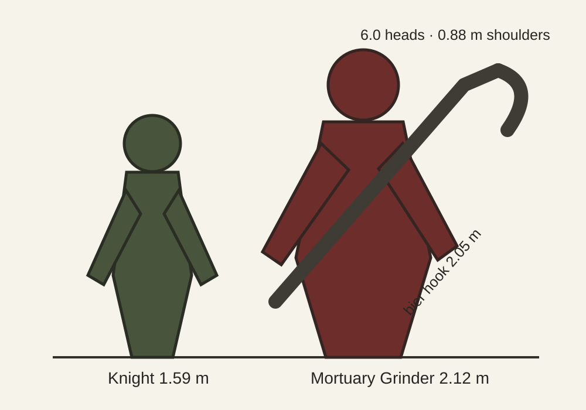

# BRAV-144 — Mortuary Grinder redesign v002

Status: owner-directed redesign draft, 2026-10-02. Concept only; not approval for production or Tripo.

## Role and read

Floor 2 elite/miniboss. A former mortuary bearer from the Alchemical Theatre, still visibly human. His encounter teaches disengaging instead of greed: a two-handed bier hook catches, drags and bleeds; heavy OrcHammer motion sells the committed follow-through.

The silhouette is **a crooked carrying frame made into a person**: broad, uneven shoulders under a short shroud mantle; a narrow lower body; one long hooked tool crossing the body. He is not a butcher, executioner, blacksmith or industrial machine.

## Scale sheet

| Part | Size | Mark | Reason |
|---|---:|:---:|---|
| Visual height | 2.12 m | P | Elite read above the 1.59 m Knight, below the 2.40 m Aberration |
| Body proportion | 6.0 heads | P | Same human family as the Knight; heavy rather than superhero anatomy |
| Shoulder width | 0.88 m | P | Reads broad at 20 m without overlapping the Aberration's oversized-arm silhouette |
| Bier hook overall | 2.05 m | P | Two-handed OrcHammer-compatible tool; long enough for a readable grab without a fantasy polearm read |
| Hook head | 0.46 x 0.12 x 0.38 m | P | Broad hand-forged crescent, not a thin meat hook |
| Grip spacing | 0.62 m | D | Supports two-handed hammer motion and a clear cross-body pose |
| Gameplay capsule | 0.60 m radius x 2.00 m height | P | Existing large-enemy baseline; final value waits for the Floor 2 greybox |

F = fixed, D = derived, P = proposed. Floor 2 room fit remains provisional until BRAV-234 locks the greybox; target arena is at least 15.4 x 13.4 m, with a 2.5 m clear combat lane.

## Bravehood construction

- Face: broad square planar nose, strong jaw, thick brows, small watchful eyes; stern and exhausted, never monstrous or handsome-fantasy.
- Body: authored irregular planes, slight asymmetry, one shoulder higher from years of carrying biers; large hands; short sturdy legs.
- Clothing: oxblood heavy wool work coat, undyed linen sleeves and coif, charcoal leather belts, a short dirty-ivory shroud mantle with three broad folds.
- Armour: only a mismatched desaturated-iron shoulder splint and forearm bands. Broad planar highlights; no full plate.
- Tool: ash haft, hand-forged dark iron crescent with a blunt inside spur. A mortuary lifting tool repurposed for violence, not an axe and not a modern meat hook.
- Palette: oxblood, umber, charcoal, dirty linen, desaturated iron; a few tarnished-brass fasteners. No teal/violet glow.
- Wear: dented and chipped planes, crooked belt and patched cloth. No grime overlay, scratches, wetness, blood or gore.

## Approval-image pose

Full body, three-quarter 45-degree view, camera slightly above, both hands naturally gripping the bier hook diagonally across the body. Weight settled over the back foot; hooked head fully visible beyond the raised shoulder. Pure white background, flat even neutral light, no shadow, no text.

## Rejection guard

Reject if it reads as photoreal, Witcher-like, PBR, butcher/apron, masked executioner, steampunk, industrial, bodybuilder, undead monster, blood-covered, or densely noisy. It must sit beside the Bravehood Knight as the same game's enemy.
