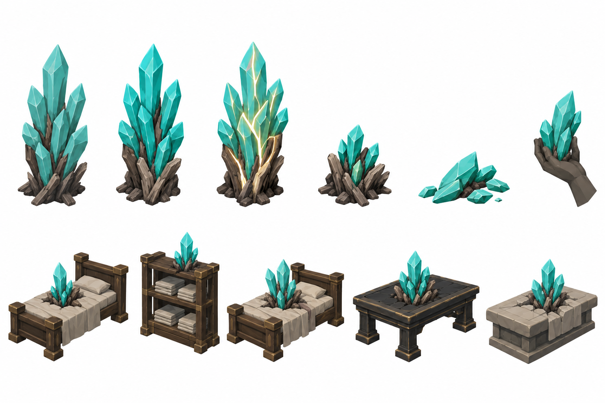
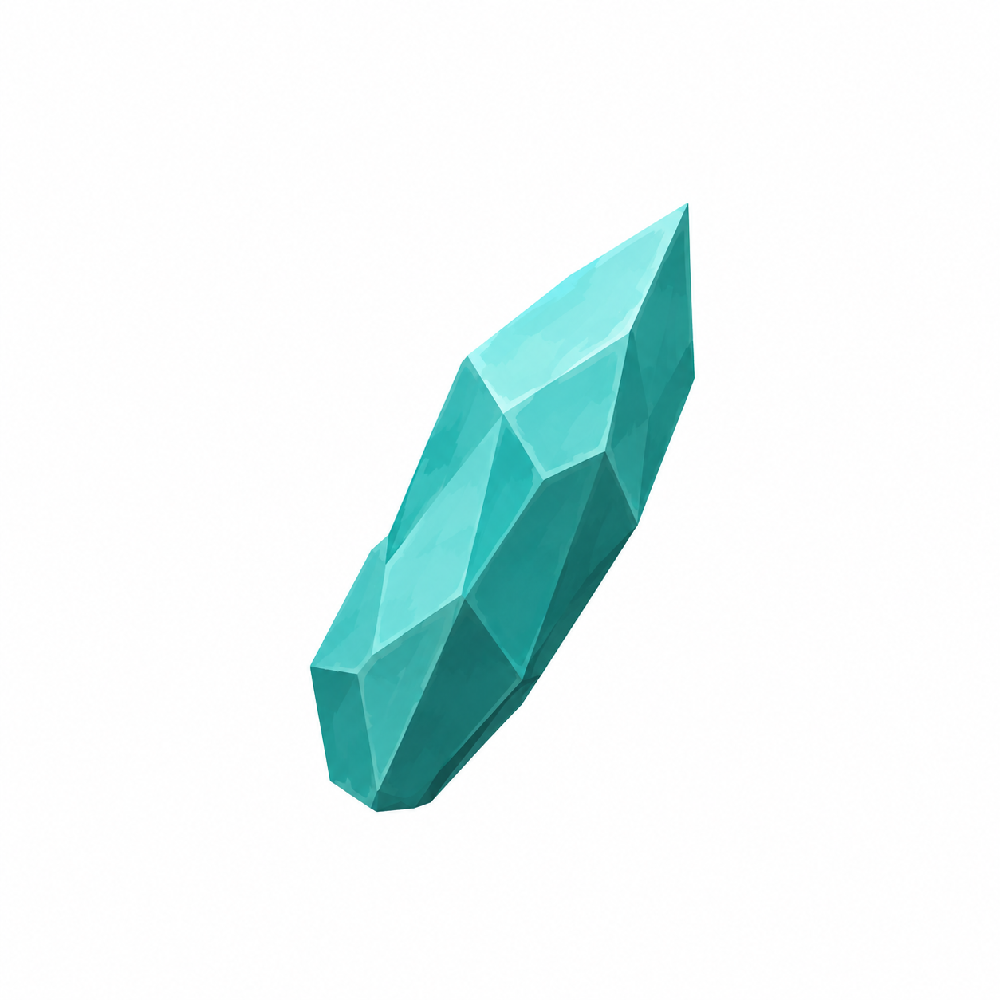
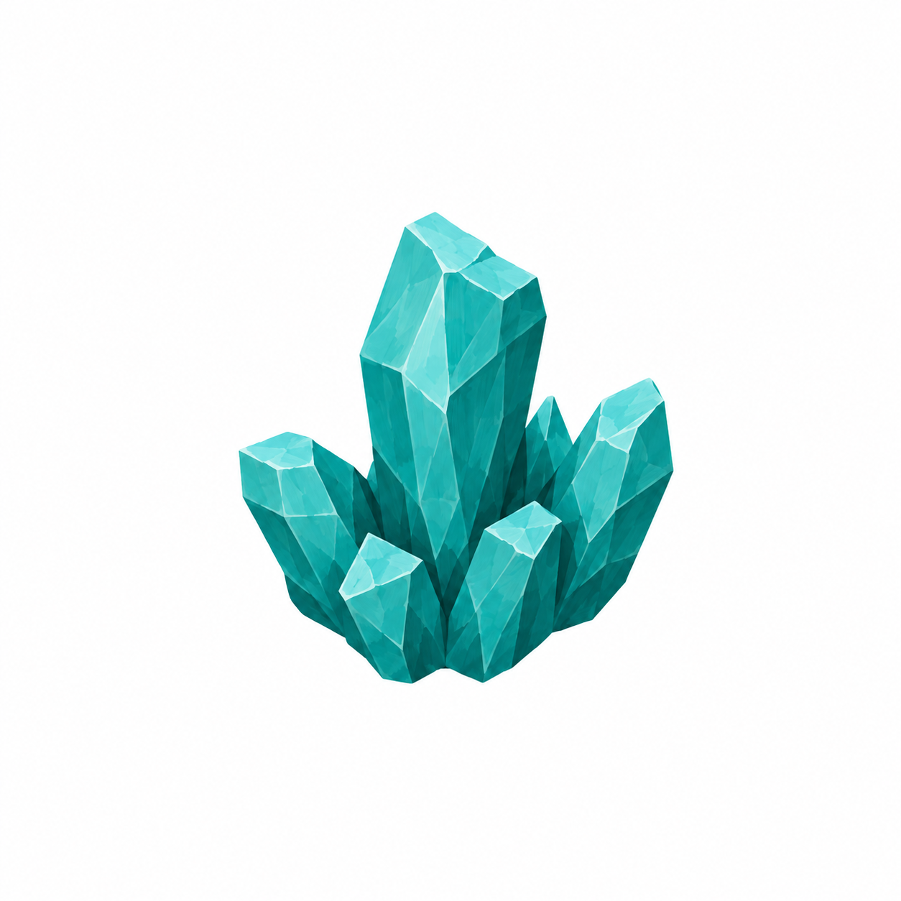
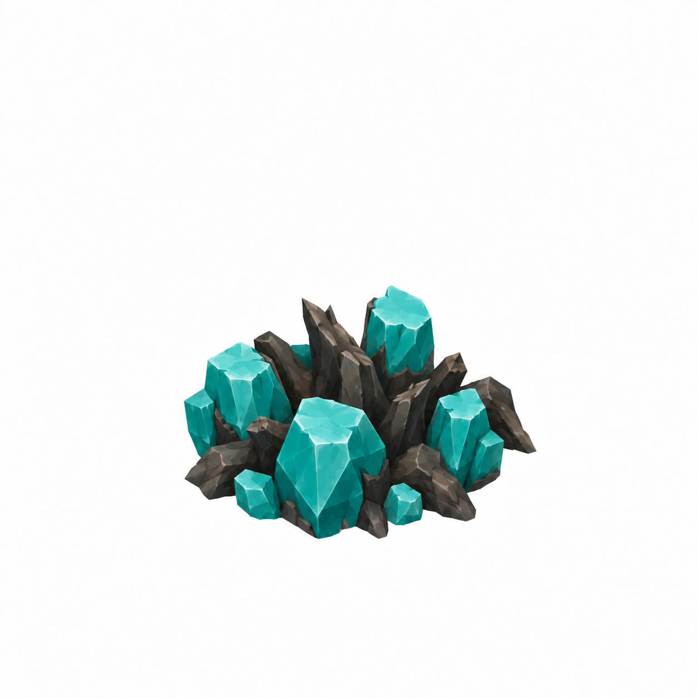
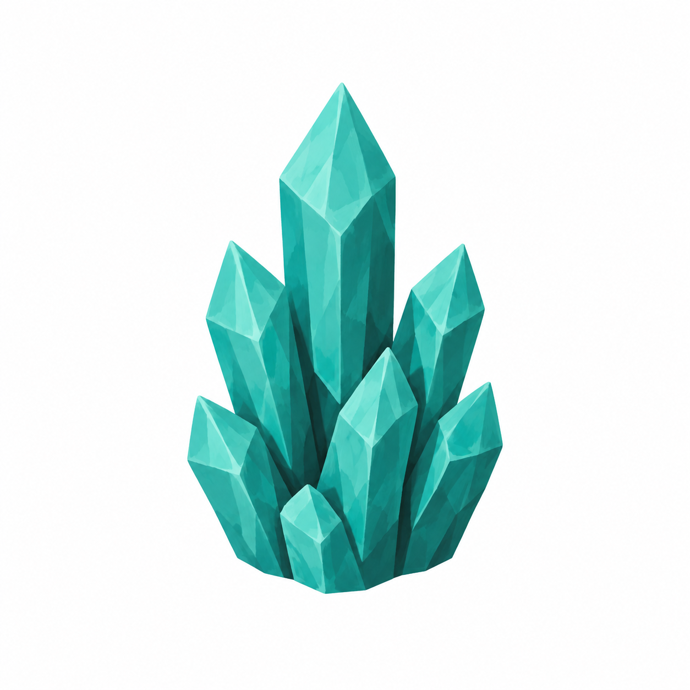

# BRAV-145 — user-approved visual references

User visual approval: 2026-10-02. Mustafa design approval: approved with corrected Claimed Stump v002.

Jira: https://blbrn-team.atlassian.net/browse/BRAV-145?focusedCommentId=10790

Reference archive only. No Tripo generation or Unity integration. Technical fit remains pending.

`BRAV-145_ClaimedStump_45_DRAFT_v002.png` is the approved claimed-state reference. It replaces v001,
which incorrectly read as an intact crystal cluster. The v001 file remains archived for provenance only.

## Approval_DRAFT_v002.png

## BRAV-145_CarriedShard_45_DRAFT_v001.png

## BRAV-145_ClaimedStump_45_DRAFT_v001.png

Superseded by v002; retained for provenance.

## BRAV-145_ClaimedStump_45_DRAFT_v002.png

Approved corrected reference: low broken crystal/root remnant, approximately 0.15 m high and no more than
0.6 × 0.6 m in footprint, with truncated fracture faces and no emissive glow.

## BRAV-145_CrystalCluster_45_DRAFT_v001.png

