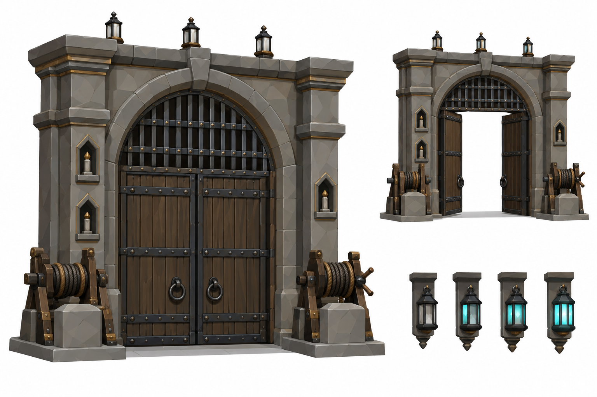
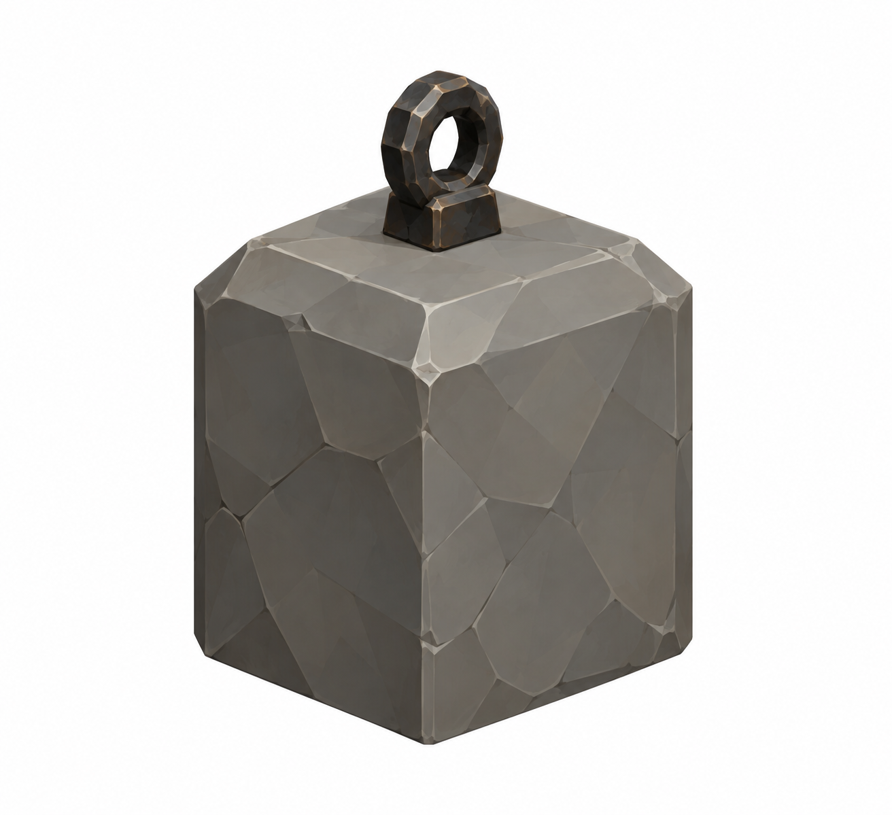
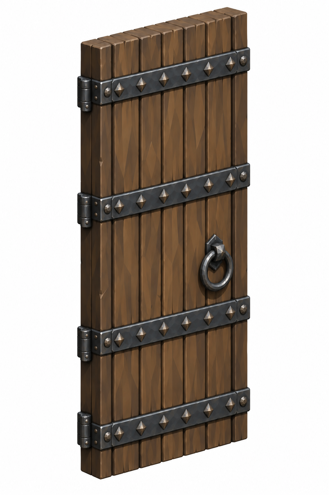
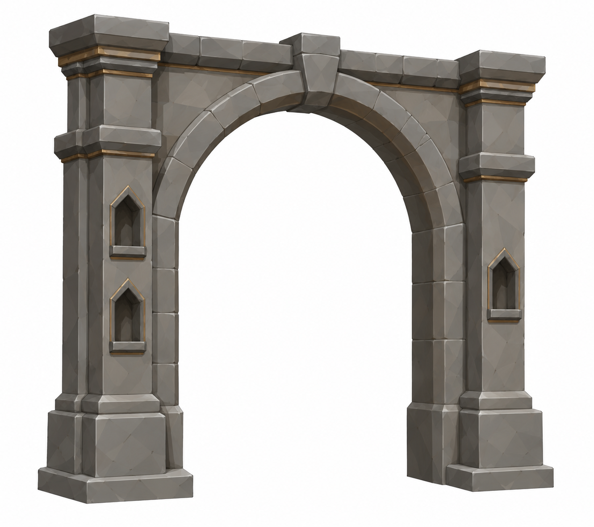
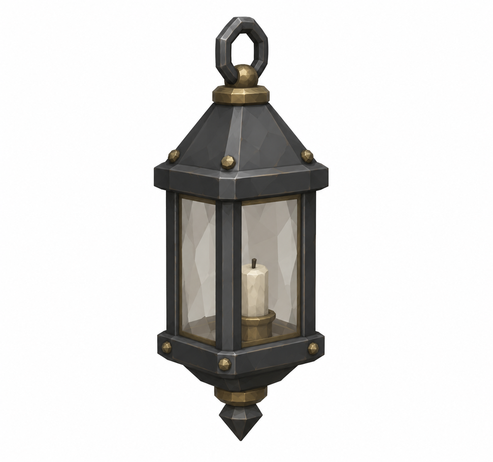
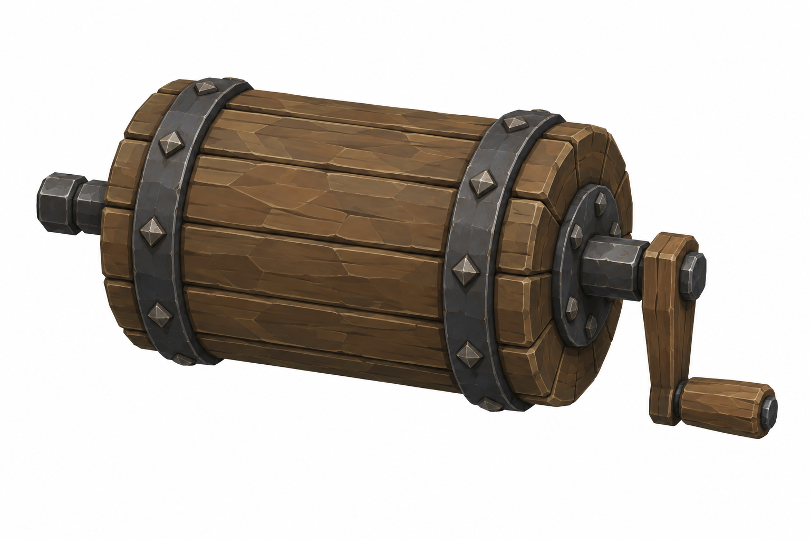
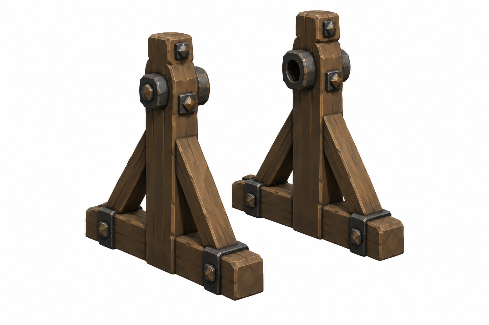

# BRAV-146 — user-approved visual references

User visual approval: 2026-10-02. Mustafa design approval: pending.

Jira: https://blbrn-team.atlassian.net/browse/BRAV-146?focusedCommentId=10746

Reference archive only. No Tripo generation or Unity integration. Technical fit remains pending.

Known technical note: Üç yuva düzeltildi; sayaç alt çizimi doğru 0/1/2/3 fener sayısını hâlâ göstermiyor. Tripo için uygun değil.

## Approval_DRAFT_v002.png

## BRAV-146_Counterweight_45_DRAFT_v001.png

## BRAV-146_OakLeaf_45_DRAFT_v002.png

## BRAV-146_StonePortal_45_DRAFT_v001.png

## BRAV-146_TallyLantern_45_DRAFT_v001.png

## BRAV-146_WindlassDrum_45_DRAFT_v001.png

## BRAV-146_WindlassFrame_45_DRAFT_v001.png

