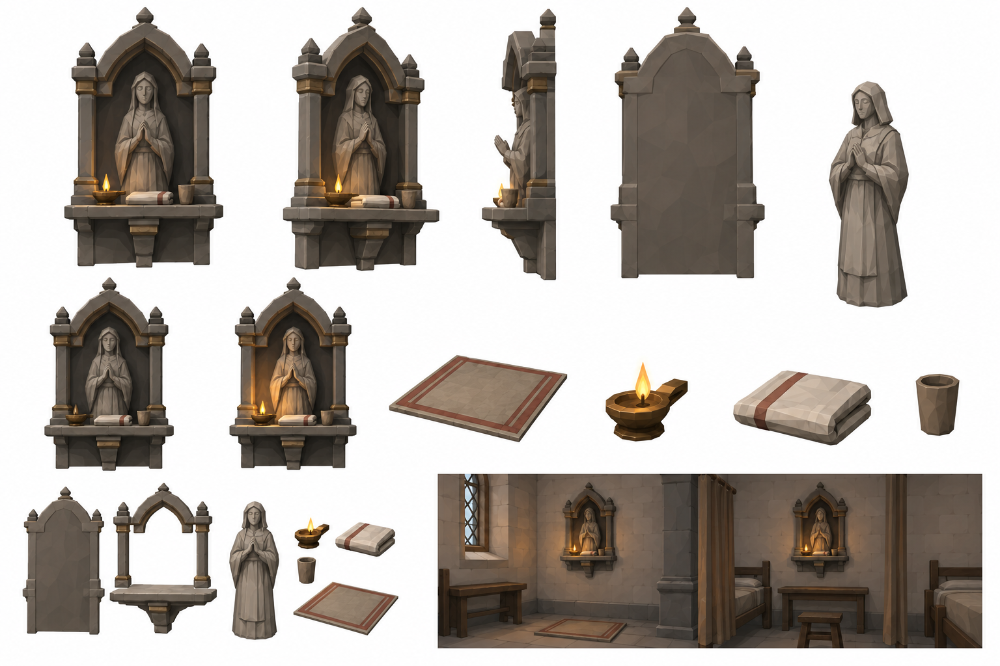
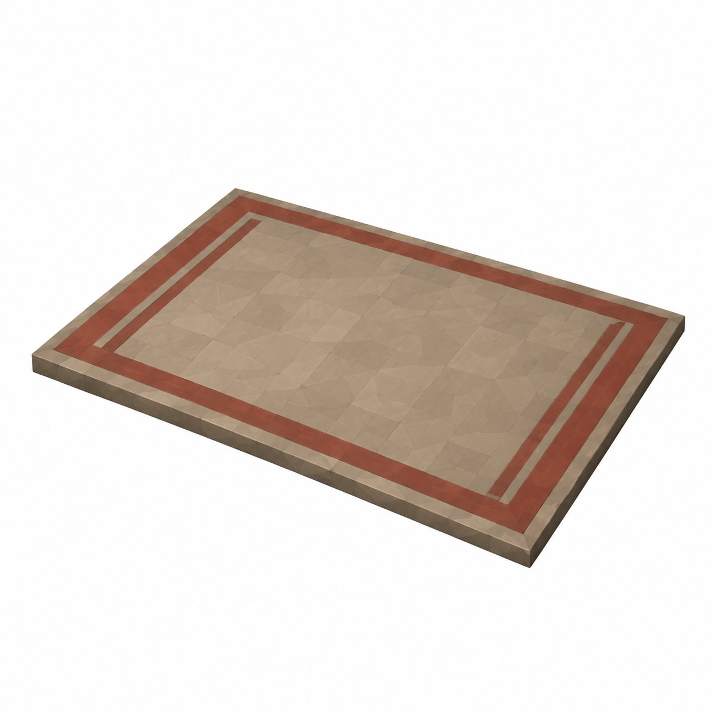
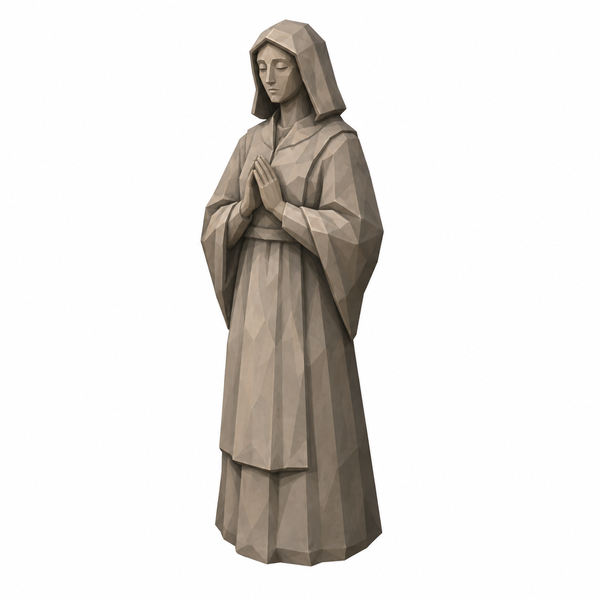
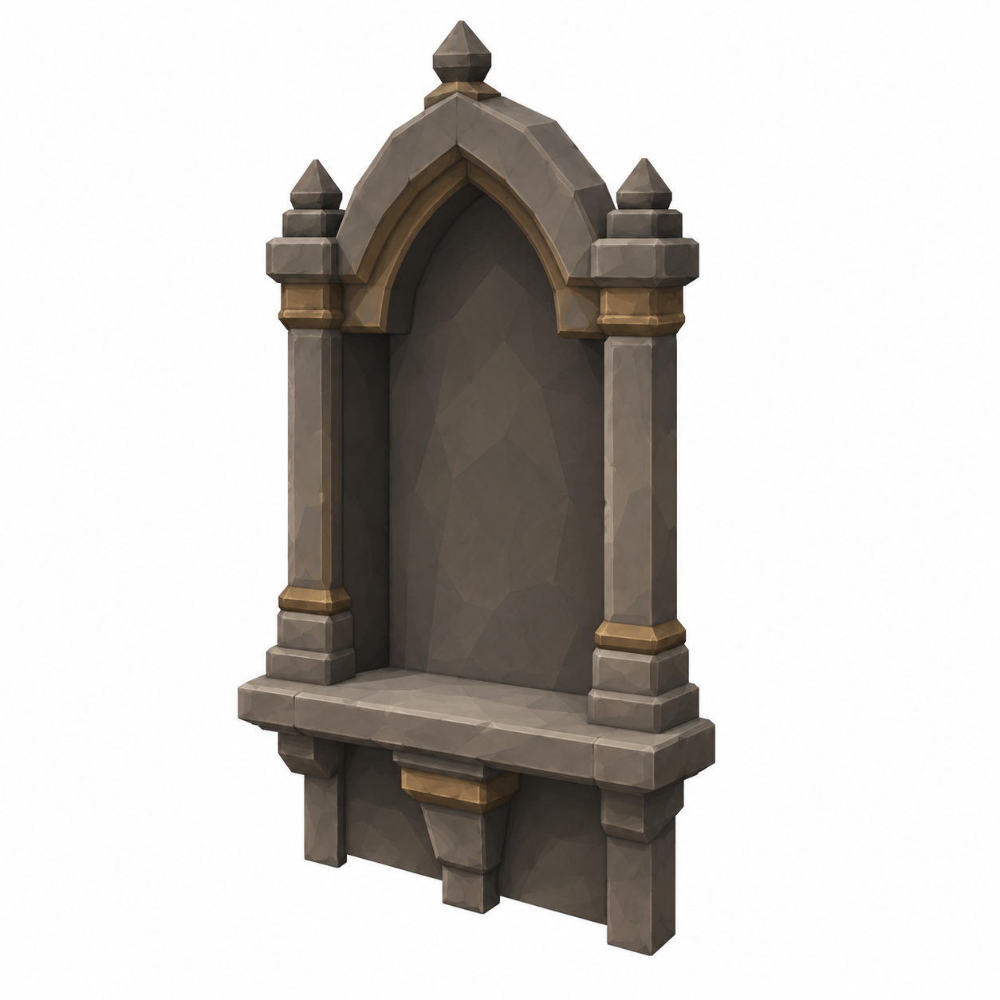

# BRAV-150 — user-approved visual references

User visual approval: 2026-10-02. Mustafa design approval: pending.

Jira: https://blbrn-team.atlassian.net/browse/BRAV-150?focusedCommentId=10754

Reference archive only. No Tripo generation or Unity integration. Technical fit remains pending.

## Approval_DRAFT_v002.png

## BRAV-150_KneelingMat_45_DRAFT_v001.png

## BRAV-150_SaintFigure_45_DRAFT_v001.png

## BRAV-150_SaintNiche_45_DRAFT_v001.png

