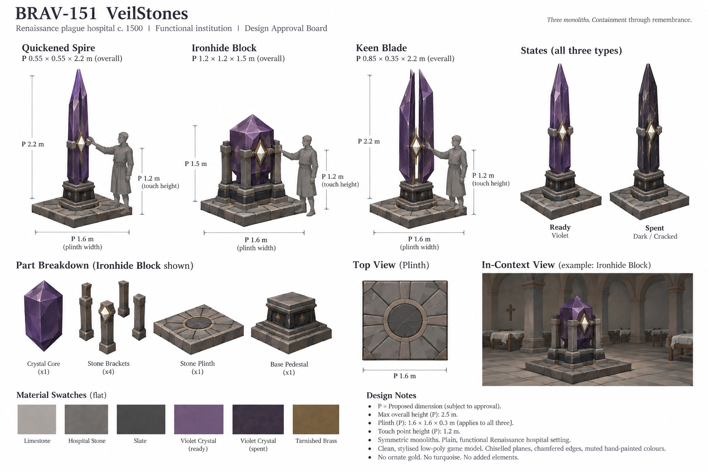
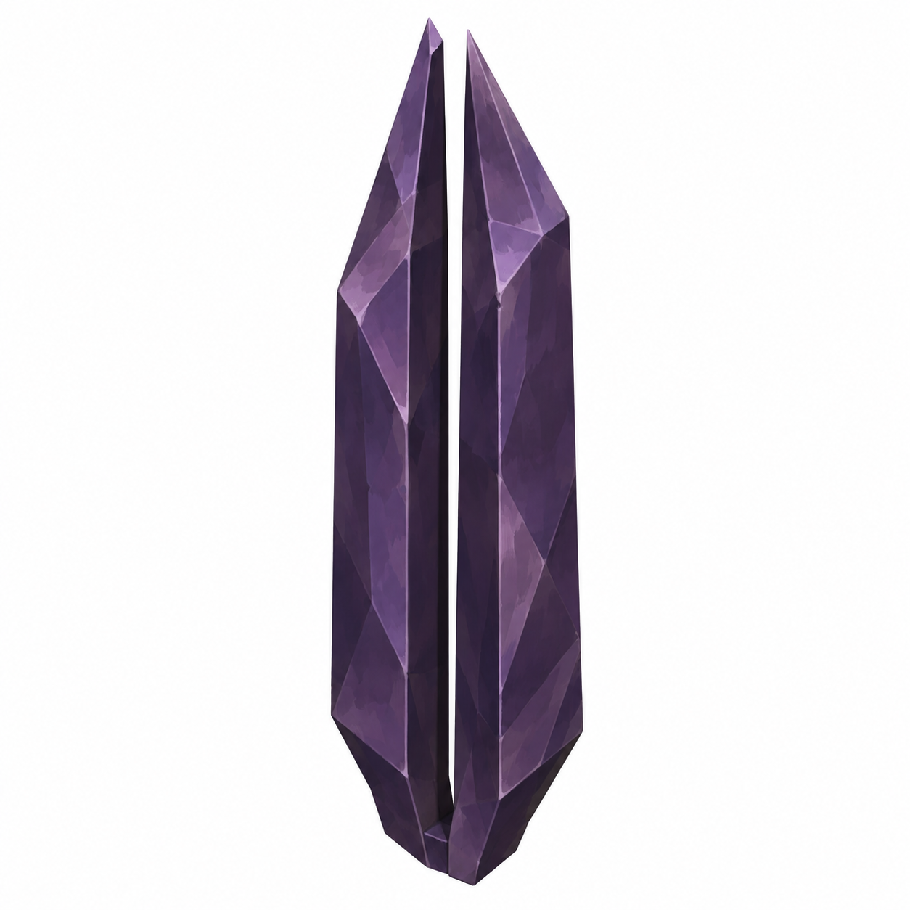
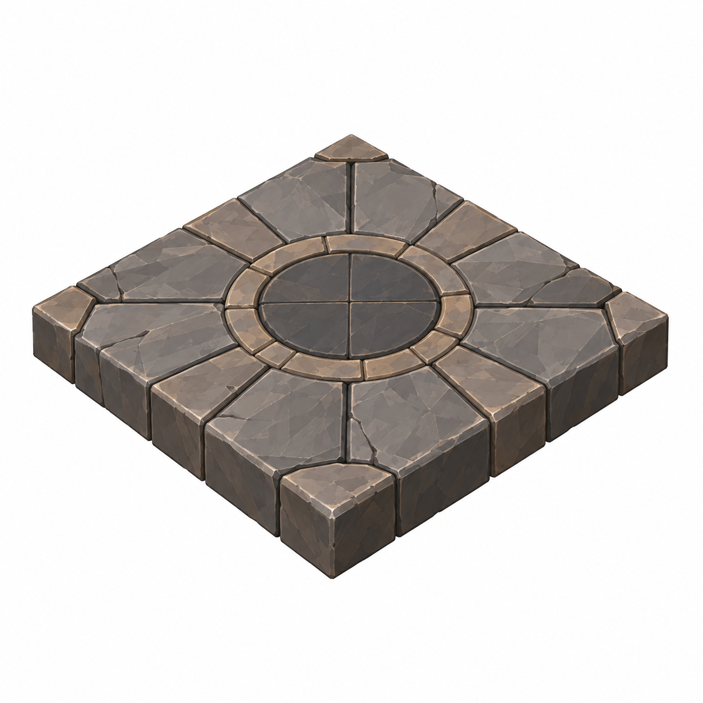

# BRAV-151 — user-approved visual references

User visual approval: 2026-10-02. Mustafa design approval: pending.

Jira: https://blbrn-team.atlassian.net/browse/BRAV-151?focusedCommentId=10755

Reference archive only. No Tripo generation or Unity integration. Technical fit remains pending.

## Approval_DRAFT_v001.png

## BRAV-151_IronhideBlock_45_DRAFT_v001.png

## BRAV-151_KeenBlade_45_DRAFT_v001.png

## BRAV-151_QuickenedSpire_45_DRAFT_v001.png

## BRAV-151_SharedPlinth_45_DRAFT_v001.png

