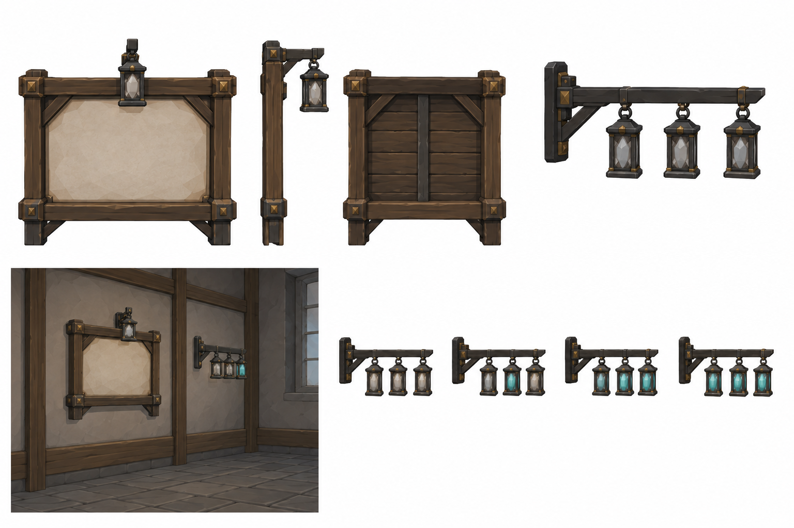
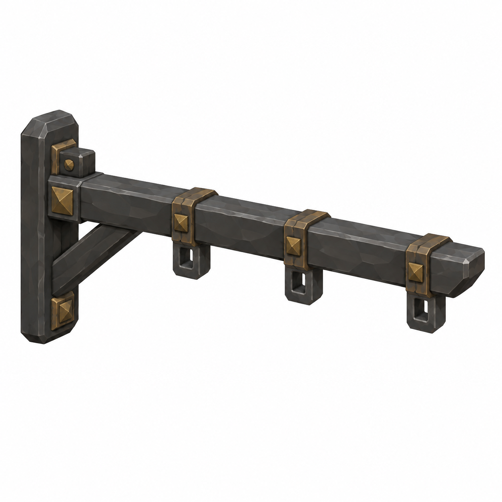
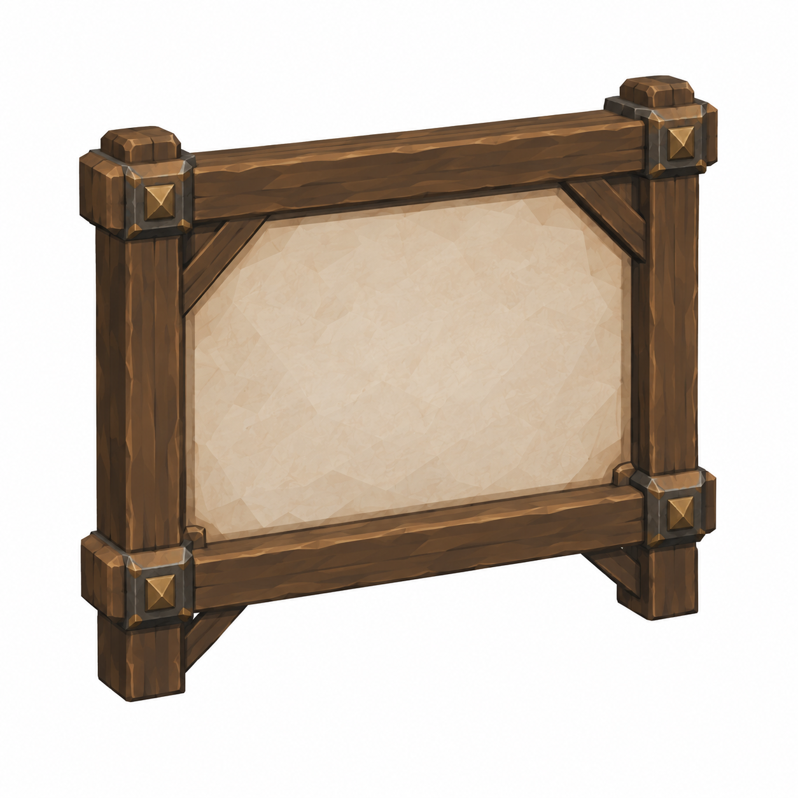

# BRAV-155 — user-approved visual references

User visual approval: 2026-10-02. Mustafa design approval: pending.

Jira: https://blbrn-team.atlassian.net/browse/BRAV-155?focusedCommentId=10757

Reference archive only. No Tripo generation or Unity integration. Technical fit remains pending.

Known technical note: Ek kasa kaldırıldı; alt durum şeridinin 2 shard durumunda üç fener yanıyor. Tripo için uygun değil.

## Approval_DRAFT_v002.png

## BRAV-155_TallyBracket_45_DRAFT_v001.png

## BRAV-155_WallPlanFrame_45_DRAFT_v001.png

