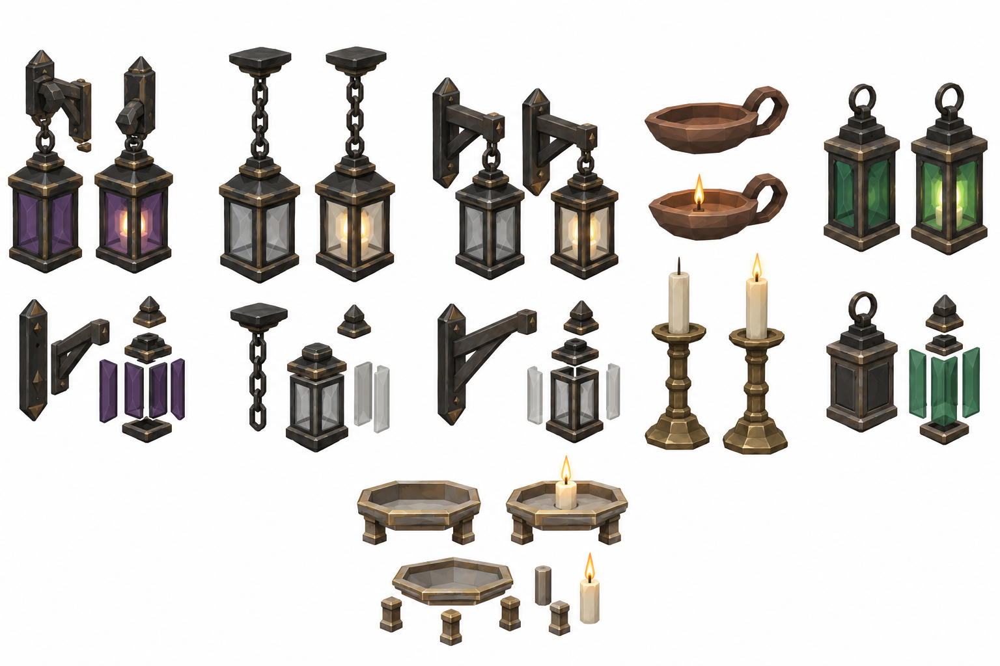
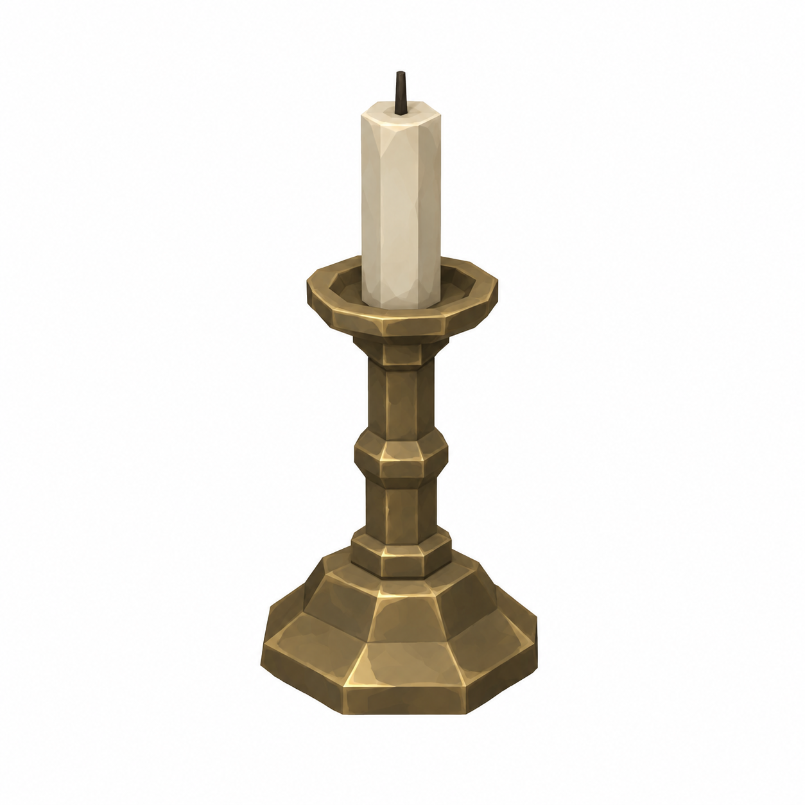
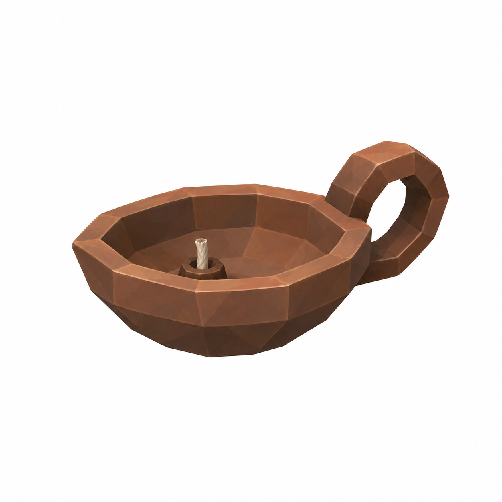
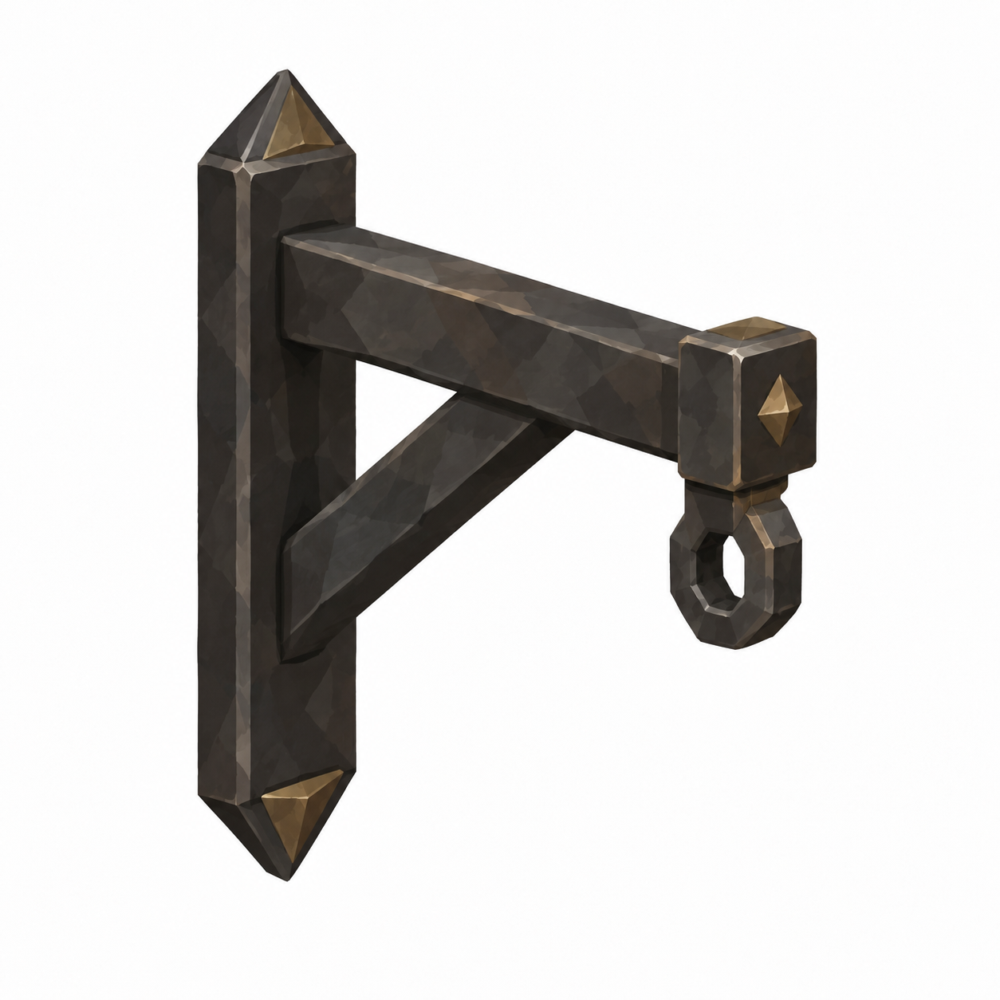

# BRAV-156 — user-approved visual references

User visual approval: 2026-10-02. Mustafa design approval: pending.

Jira: https://blbrn-team.atlassian.net/browse/BRAV-156?focusedCommentId=10753

Reference archive only. No Tripo generation or Unity integration. Technical fit remains pending.

Known technical note: Altın-beyaz etkileşim parçası gereğinden büyük bir ayaklı kap gibi çizildi. Küçük rim/levha gerekiyor.

## Approval_DRAFT_v002.png

## BRAV-156_CandlePricket_45_DRAFT_v001.png

## BRAV-156_OilLamp_45_DRAFT_v001.png

## BRAV-156_WallBracket_45_DRAFT_v001.png

