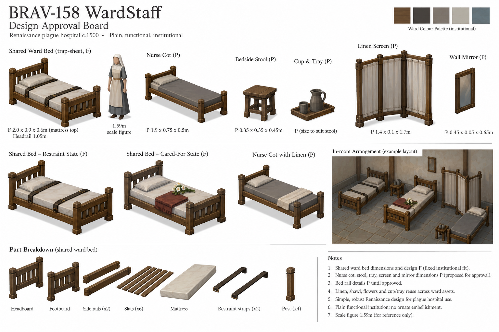
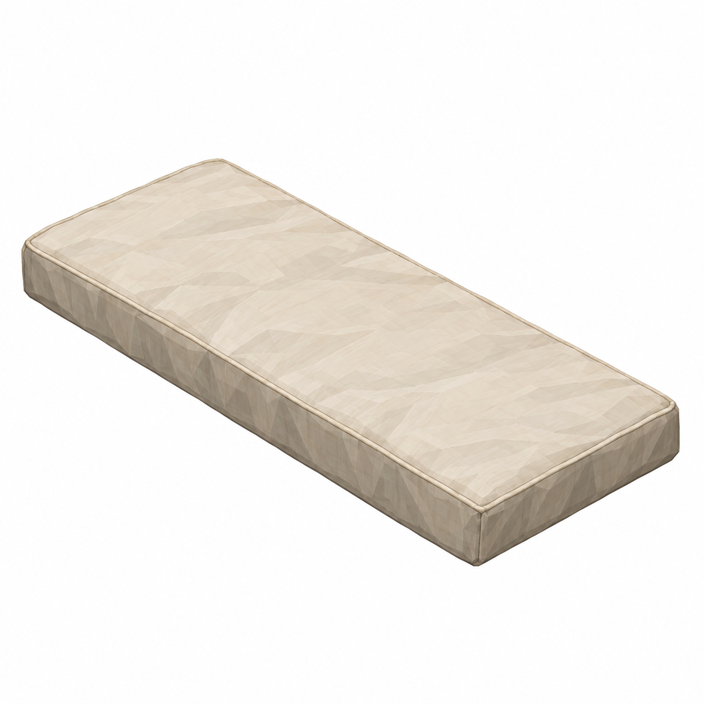
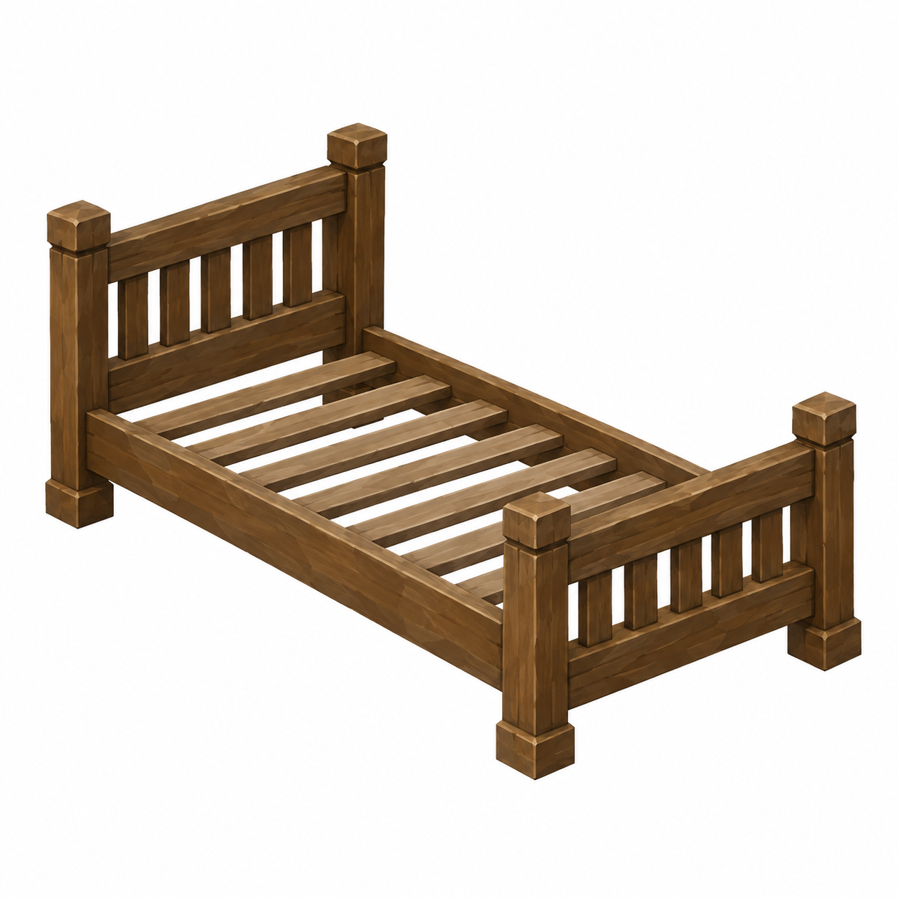

# BRAV-158 — user-approved visual references

User visual approval: 2026-10-02. Mustafa design approval: pending.

Jira: https://blbrn-team.atlassian.net/browse/BRAV-158?focusedCommentId=10751

Reference archive only. No Tripo generation or Unity integration. Technical fit remains pending.

## Approval_DRAFT_v001.png

## BRAV-158_Mattress_45_DRAFT_v001.png

## BRAV-158_WardBedFrame_45_DRAFT_v001.png

