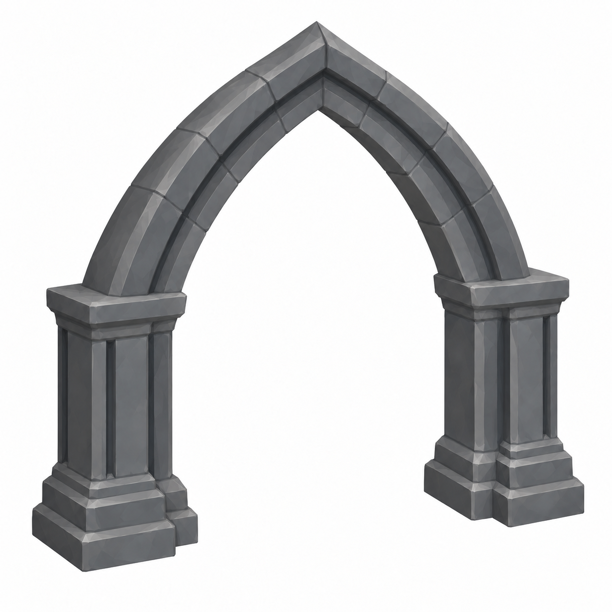

# BRAV-329 part 06 — revision v003

Pending Mustafa approval. Responds to Jira comment10652: clearly pointed Gothic arch, no central keystone, both springers bearing on the piers. Sheet targets remain overall6.2x5.3x1.0m, opening4.6x4.5m, no door leaf. Grey faceted stone, white background,45-degree view.

[Old/new comparison](BRAV-329_06_Review_v003.html) · [prompt, dimensions and SHA256](MANIFEST_06_v003.json)

The other12 v002 parts were accepted for Tripo in comment10652. This submission is only the held06 redraw; it is not an approval or mesh. Minimum resolution was removed in comment10650. Part14, dome and stair decisions are recorded in10652; this redraw does not change them.
