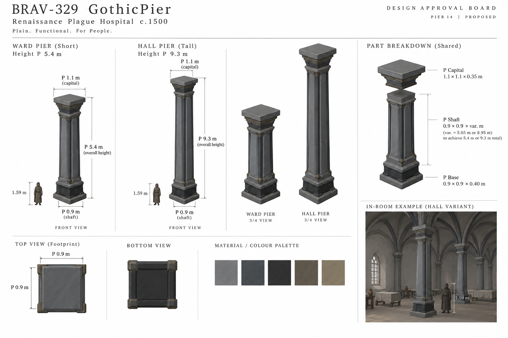
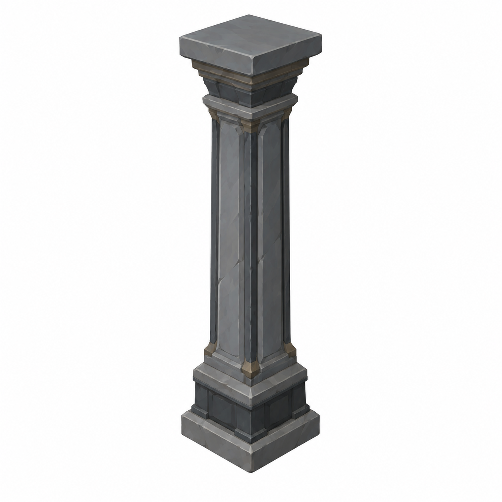
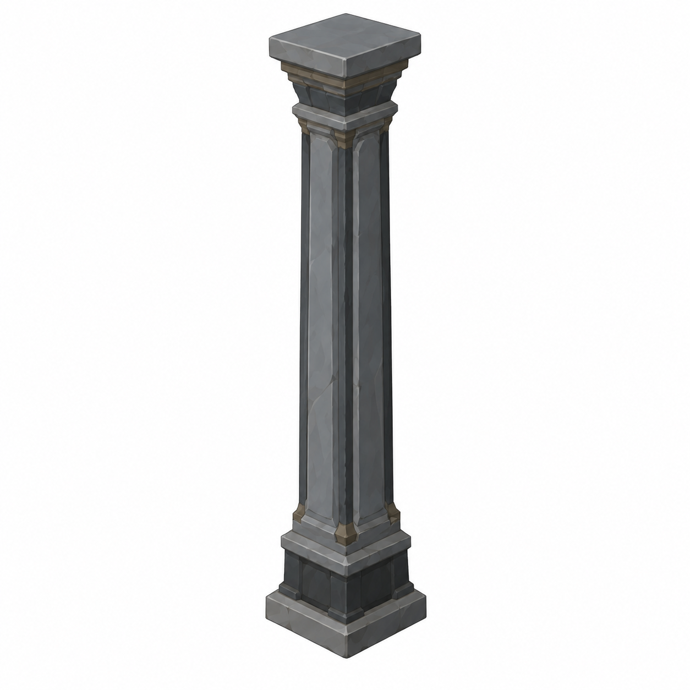

# BRAV-329 — user-approved visual references

User visual approval: 2026-10-02. Mustafa design approval: pending.

Jira: https://blbrn-team.atlassian.net/browse/BRAV-329?focusedCommentId=10748

Reference archive only. No Tripo generation or Unity integration. Technical fit remains pending.

Scope: Gothic pier only. Dome 05 v004 was not approved in this session and is excluded.

## Approval_DRAFT_v001.png

## BRAV-329_PierShort_45_DRAFT_v001.png

## BRAV-329_PierTall_45_DRAFT_v001.png

