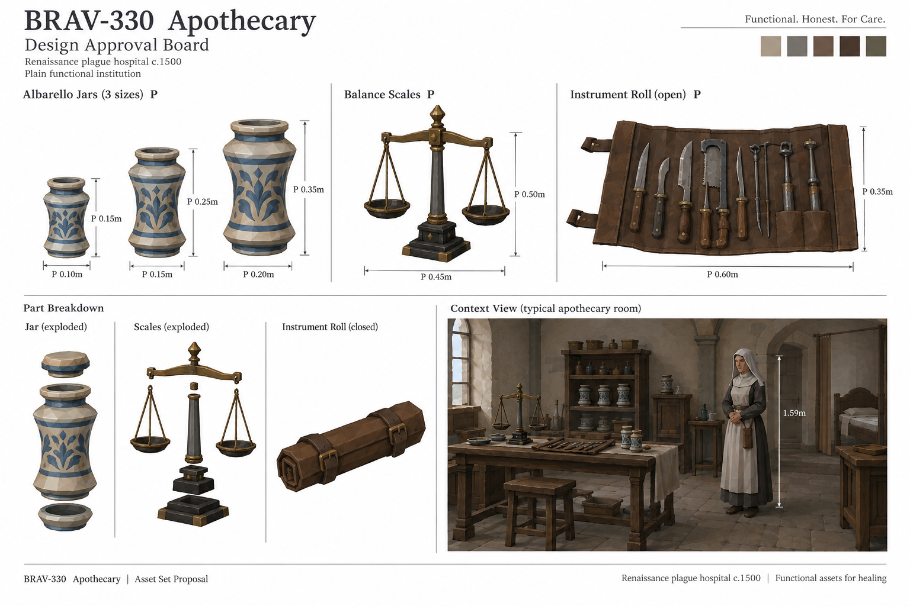
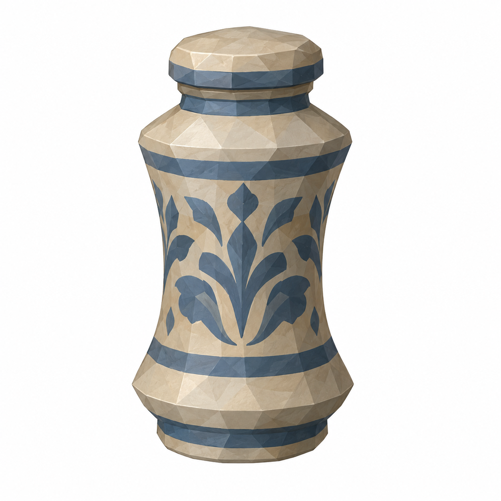
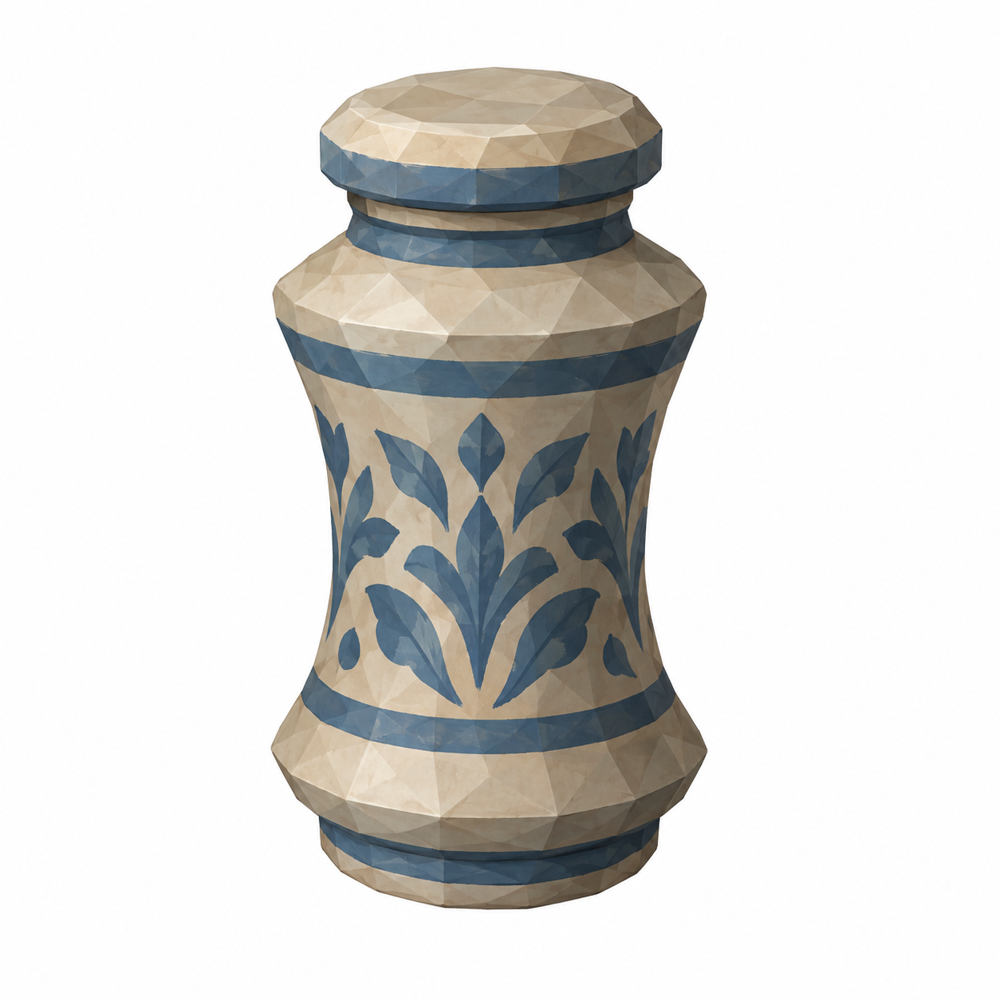
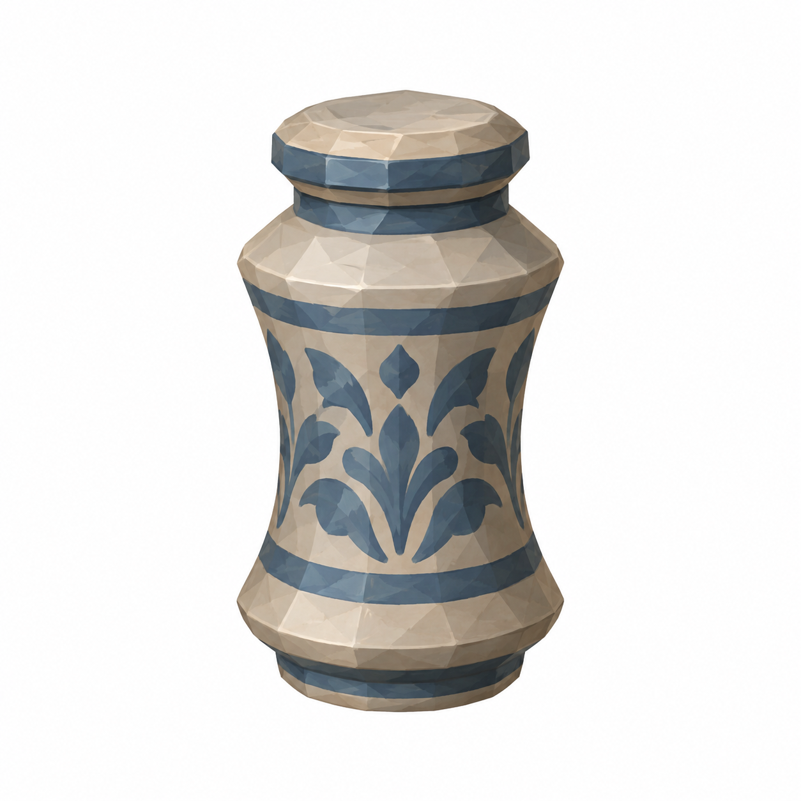
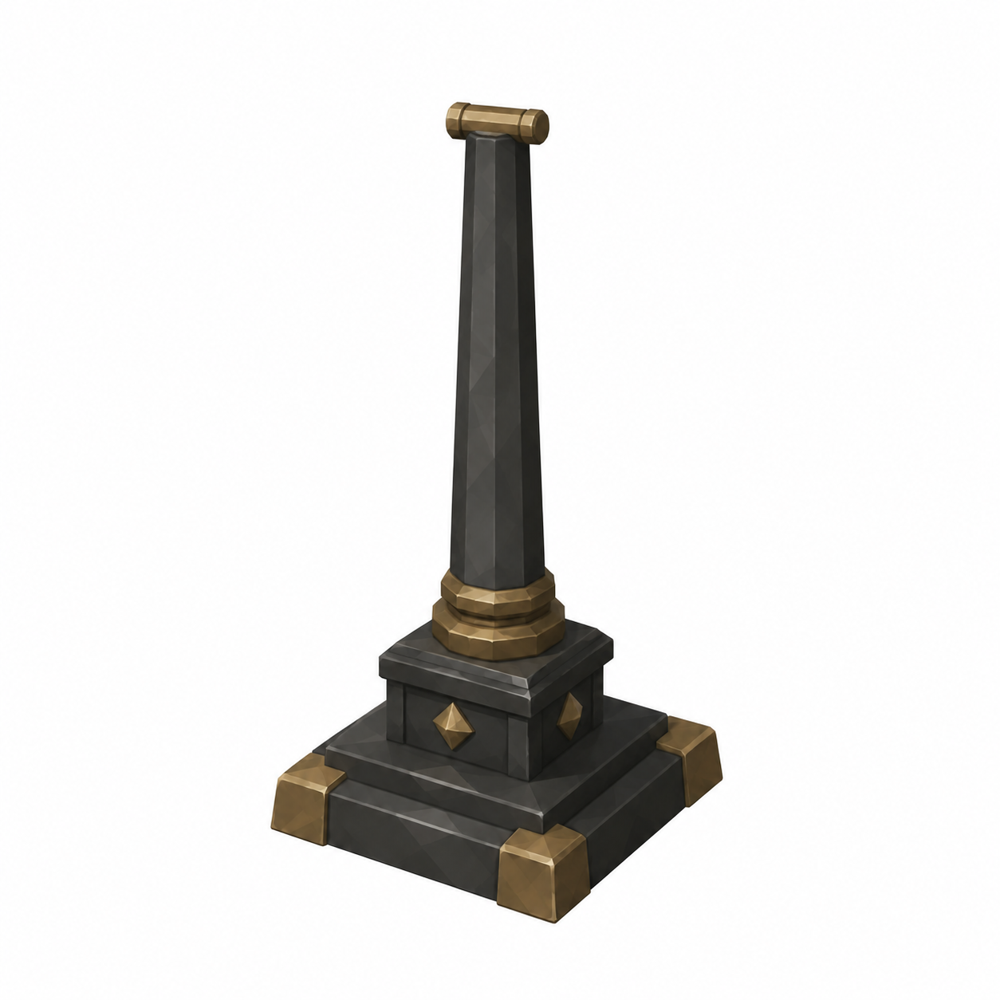
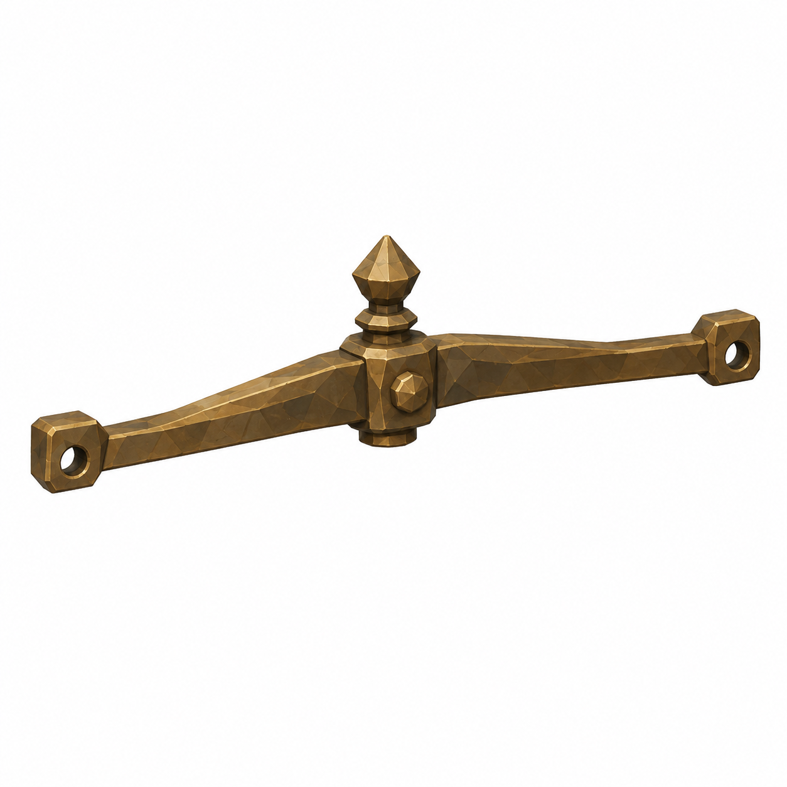
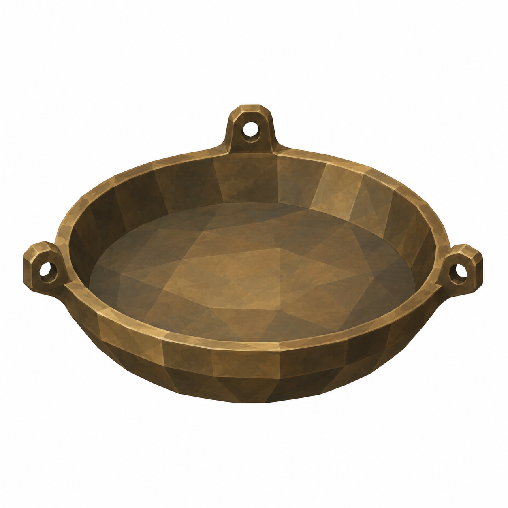
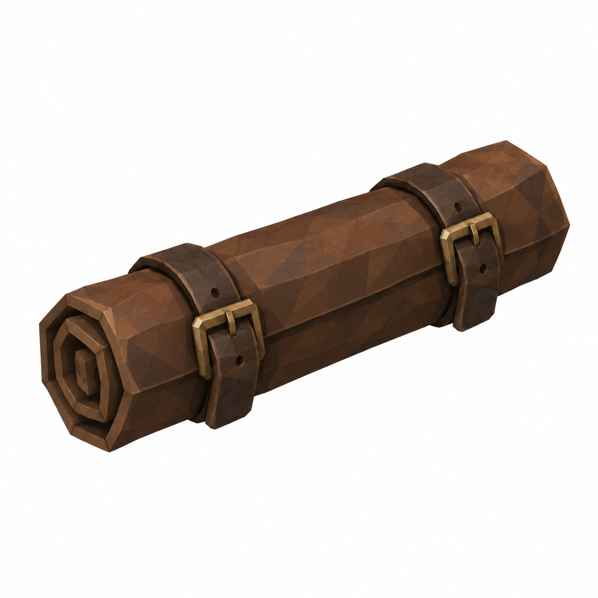
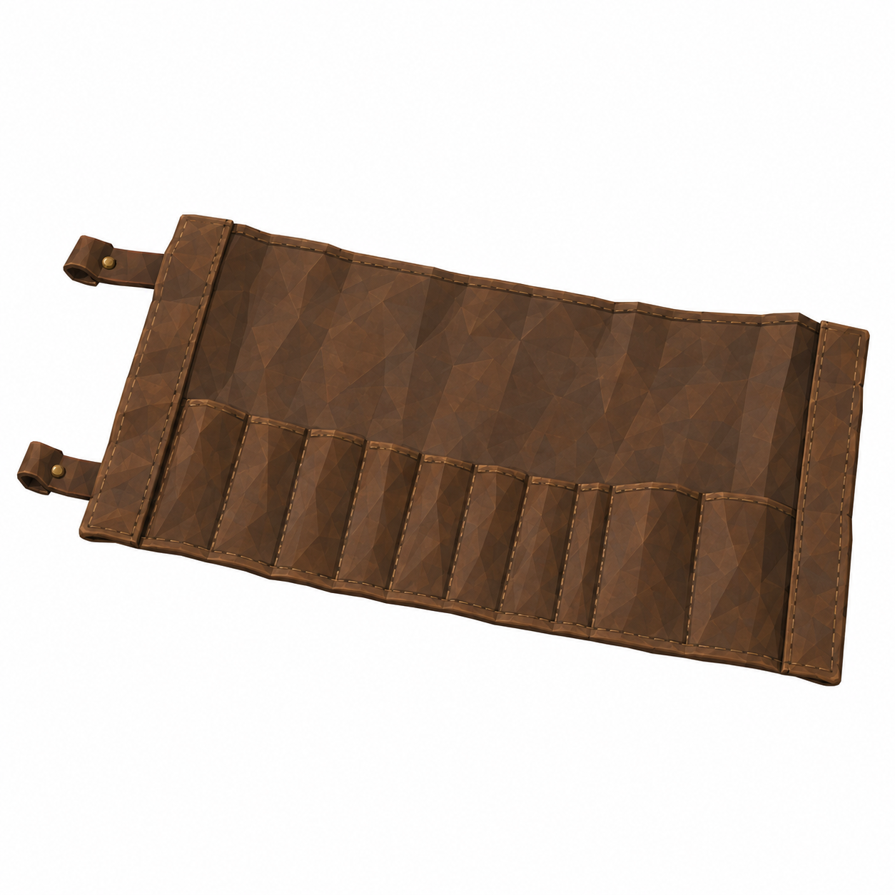

# BRAV-330 — user-approved visual references

User visual approval: 2026-10-02. Mustafa design approval: pending.

Jira: https://blbrn-team.atlassian.net/browse/BRAV-330?focusedCommentId=10760

Reference archive only. No Tripo generation or Unity integration. Technical fit remains pending.

## Approval_DRAFT_v001.png

## BRAV-330_AlbarelloJarLarge_45_DRAFT_v001.png

## BRAV-330_AlbarelloJarMedium_45_DRAFT_v001.png

## BRAV-330_AlbarelloJarSmall_45_DRAFT_v001.png

## BRAV-330_BalanceBase_45_DRAFT_v002.png

## BRAV-330_BalanceBeam_45_DRAFT_v001.png

## BRAV-330_BalancePan_45_DRAFT_v001.png

## BRAV-330_InstrumentRollClosed_45_DRAFT_v001.png

## BRAV-330_InstrumentRollOpen_45_DRAFT_v001.png

