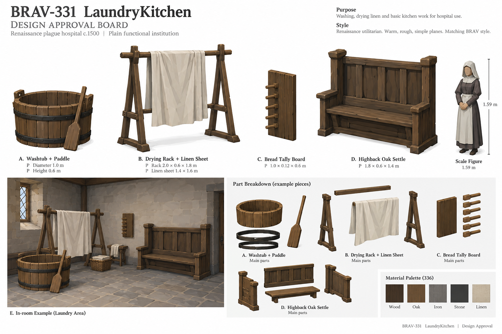
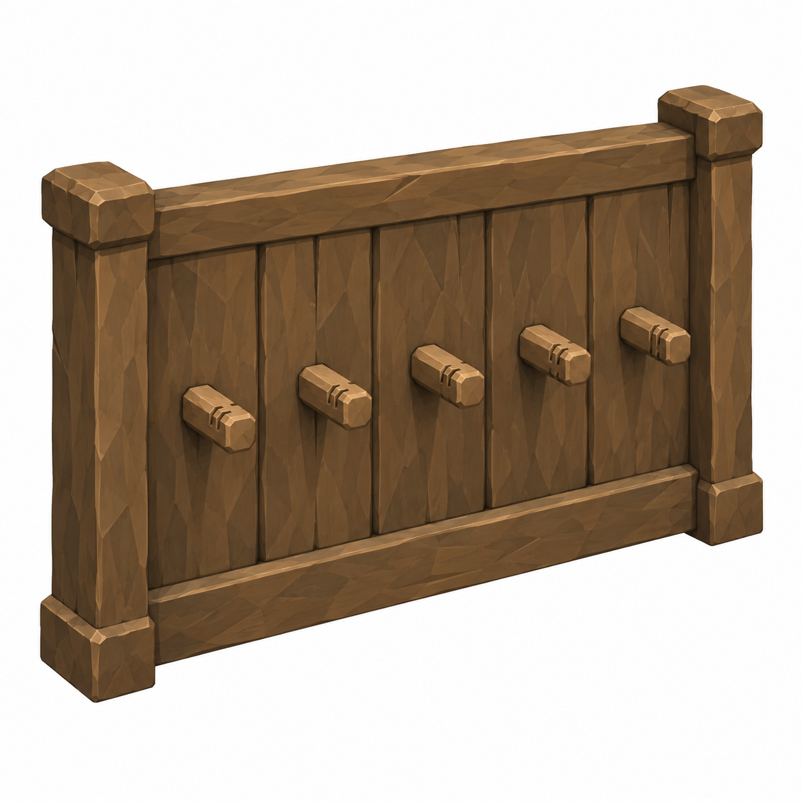
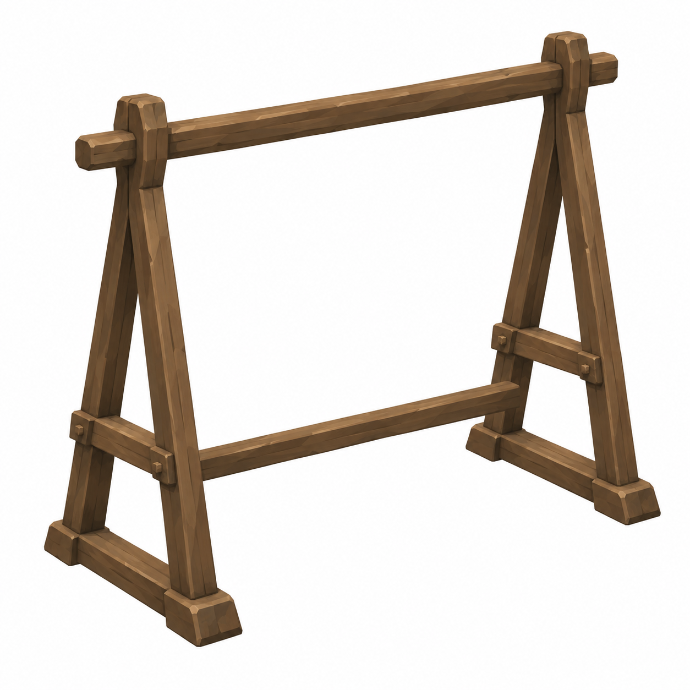
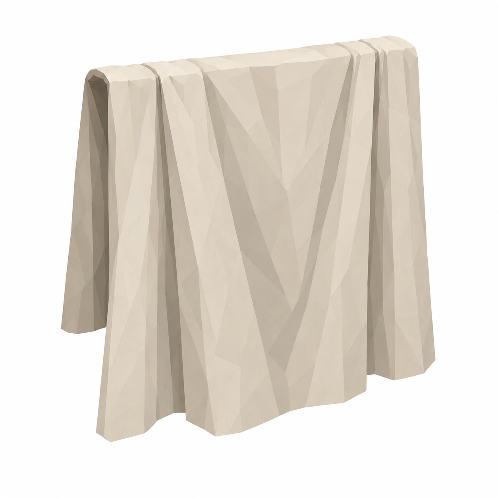
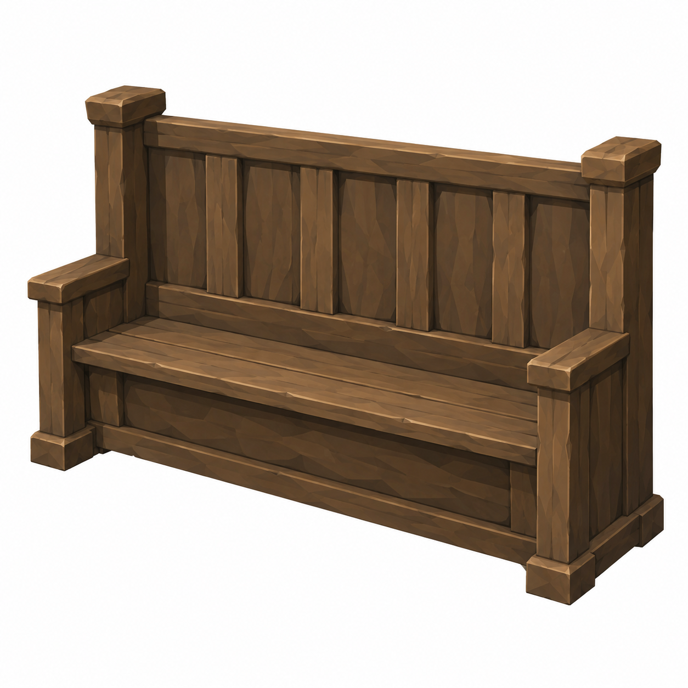

# BRAV-331 — user-approved visual references

User visual approval: 2026-10-02. Mustafa design approval: pending.

Jira: https://blbrn-team.atlassian.net/browse/BRAV-331?focusedCommentId=10761

Reference archive only. No Tripo generation or Unity integration. Technical fit remains pending.

## Approval_DRAFT_v001.png

## BRAV-331_BreadTallyBoard_45_DRAFT_v001.png

## BRAV-331_DryingRack_45_DRAFT_v001.png

## BRAV-331_LinenSheet_45_DRAFT_v001.png

## BRAV-331_OakSettle_45_DRAFT_v001.png

## BRAV-331_WashPaddle_45_DRAFT_v001.png

## BRAV-331_WashTub_45_DRAFT_v001.png

