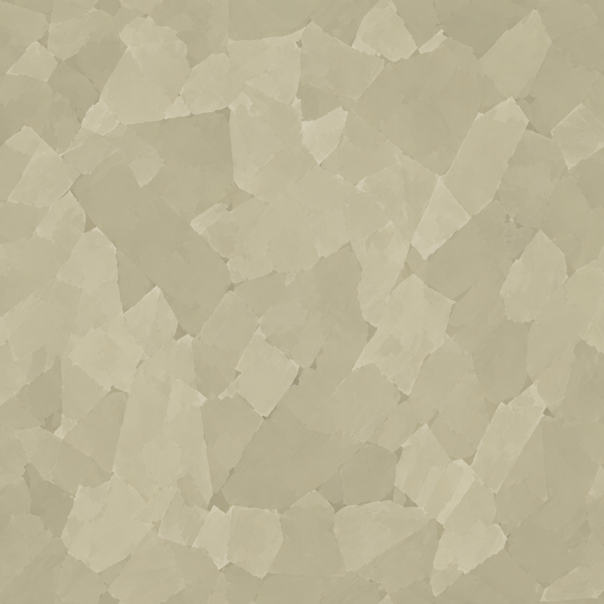
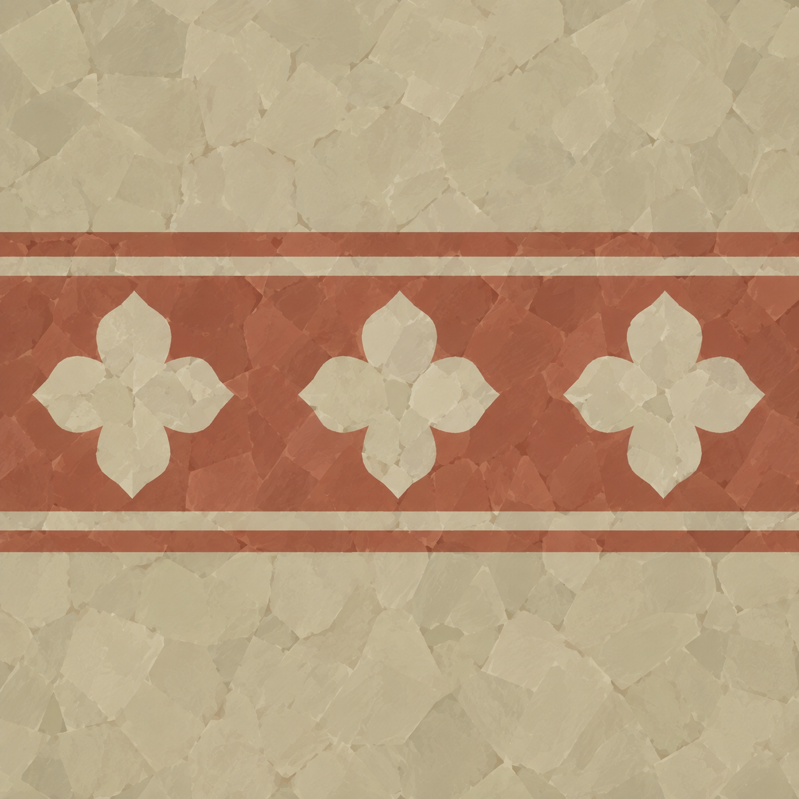
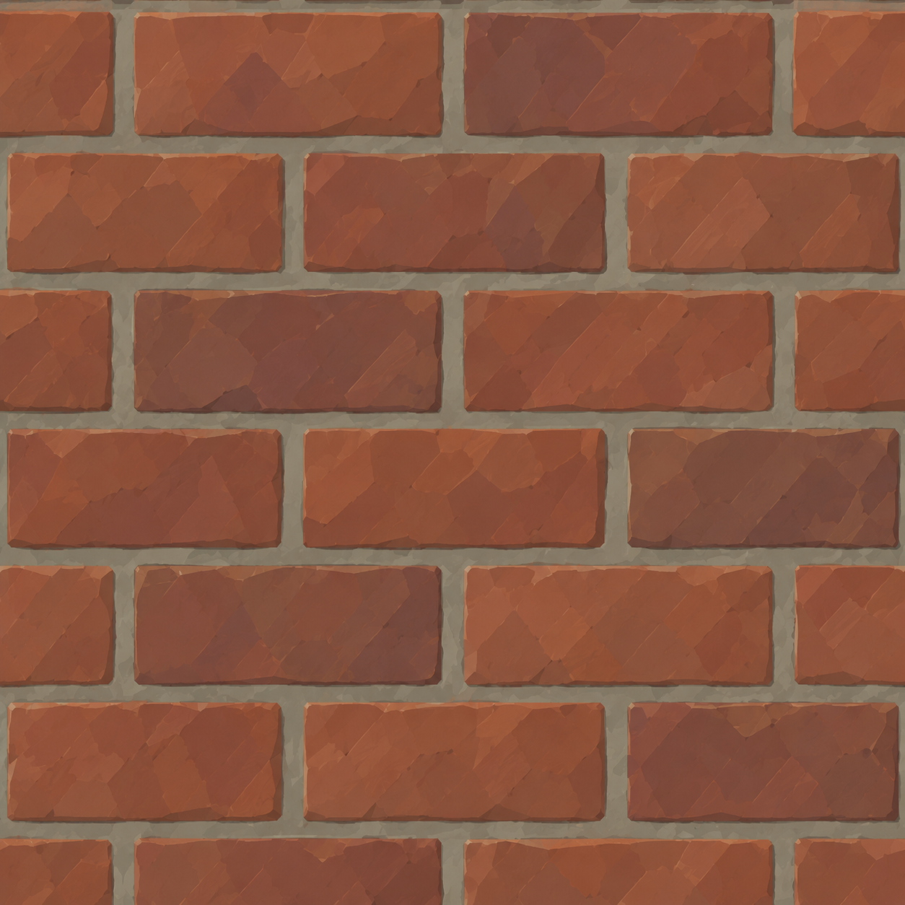
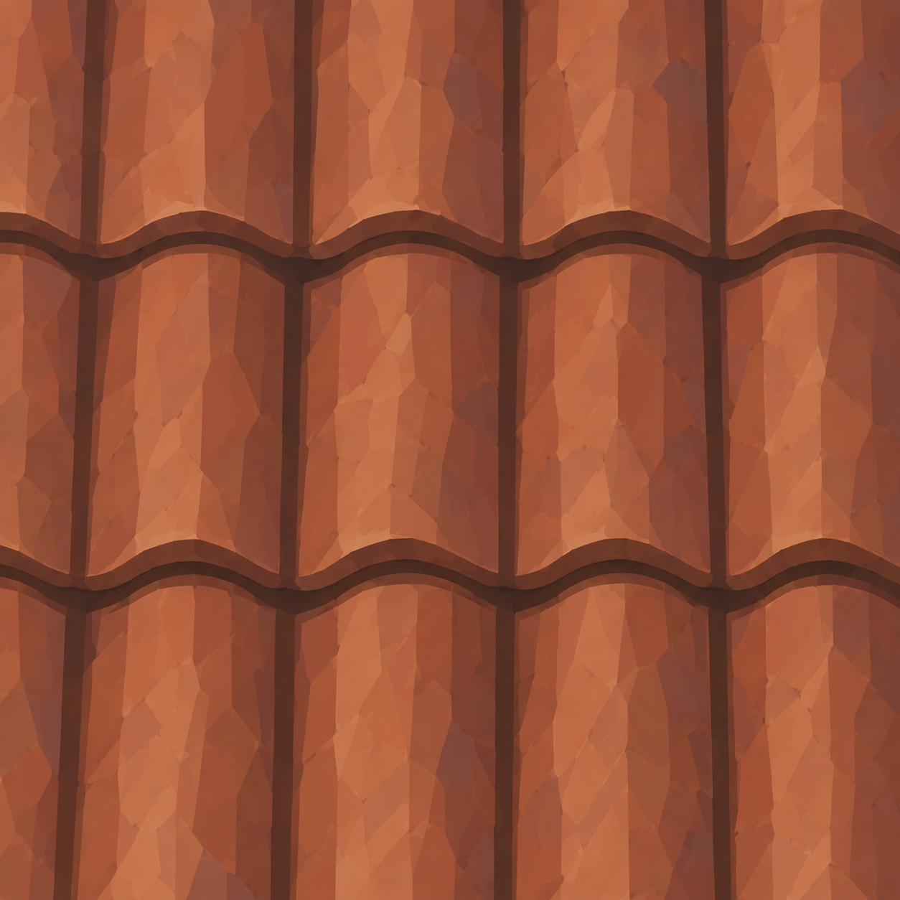
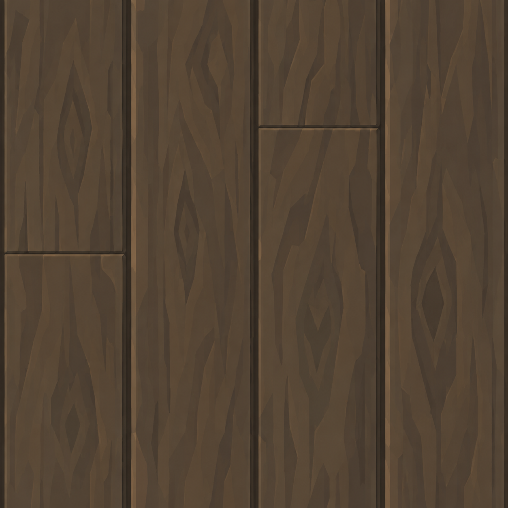
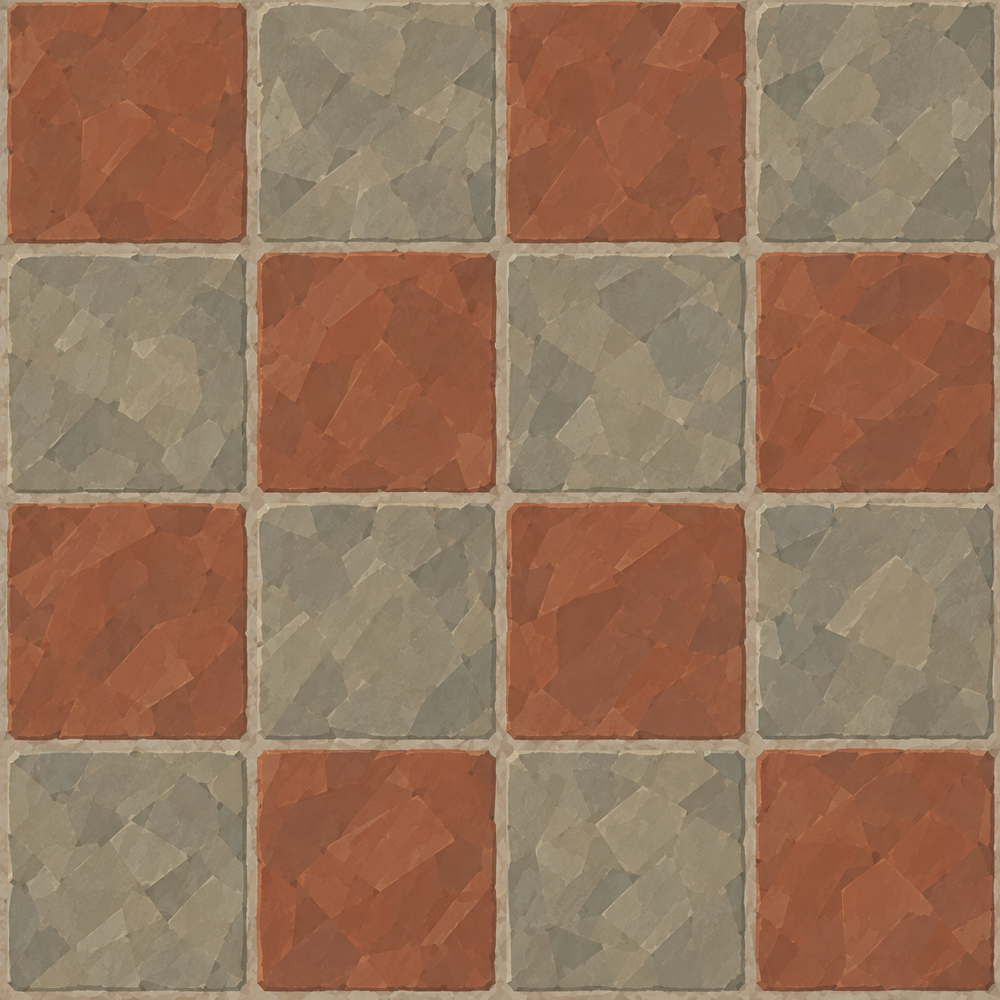

# BRAV-336 — user-approved visual references

User visual approval: 2026-10-02. Mustafa design approval: pending.

Jira: https://blbrn-team.atlassian.net/browse/BRAV-336?focusedCommentId=10737

Reference archive only. No Tripo generation or Unity integration. Technical fit remains pending.

The plague-cross decal is excluded at the user's request. Seamless repeat and URP implementation are unverified.

Color targets: dull brass #776A4C; neutral glass #B5BAB6; muted olive bottles #596451; oxblood bottles #684541. Not applied to original assets.

## BRAV-336_LimePlaster_v002.png

## BRAV-336_FrescoPlaster_v002.png

## BRAV-336_ServiceBrick_v002.png

## BRAV-336_TerracottaRoofTile_v002.png

## BRAV-336_OakFloorPlanks_v002.png

## BRAV-336_FloorTile_v002.png

## BRAV-336_OrderSign_v002.png

## BRAV-336_MerchantMark_v002.png

