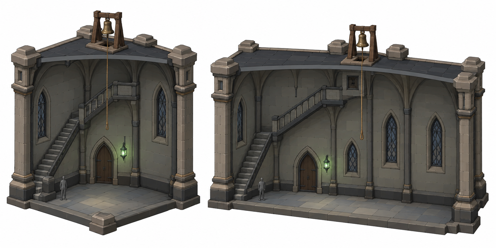
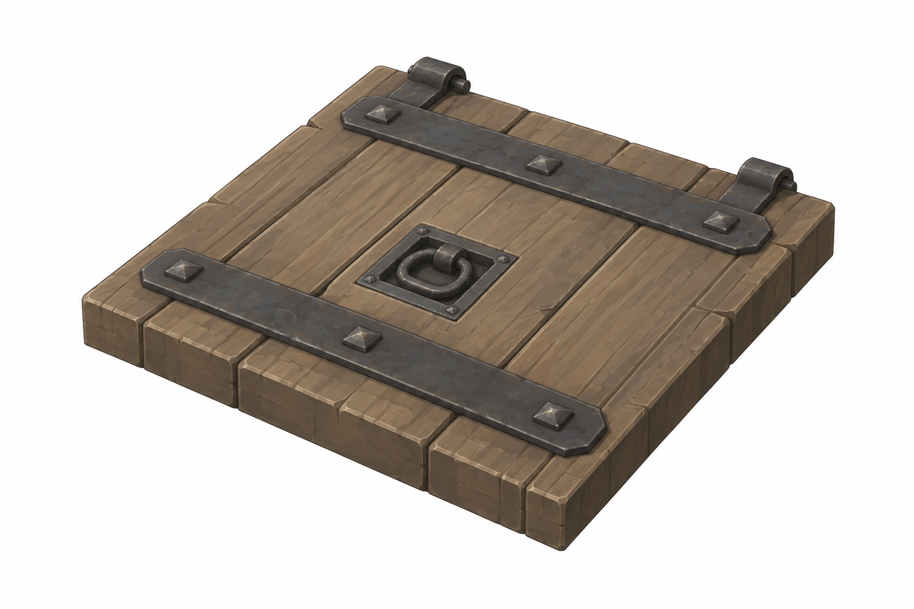
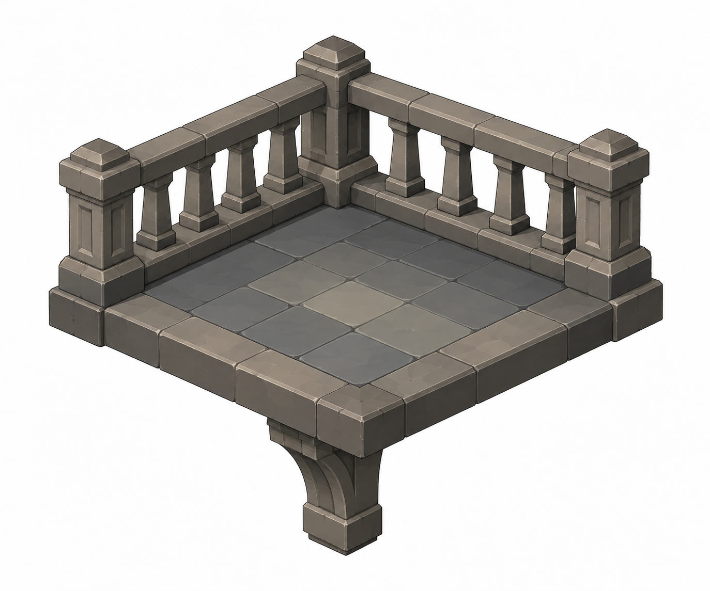
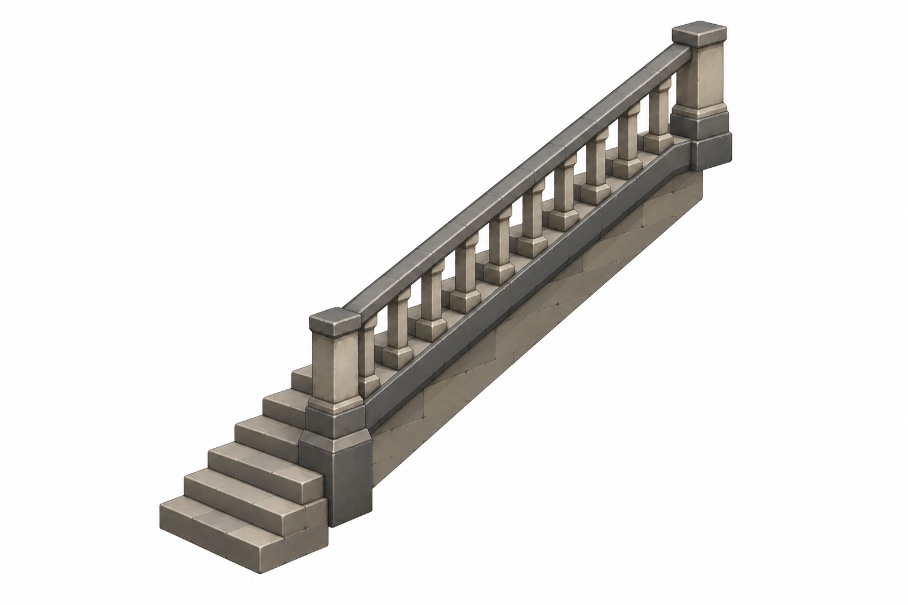

# BRAV-350 — user-approved visual references

User visual approval: 2026-10-02. Mustafa design approval: pending.

Jira: https://blbrn-team.atlassian.net/browse/BRAV-350?focusedCommentId=10745

Reference archive only. No Tripo generation or Unity integration. Technical fit remains pending.

## Approval_DRAFT_v002.png

## BRAV-350_Hatch_45_DRAFT_v001.png

## BRAV-350_Landing_45_DRAFT_v001.png

## BRAV-350_StairFlight_45_DRAFT_v002.png

