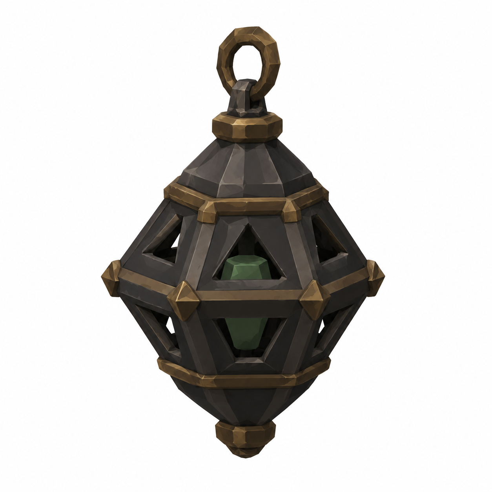

# BRAV-143 — User approved, Mustafa review pending

[Revision brief and dimensions](REVISION_SPEC.md)

[Manifest and QA history](GENERATION_MANIFEST.json)

## Body

Dik A-pose 1.80 m; omuz0.56; belt1.01; diz0.45

## Censer

Ø0.30 ×0.45m; chainbuiltlater1.1m/free0.45

