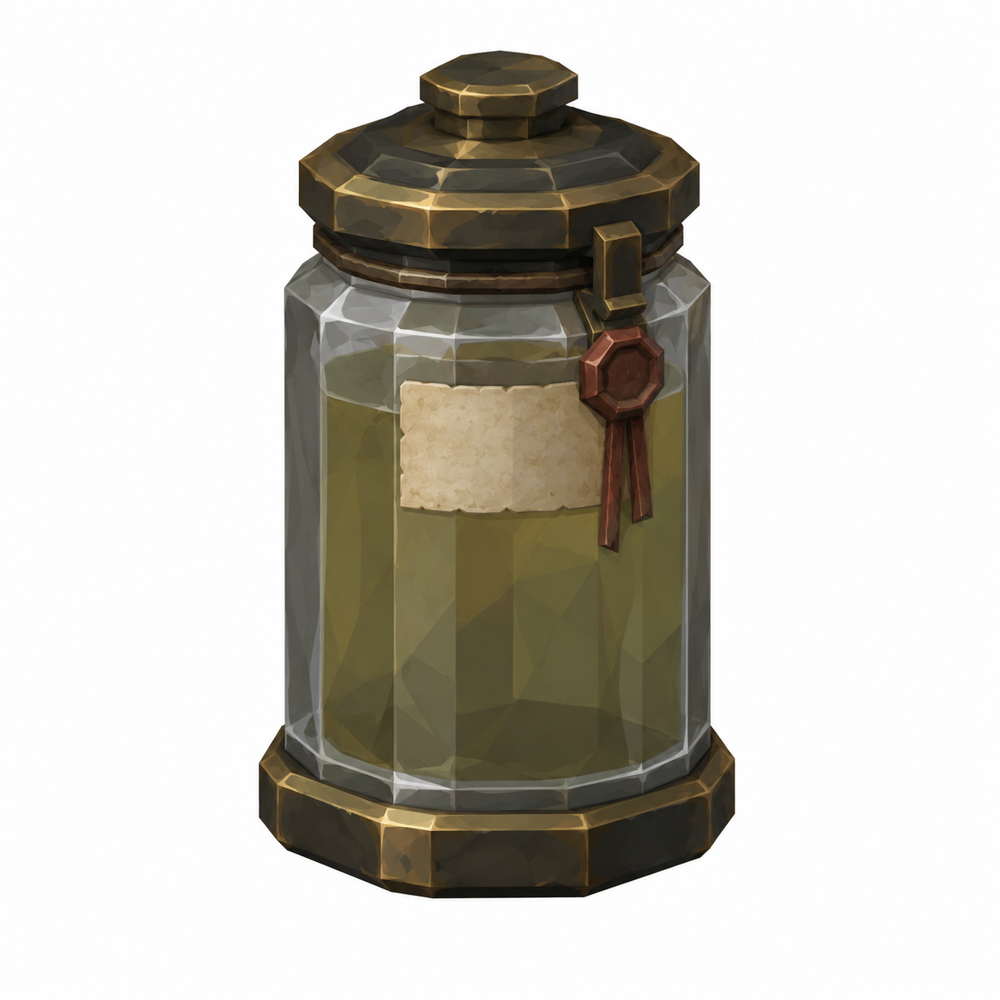
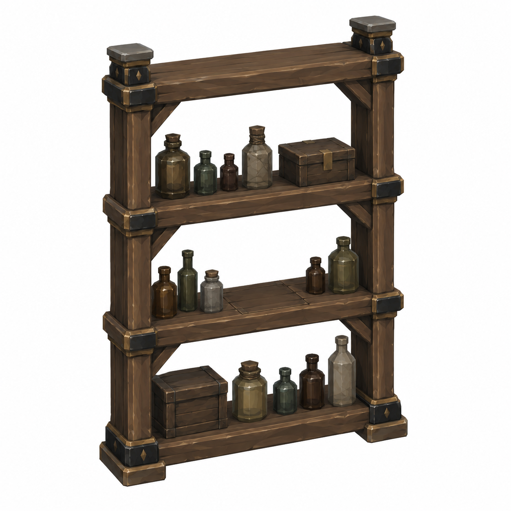
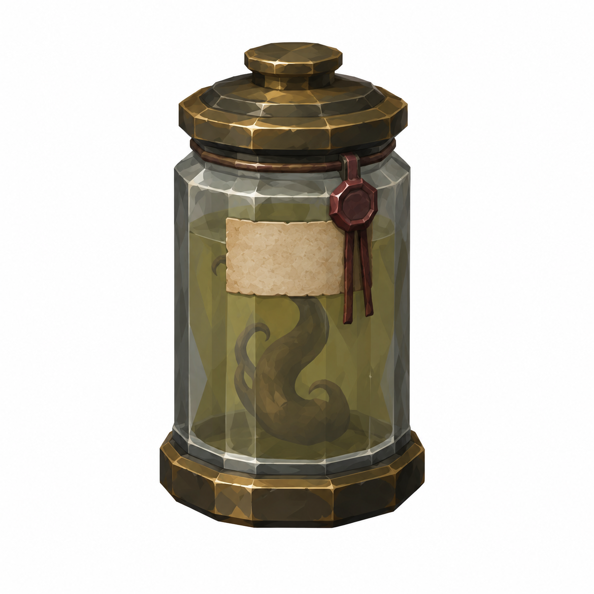
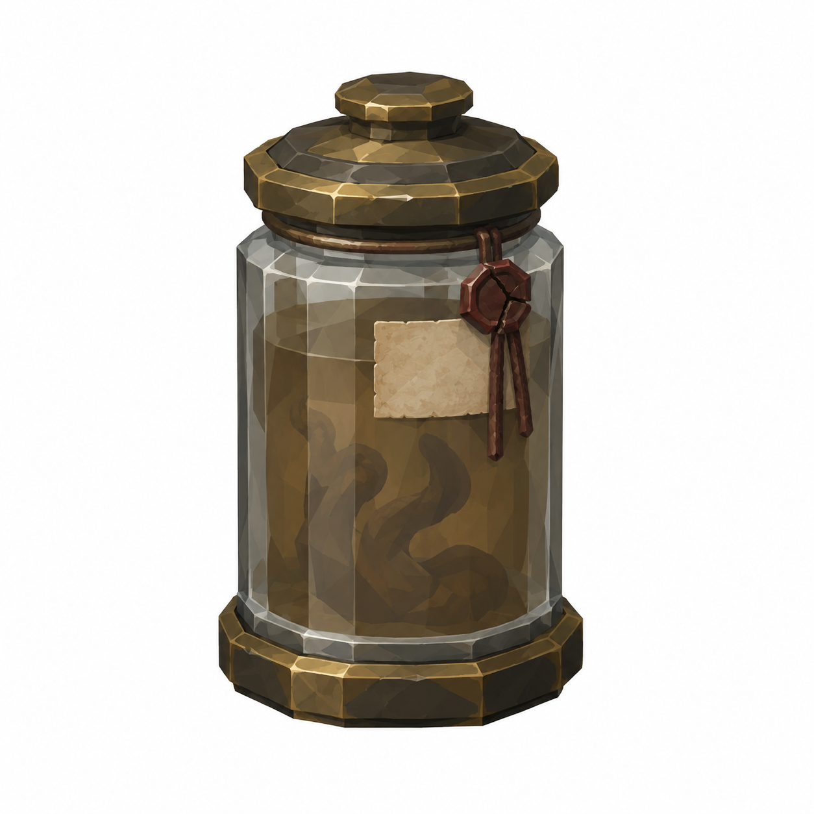

# BRAV-147 — User approved, Mustafa review pending

[Revision brief and dimensions](REVISION_SPEC.md)

[Manifest and QA history](GENERATION_MANIFEST.json)

## DecoyJar

Ø0.22 ×0.35m; tag0.12 ×0.08

## ShelfRack

1.20 ×0.45 ×1.90m; Socket_Jar1.00m

## NamedJar

Ø0.22 ×0.35m; label0.12 ×0.08

## SpoiledJar

Ø0.22 ×0.35m; crackedseal/murkybrownfluid

