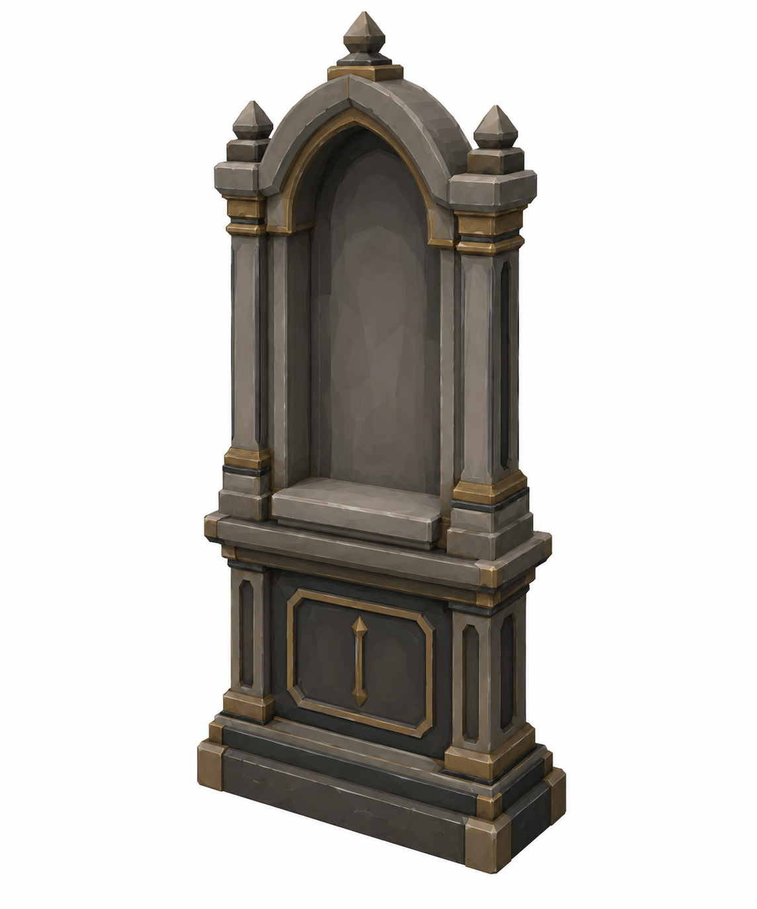
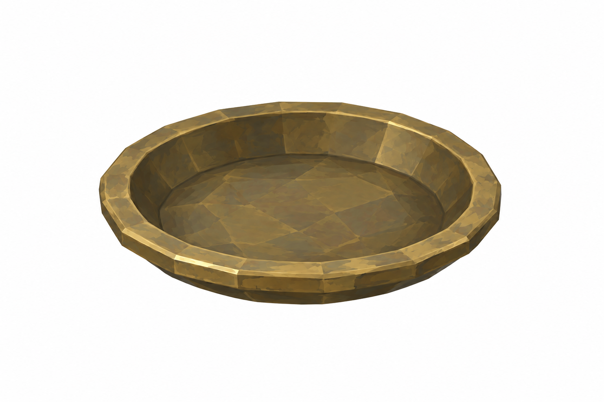
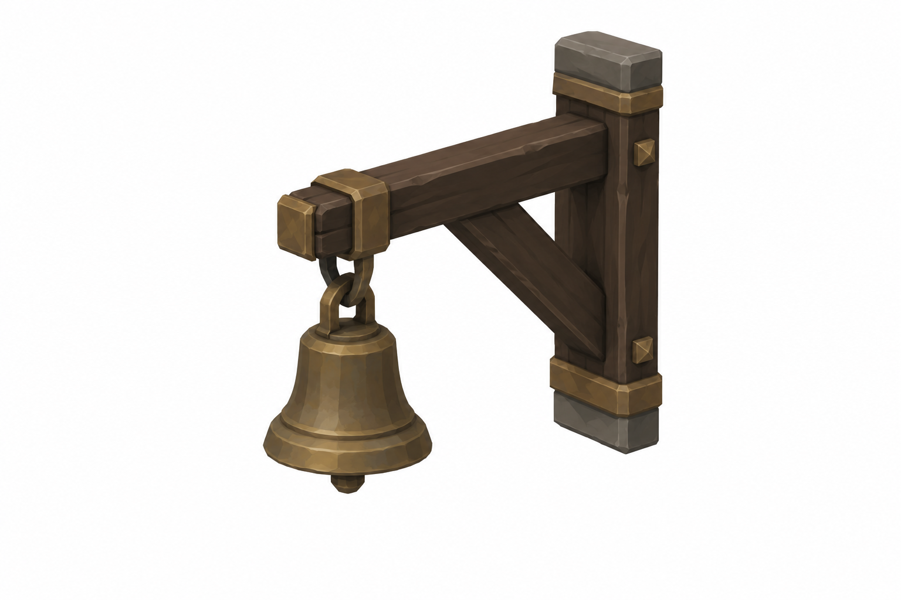
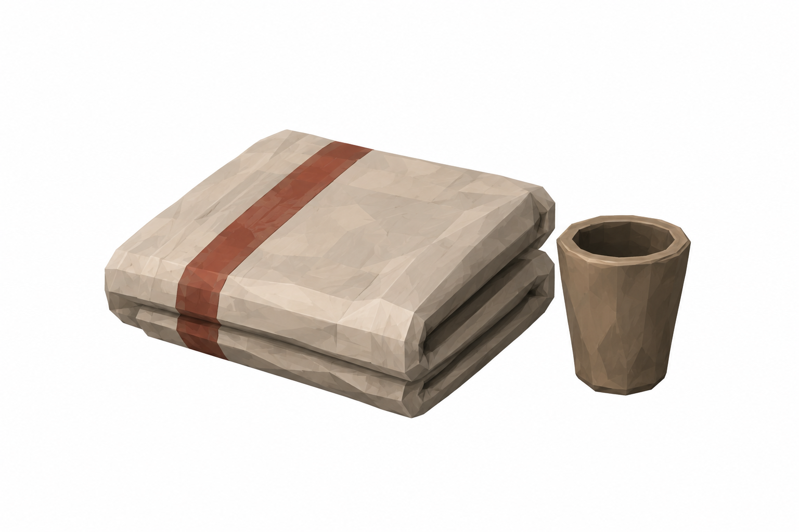

# BRAV-150 — User approved, Mustafa review pending

[Revision brief and dimensions](REVISION_SPEC.md)

[Manifest and QA history](GENERATION_MANIFEST.json)

## Tabernacle

1.2 × 0.45 × 2.4 m; sill 0.78; niche0.6 ×0.2 ×0.95

## HearthDish

Ø0.25 m

## SanctusBell

Ø0.15 m

## Offerings

blanket0.36×0.30; cupØ0.07

## Reused references

[SharedSaint_PRESERVED_v001.png](SharedSaint_PRESERVED_v001.png) — PRESERVED_OR_SHARED_DRAFT 

[KneelingMat_PRESERVED_v001.png](KneelingMat_PRESERVED_v001.png) — PRESERVED_OR_SHARED_DRAFT 

[OilLamp_SHARED_BRAV156_v001.png](OilLamp_SHARED_BRAV156_v001.png) — PRESERVED_OR_SHARED_DRAFT 

