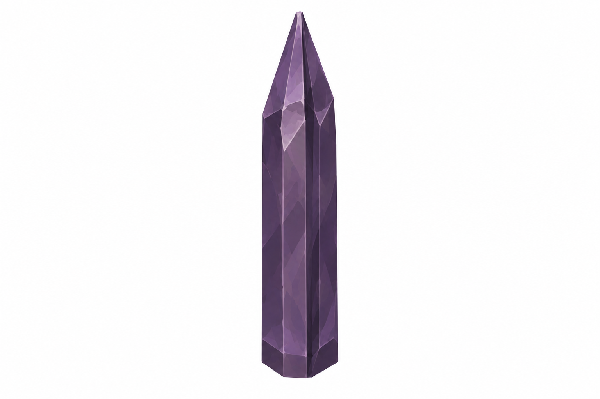
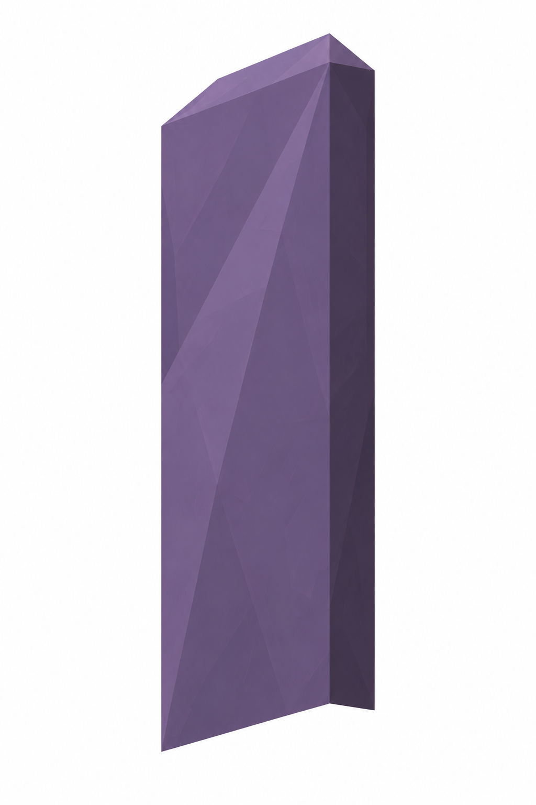
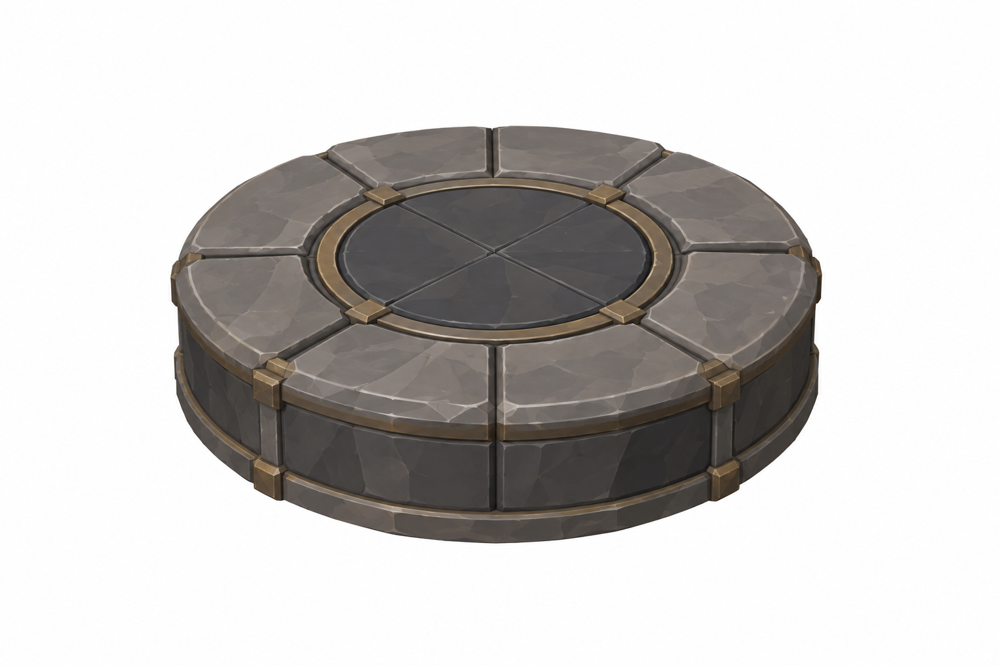
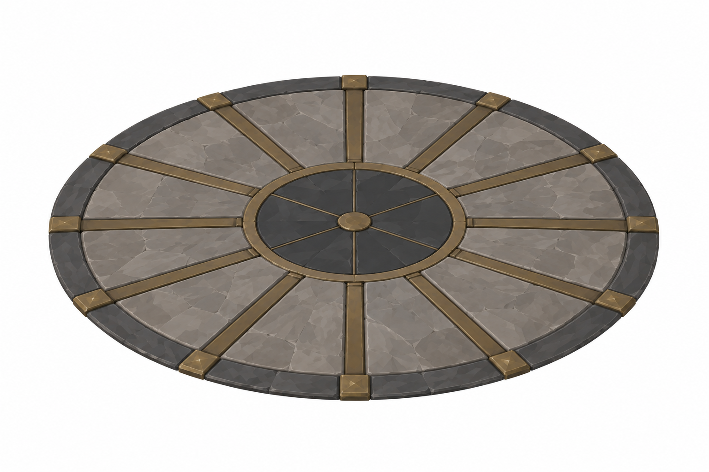

# BRAV-151 — User approved, Mustafa review pending

[Revision brief and dimensions](REVISION_SPEC.md)

[Manifest and QA history](GENERATION_MANIFEST.json)

## Quickened

total floor height2.6–2.8 m; footprint≤0.5²

## Ironhide

1.0 ×1.0; totalH1.9 m

## Keen

0.9 ×0.25; totalH2.4 m

## SharedPlinth

Ø1.6 ×H0.24 m

## RadialFloor

Ø4 m; flush≤0.03

