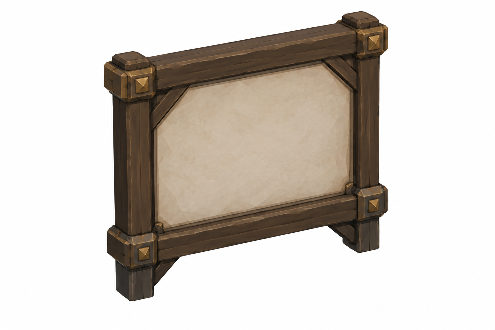
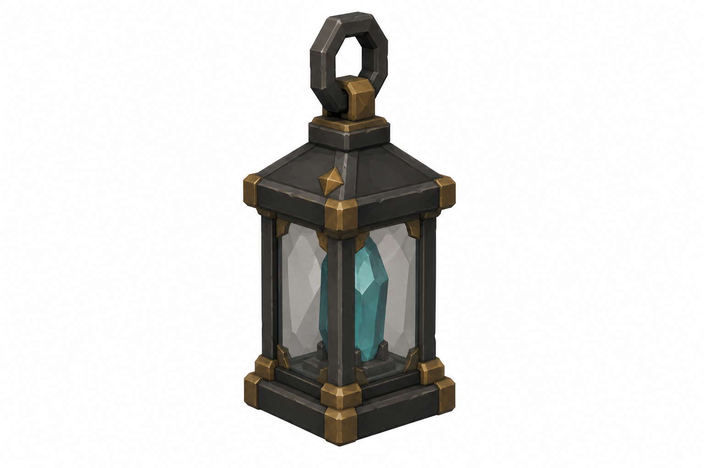
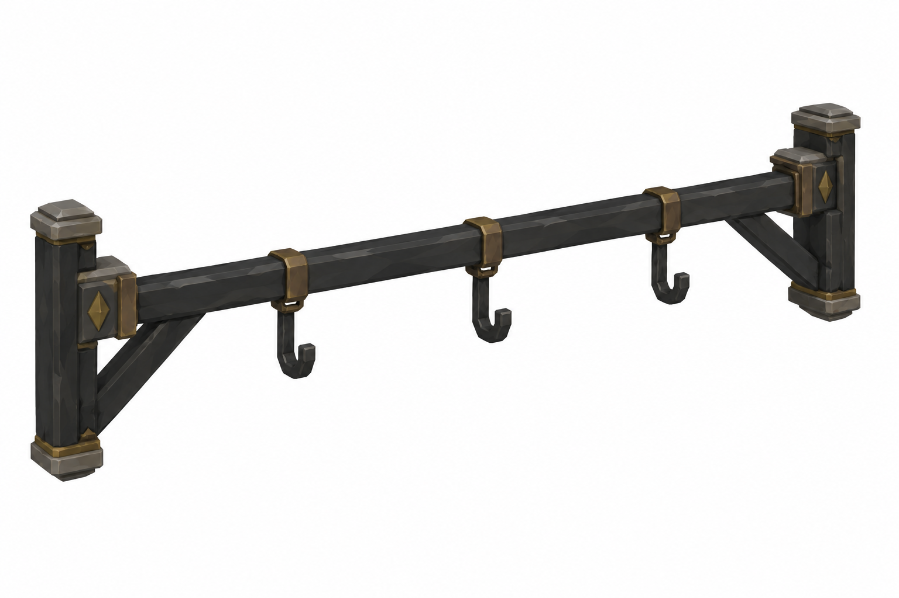

# BRAV-155 — User approved, Mustafa review pending

[Revision brief and dimensions](REVISION_SPEC.md)

[Manifest and QA history](GENERATION_MANIFEST.json)

## LandscapeFrame

outer3.16 ×1.57 m; face3 ×1.41

## SquareFrame

outer3.16 ×3m; face3 ×2.84

## TallyLantern

W0.35 ×H0.5m

## TallyBar

2.8m; hookpitch1.1m

