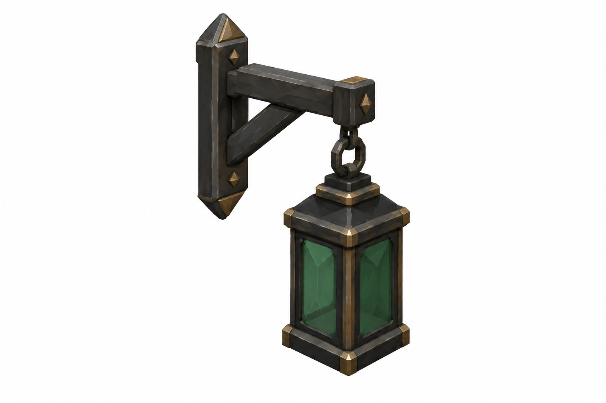
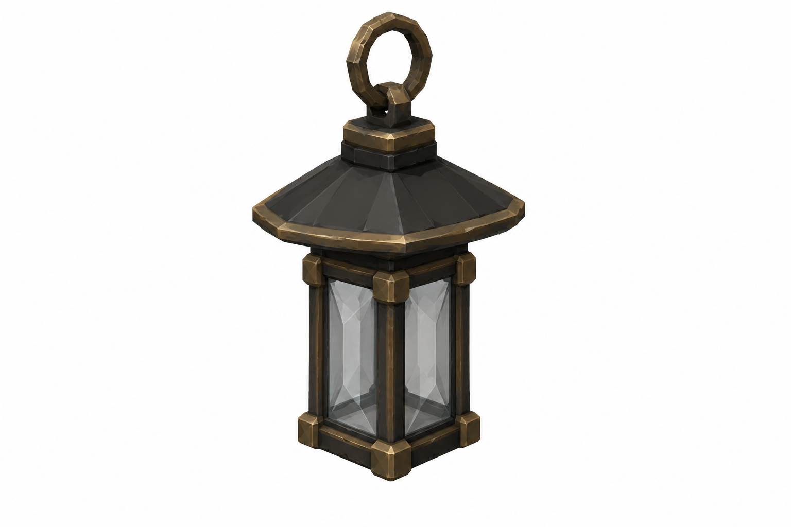
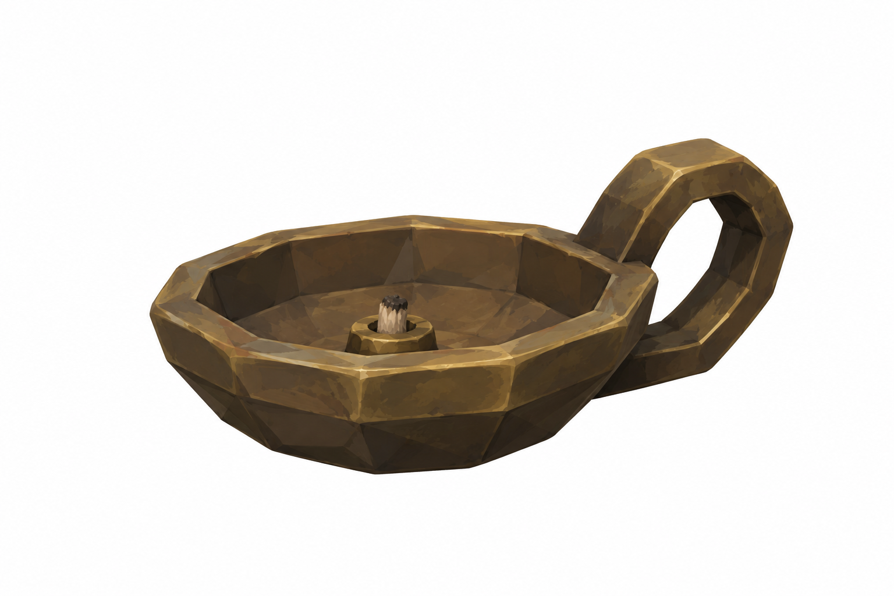
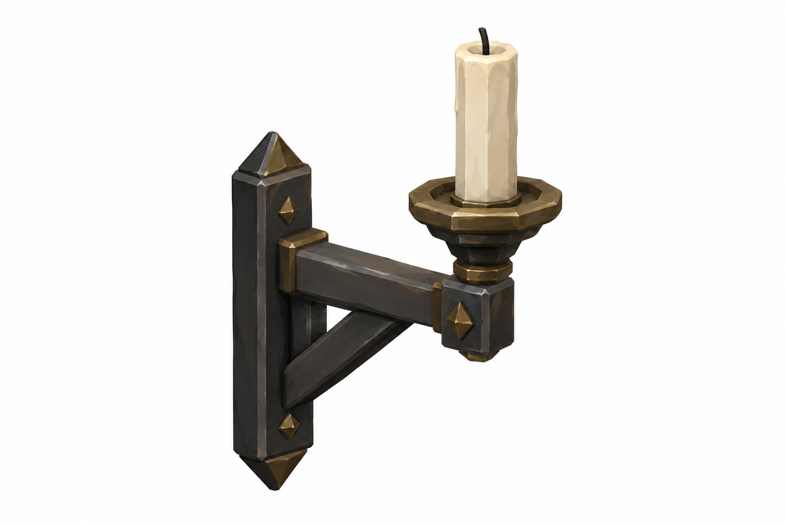
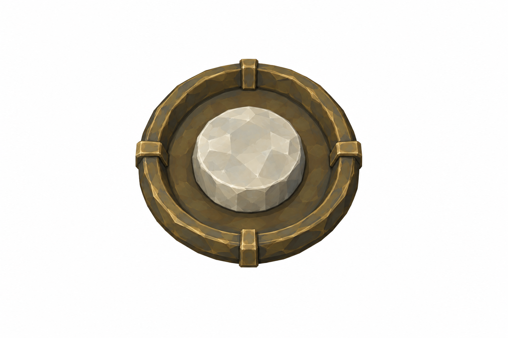
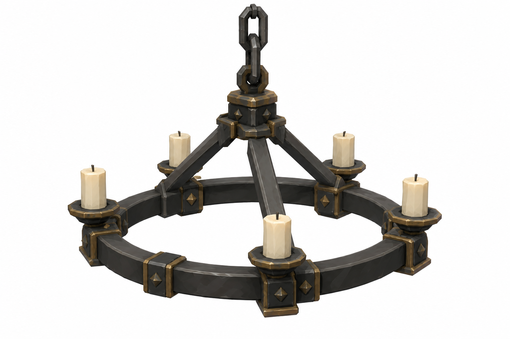

# BRAV-156 — User approved, Mustafa review pending

[Revision brief and dimensions](REVISION_SPEC.md)

[Manifest and QA history](GENERATION_MANIFEST.json)

## WallLantern

0.22 ×0.22 ×0.4m; arm0.35

## HangingLantern

Ø0.3 ×H0.45; hoodØ0.45

## OilLamp

Ø0.12 ×H0.07

## Pricket

0.25 ×H0.35

## InteractionRim

Ø0.15–0.18 ×D0.03; emberØ0.1

## CandleCrown

Ø1.2m

