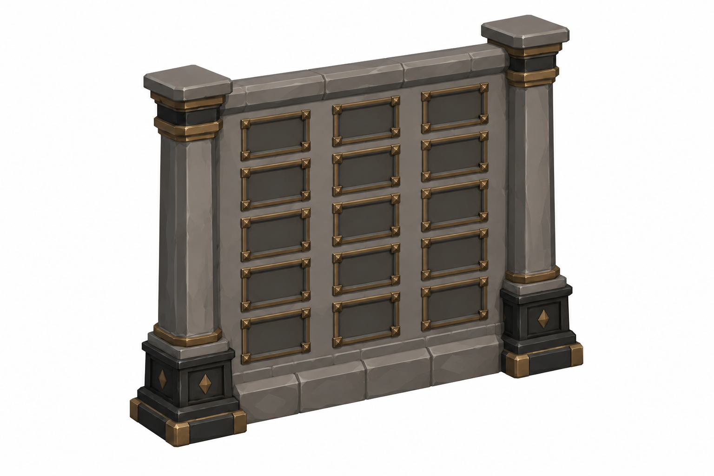
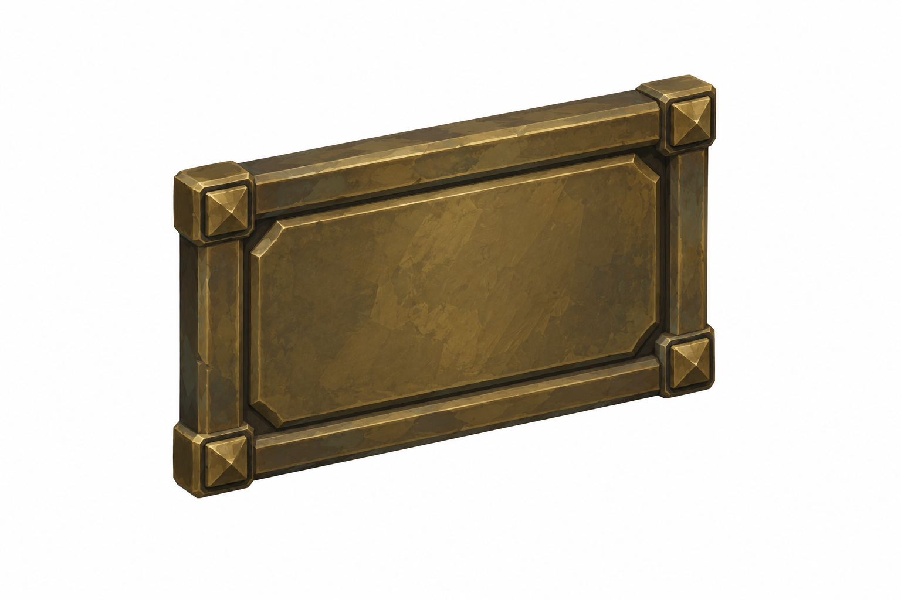
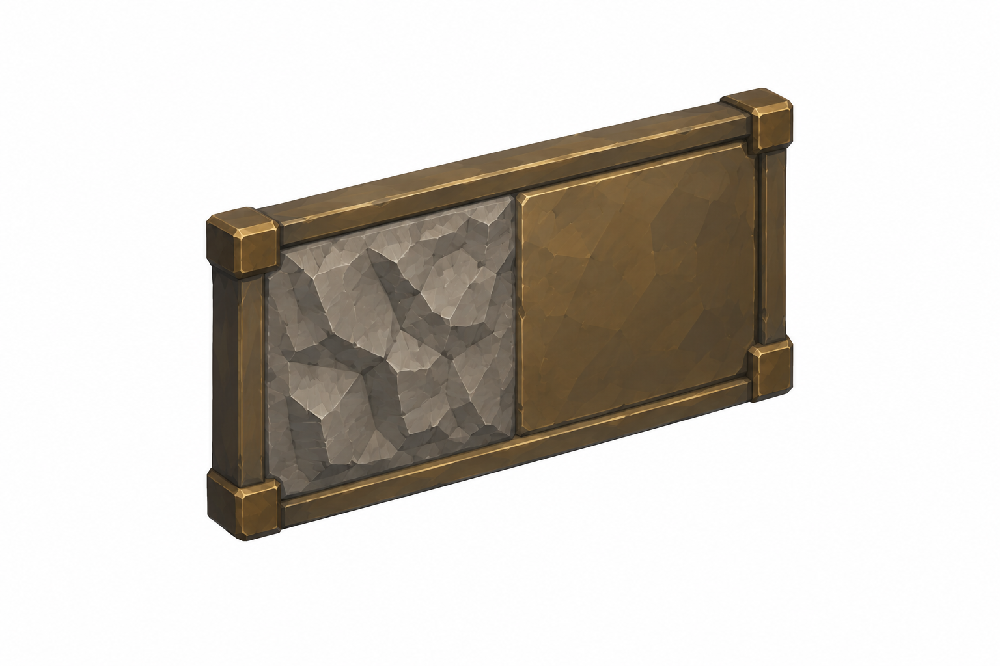
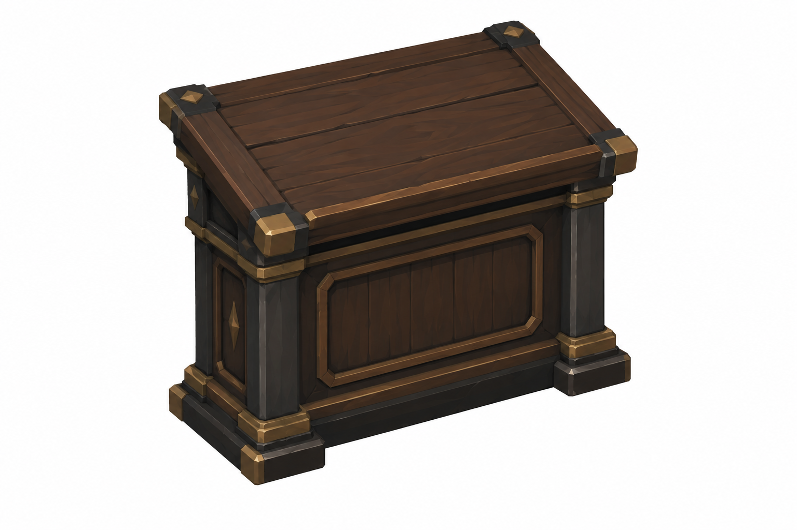
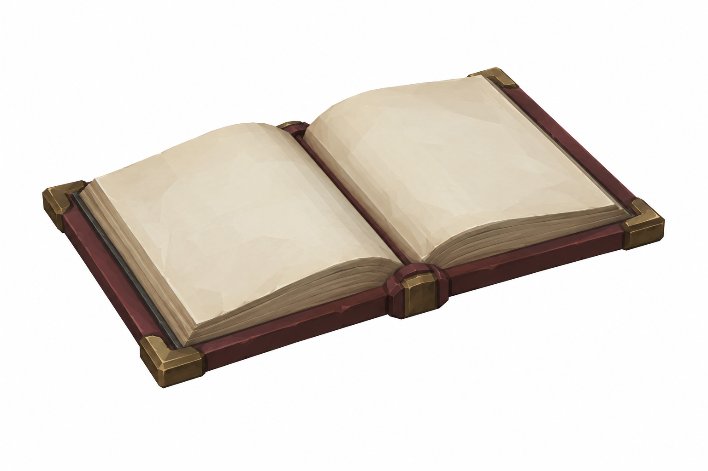
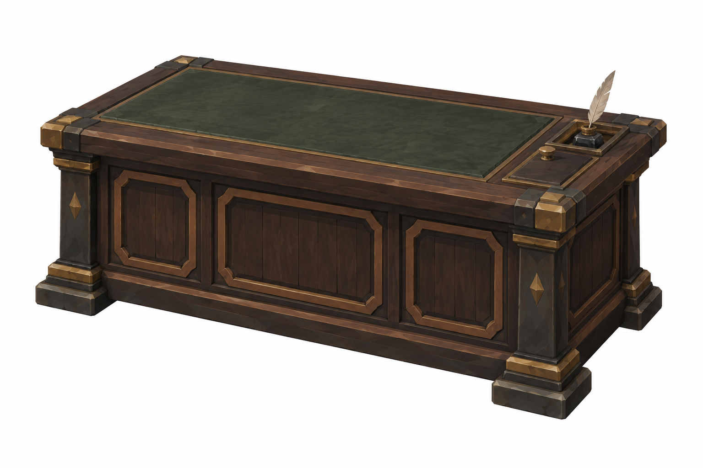
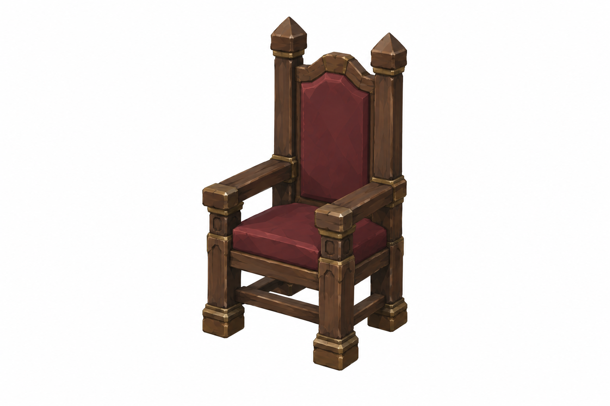
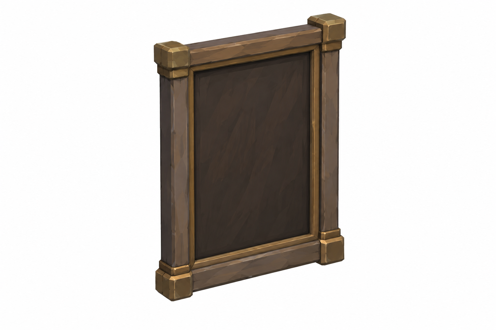
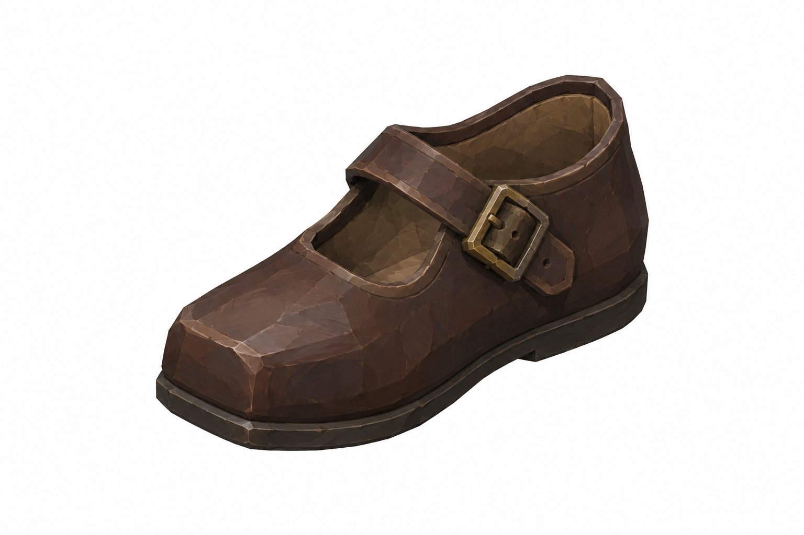

# BRAV-157 — User approved, Mustafa review pending

[Revision brief and dimensions](REVISION_SPEC.md)

[Manifest and QA history](GENERATION_MANIFEST.json)

## DonorPanel

2.3 ×0.2 ×3m;3panels6.9m

## DonorPlaque

0.5 ×0.05 ×0.3m

## HalfPlaque

0.5 ×0.05 ×0.3m; halfcut

## LedgerDesk

1.2 ×0.7 ×1.1m

## GreatLedger

0.6 ×0.45 ×0.1m

## BenefactorDesk

1.8 ×0.9 ×0.8m

## HighChair

0.7 ×0.7 ×1.4m;seat0.45

## PortraitFrame

Study0.9 ×0.08 ×1.2; Founder×2

## ChildShoe

L≈0.15m

## Reused references

[MerchantMark_PRESERVED_v002.png](MerchantMark_PRESERVED_v002.png) — APPROVED_PRESERVED 

[FounderPlaque_REUSE_geometryx2_v001.png](FounderPlaque_REUSE_geometryx2_v001.png) — DRAFT_REUSE_SCALE_VARIANT 1.0 W ×0.10 D ×0.6 H m; donorplaque geometry uniform ×2, top-centre; exact mesh fit pending

