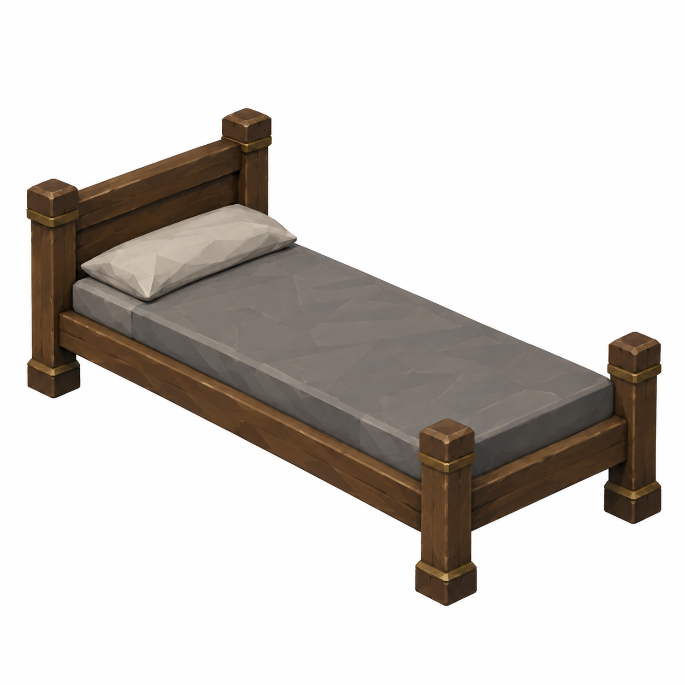
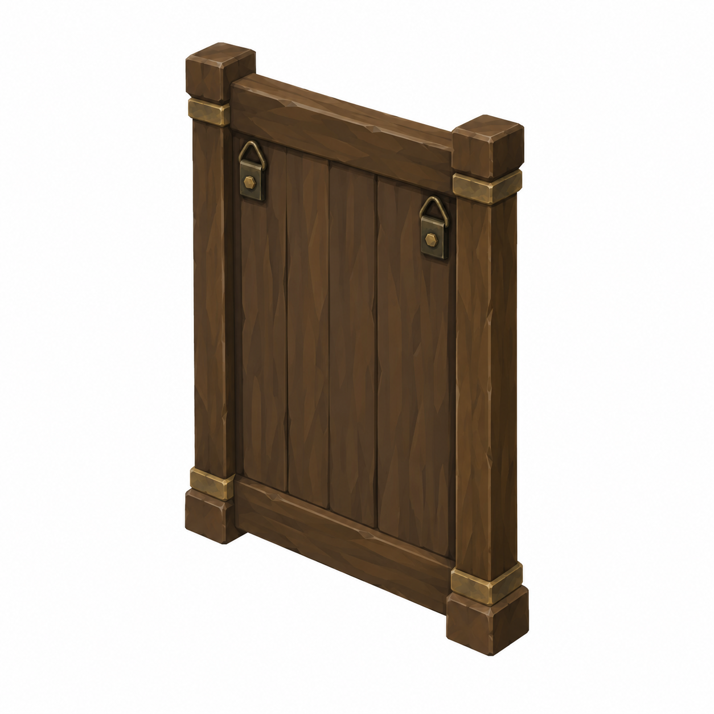
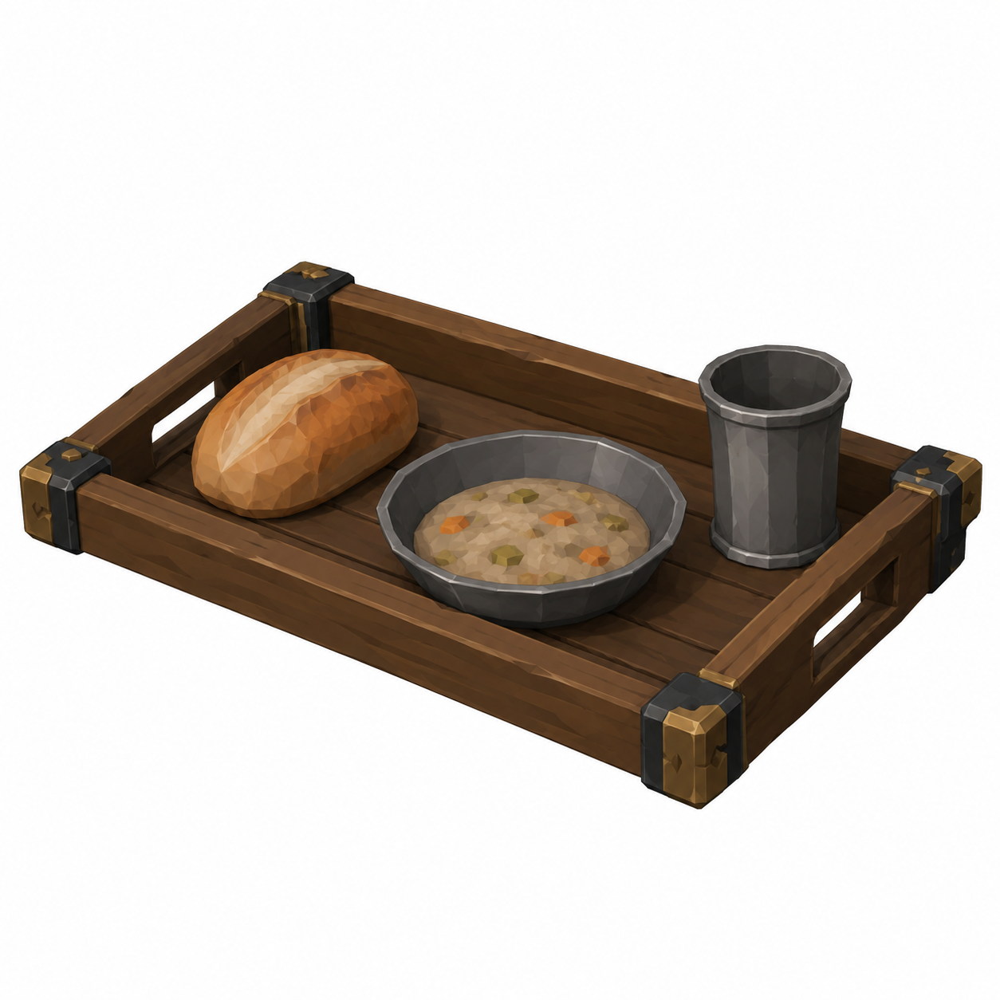
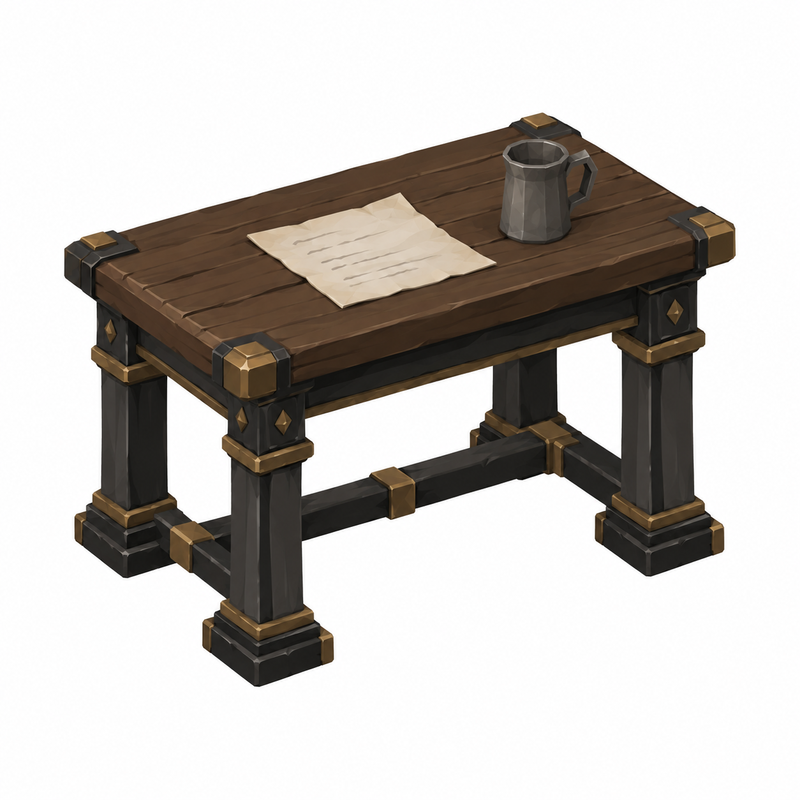

# BRAV-158 — User approved, Mustafa review pending

[Revision brief and dimensions](REVISION_SPEC.md)

[Manifest and QA history](GENERATION_MANIFEST.json)

## NurseCot

1.90 ×0.70m; mattress top0.45

## WallMirror

0.60 ×0.90m; frontturnedaway

## UntouchedMealTray

0.45 ×0.30m tray; heightunspecified

## LetterAndColdCup

table0.80 ×0.50 ×0.75m; letter/coldcup

