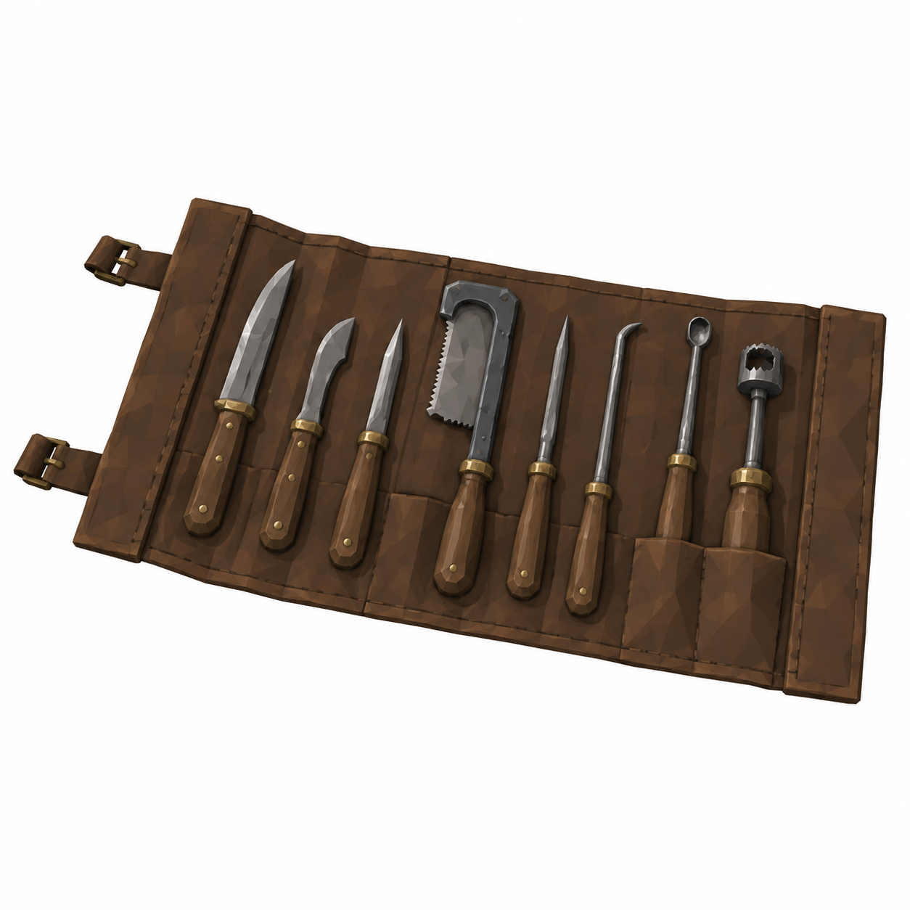
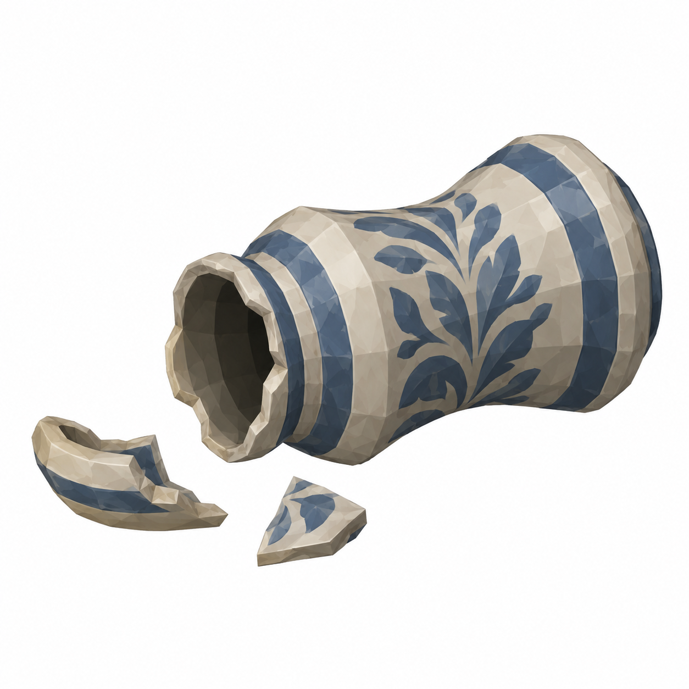

# BRAV-330 — User approved, Mustafa review pending

[Revision brief and dimensions](REVISION_SPEC.md)

[Manifest and QA history](GENERATION_MANIFEST.json)

## BalanceAssembly

0.40 ×0.20 ×0.50m; panØ0.14

## InstrumentRollOpen

0.60 ×0.30 ×0.04m open

## BrokenToppledJar

Mjar uprightH0.25/Ø0.15; toppledstate

