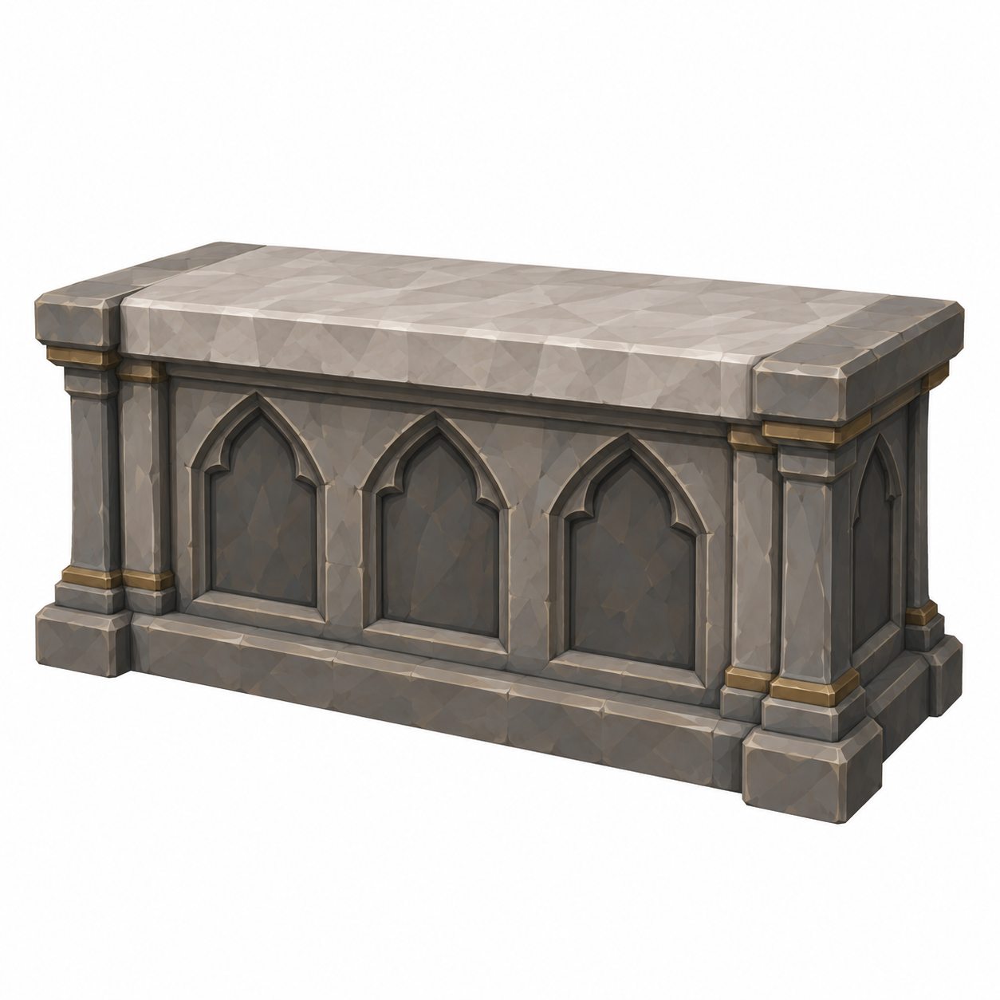
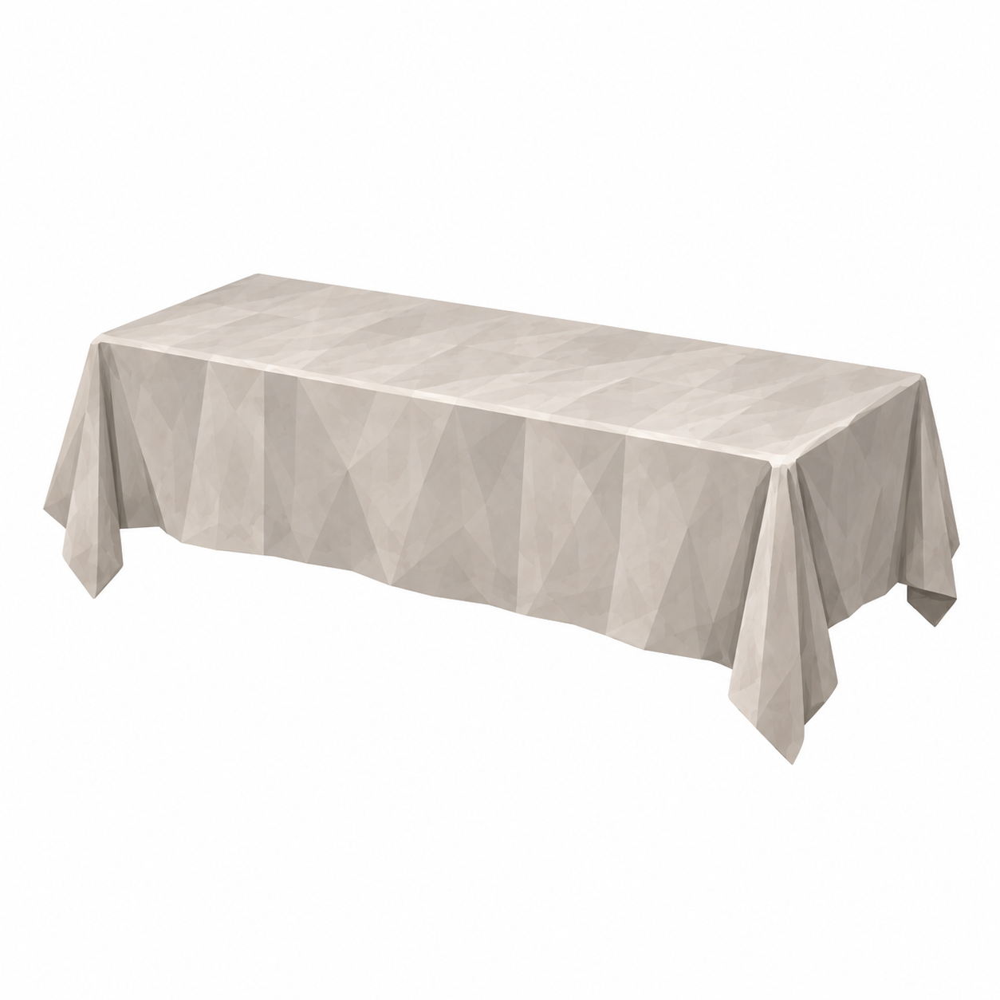
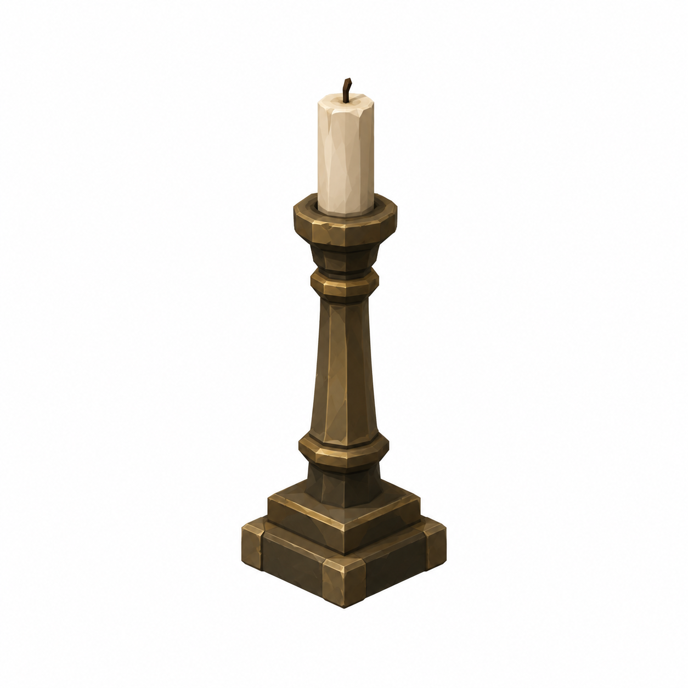
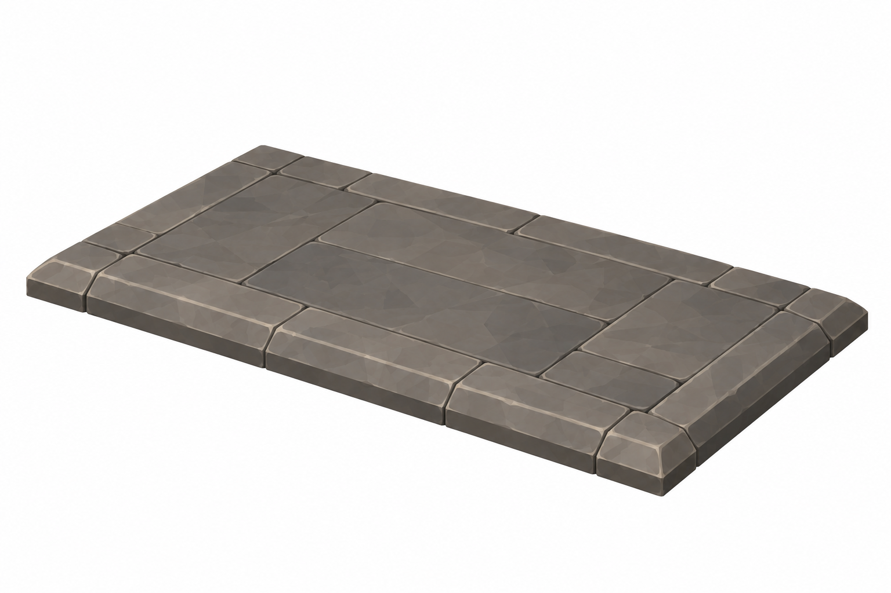

# BRAV-332 — User approved, Mustafa review pending

[Revision brief and dimensions](REVISION_SPEC.md)

[Manifest and QA history](GENERATION_MANIFEST.json)

## AltarBlock

2.00 ×0.90 ×1.00m

## AltarCloth

top2.10 ×1.00m; frontdrop0.60/sides0.30

## Candlestick

baseØ0.18 ×H0.50m

## PredellaStep

3.00 ×1.80 ×0.15m

