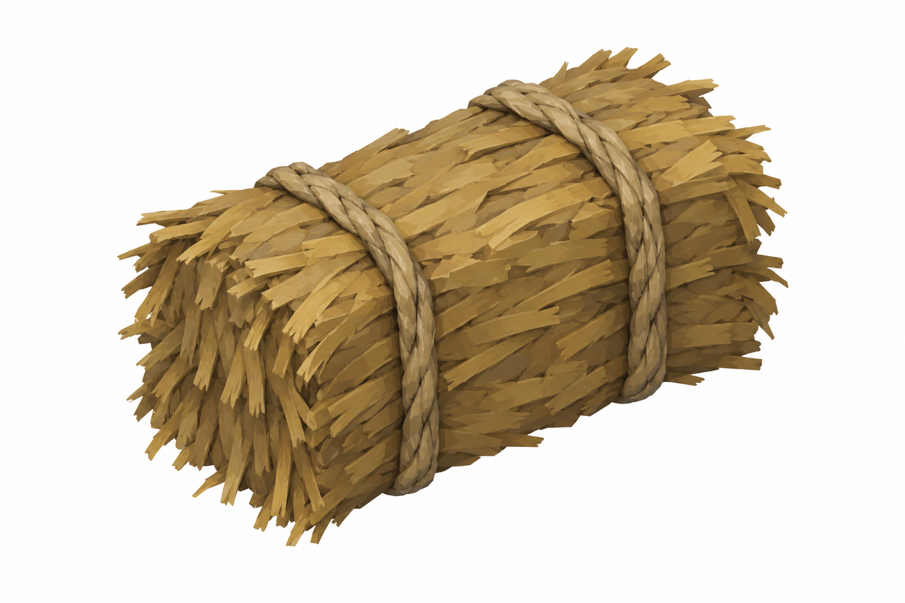
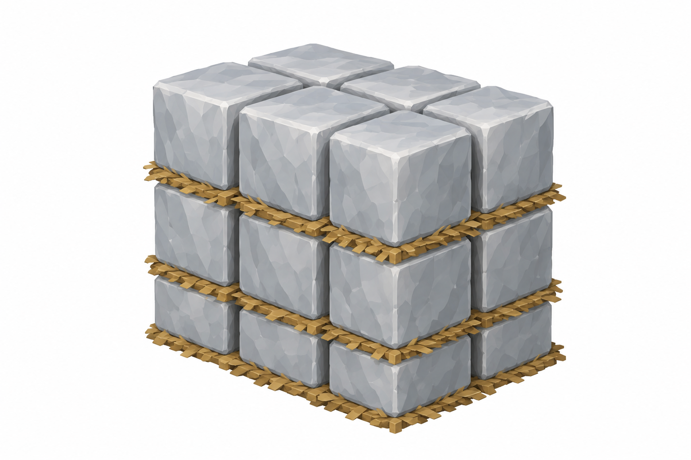
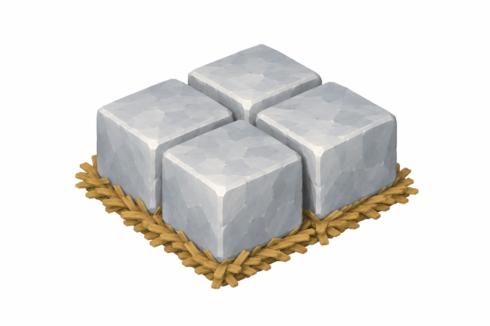
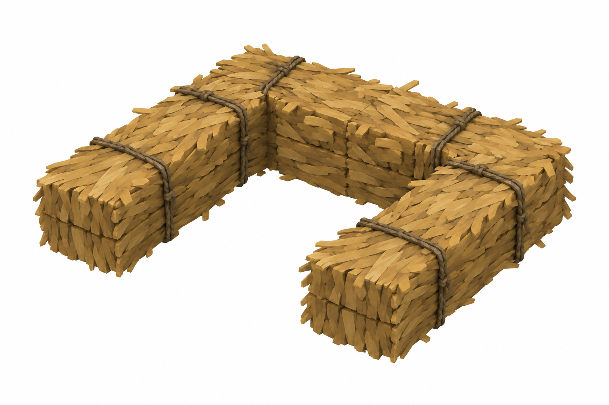
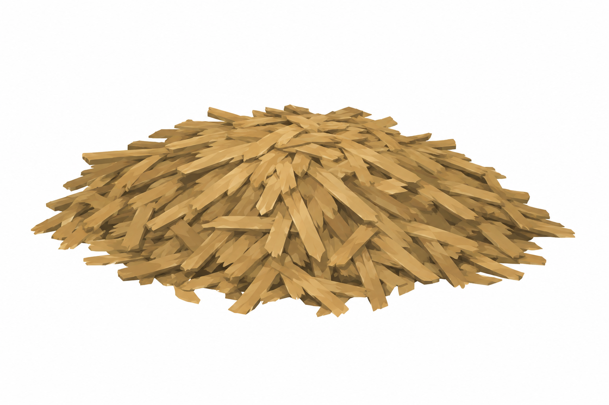
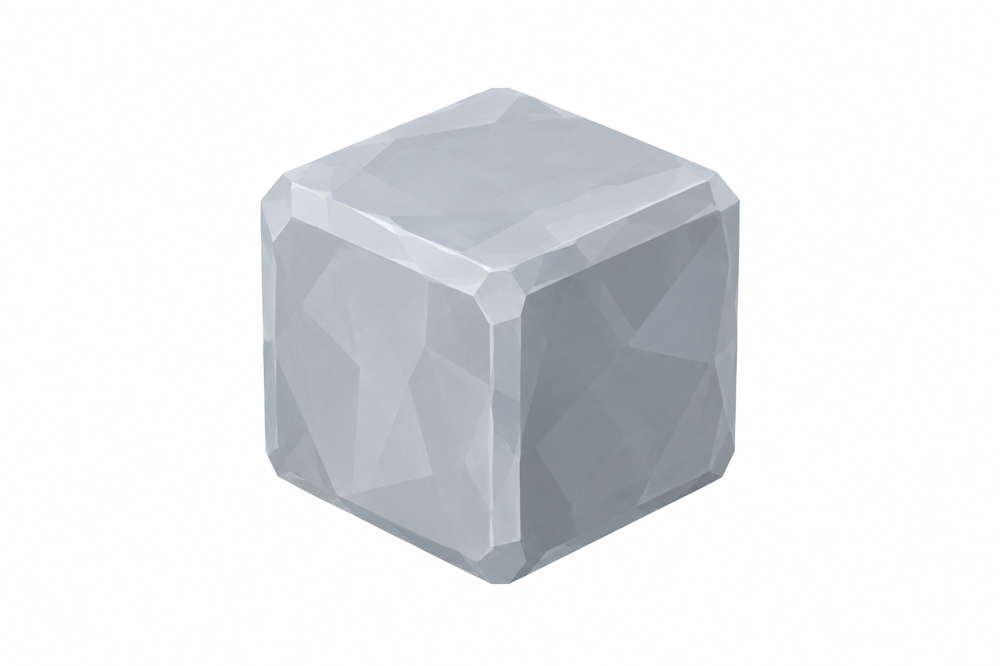

# BRAV-333 — User approved, Mustafa review pending

[Revision brief and dimensions](REVISION_SPEC.md)

[Manifest and QA history](GENERATION_MANIFEST.json)

## StrawTruss

1 ×0.5 ×0.45m

## TallIceStack

1.5 ×1 ×1.6m

## LowIceStack

1 ×1 ×0.6m

## StrawNest

1.4 ×1 ×0.35m

## LooseStraw

1.2 ×0.9 ×0.3m

## IceBlock

0.5m cube

