# BRAV-334 — User approved, Mustafa review pending

[Revision brief and dimensions](REVISION_SPEC.md)

[Manifest and QA history](GENERATION_MANIFEST.json)

## BRAV-334_Cypress_45_DRAFT_v002.png

See measured brief

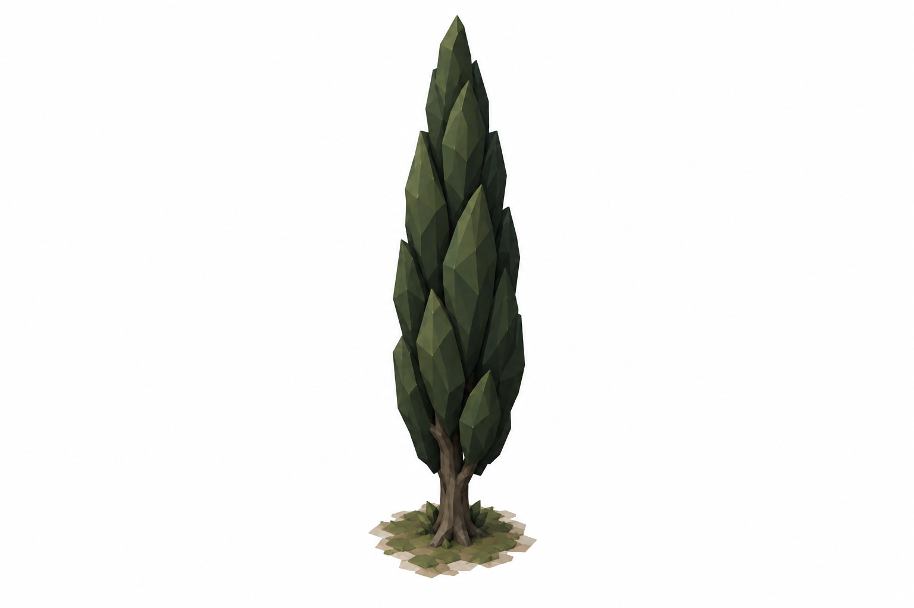

## BRAV-334_BroadTree_45_DRAFT_v002.png

See measured brief

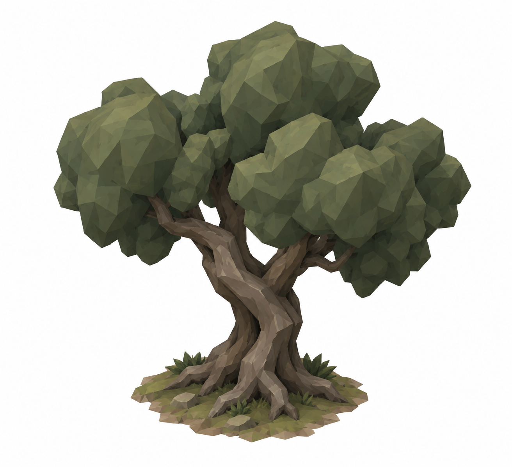

## BRAV-334_HedgeStraight_45_DRAFT_v002.png

See measured brief

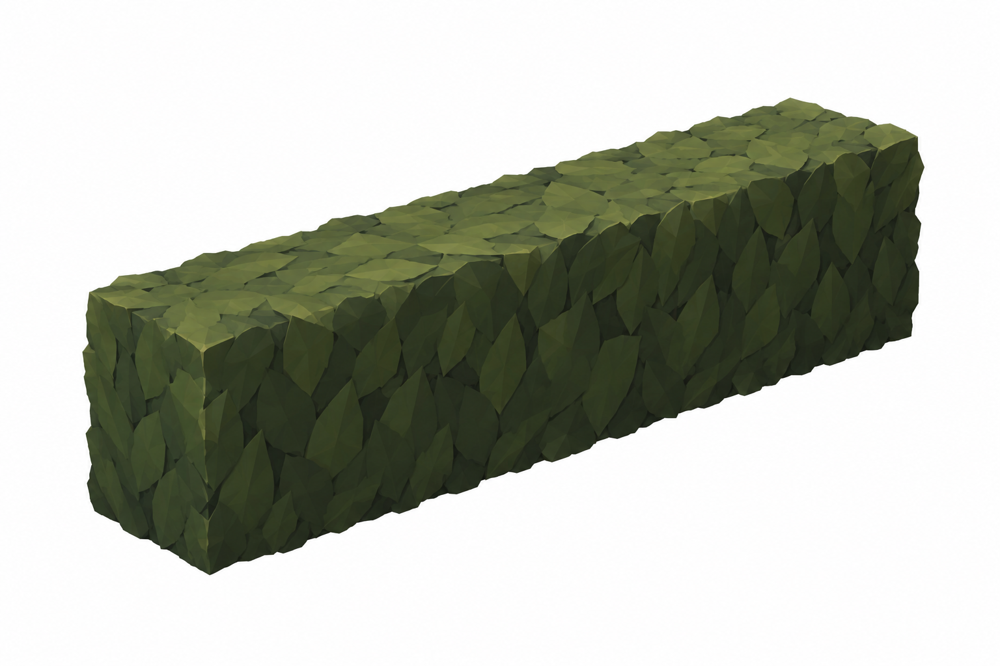

## BRAV-334_HedgeCorner_45_DRAFT_v002.png

See measured brief

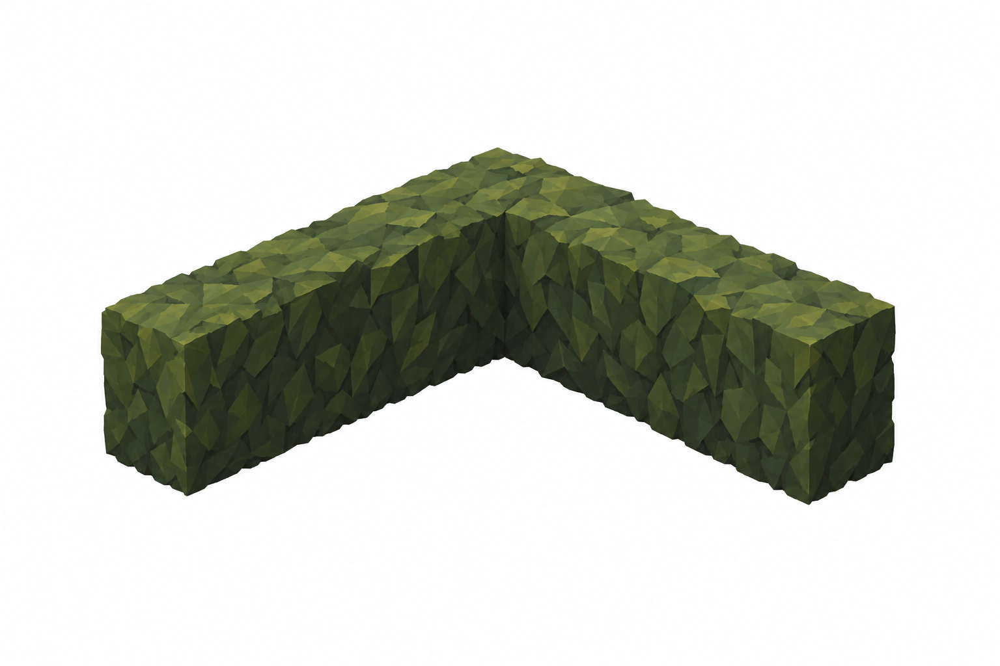

## BRAV-334_HerbBed_45_DRAFT_v002.png

See measured brief

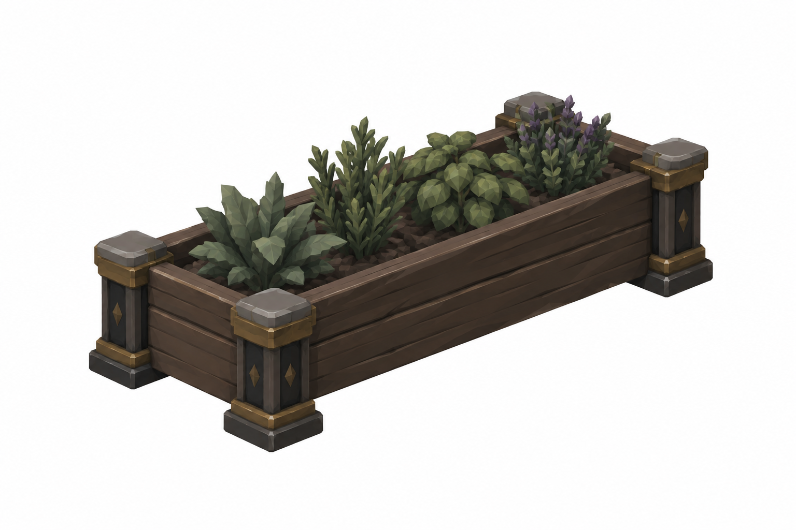

## BRAV-334_Well_45_DRAFT_v002.png

See measured brief

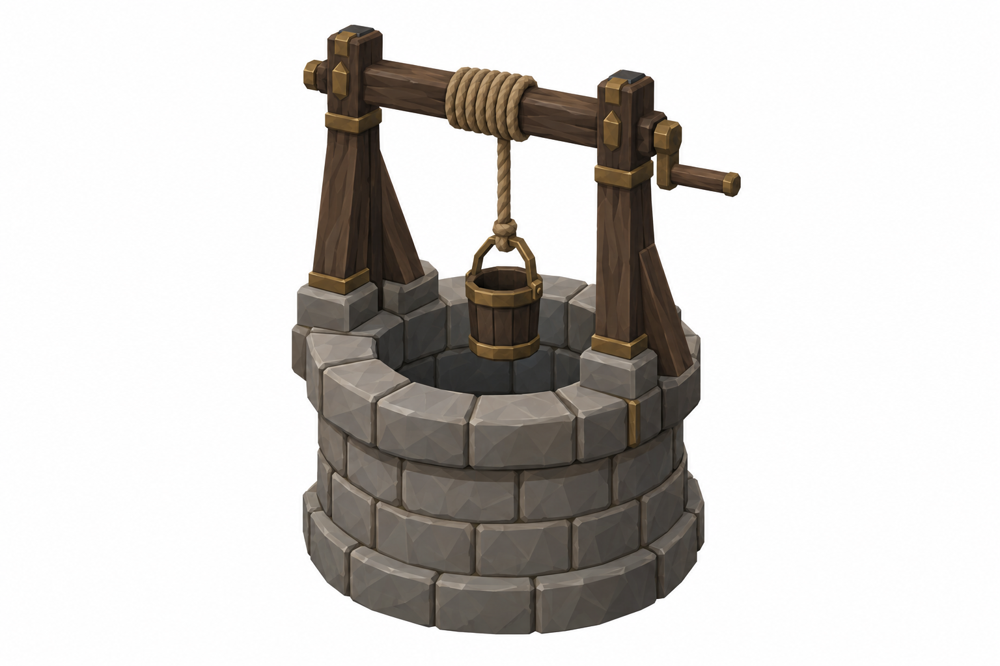

## BRAV-334_TimberStake_45_DRAFT_v002.png

See measured brief

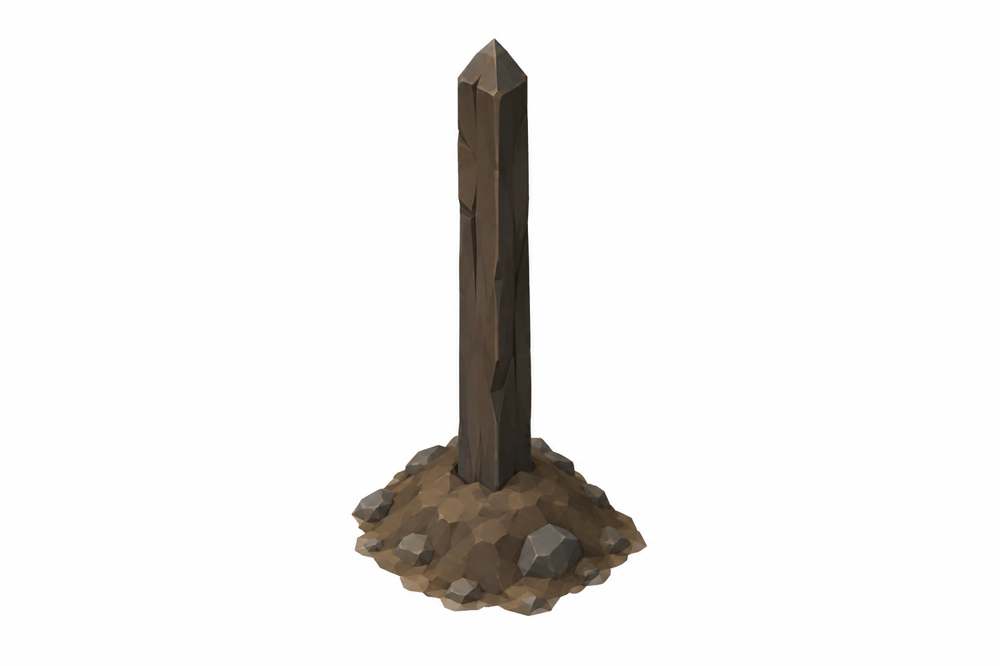

## BRAV-334_StoneMarker_45_DRAFT_v003.png

See measured brief

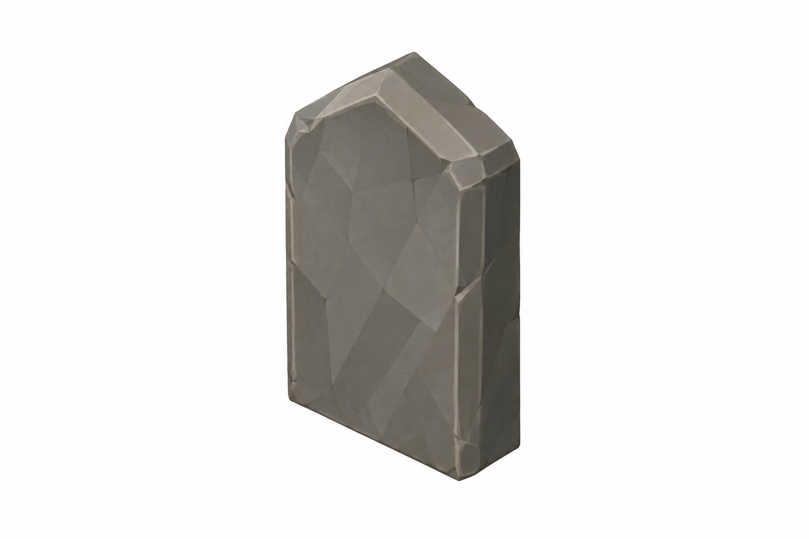

## BRAV-334_GraveMound_45_DRAFT_v002.png

See measured brief

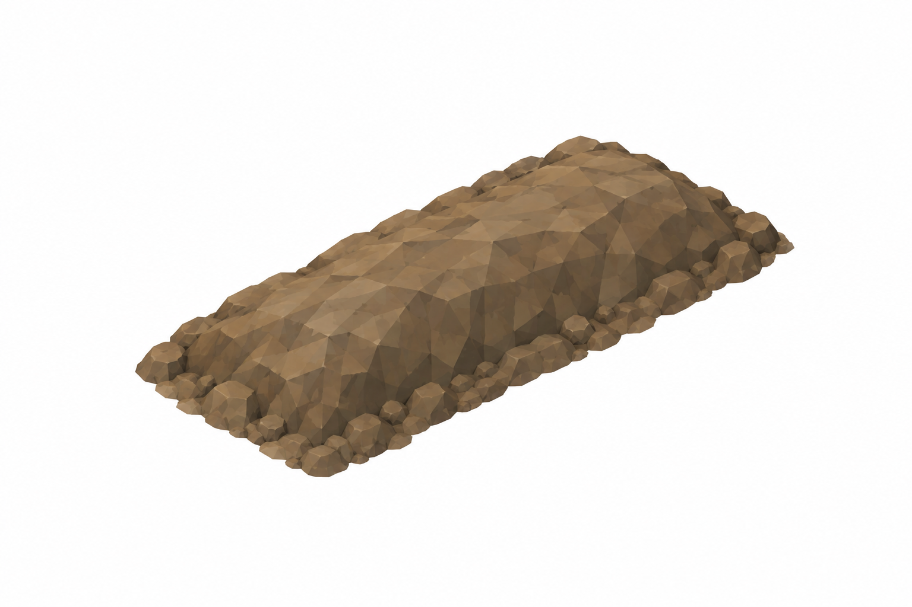

## BRAV-334_PitEdgeStraight_45_DRAFT_v003.png

See measured brief

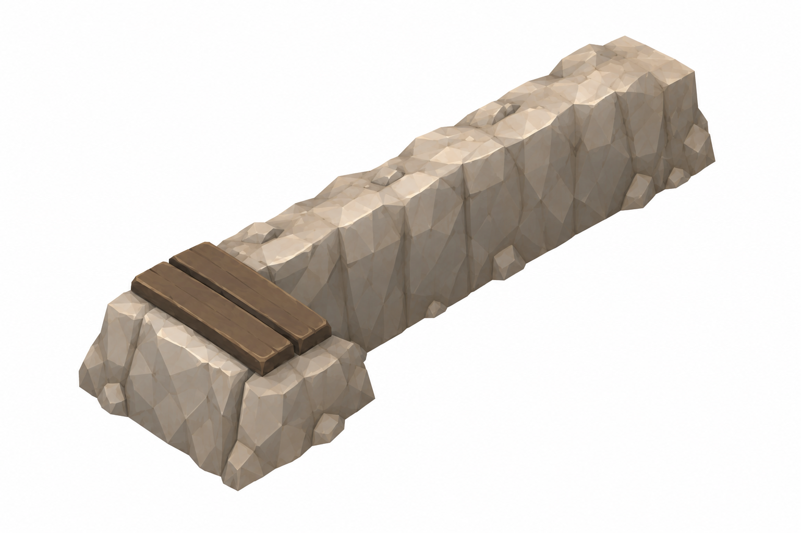

## BRAV-334_PitCorner_45_DRAFT_v002.png

See measured brief

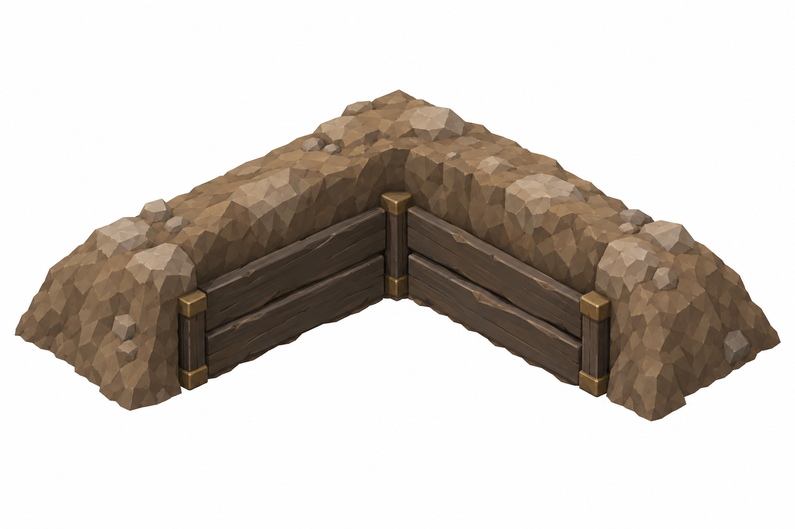

