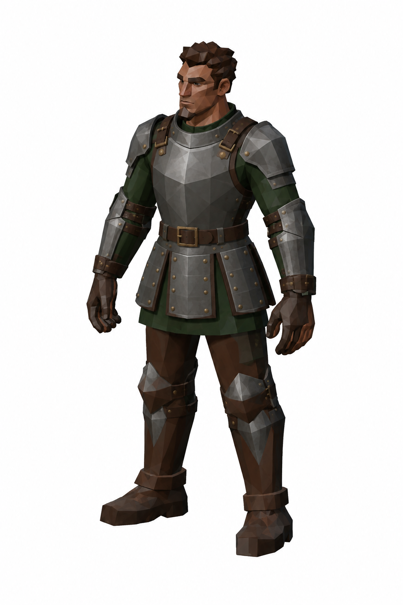
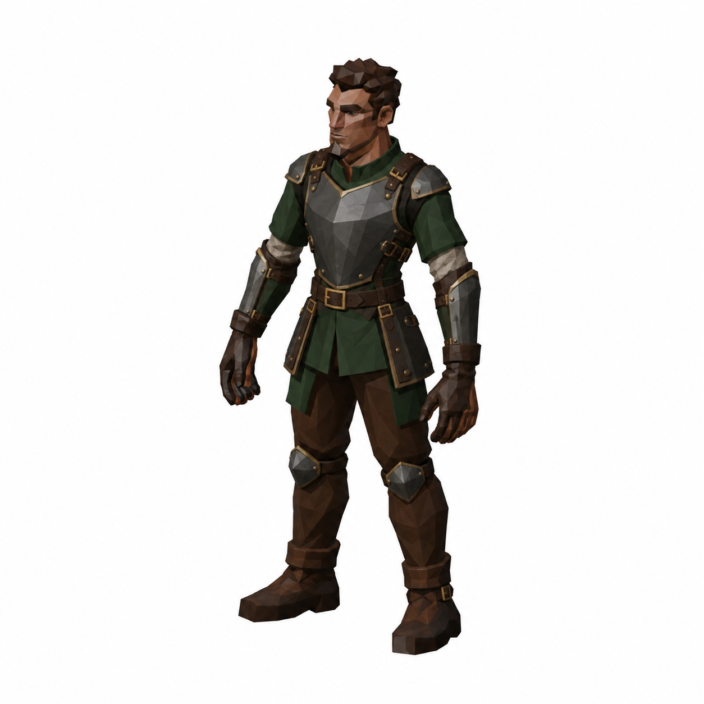
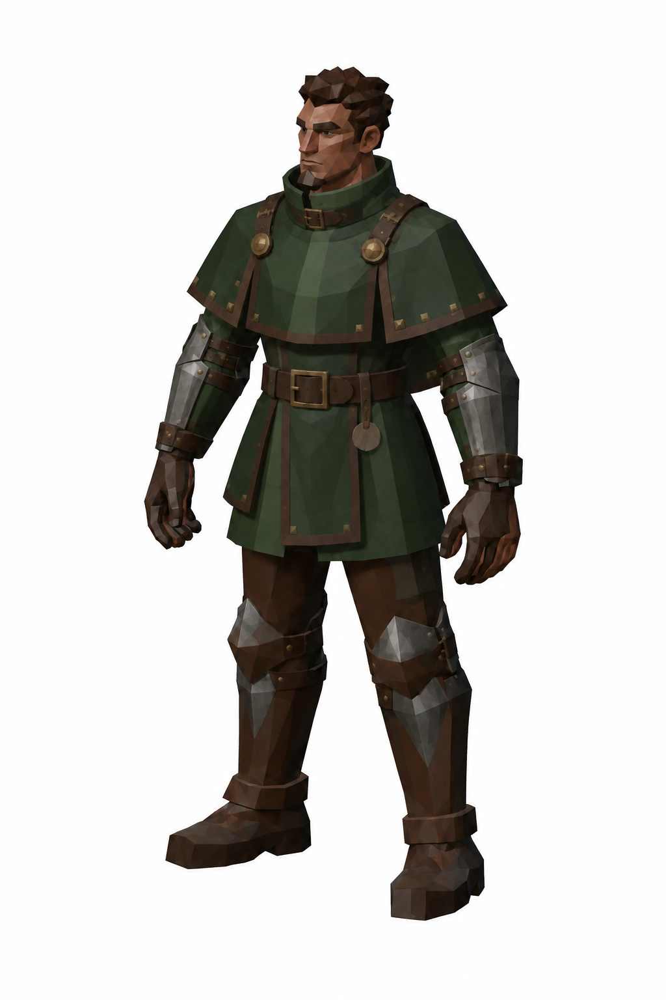
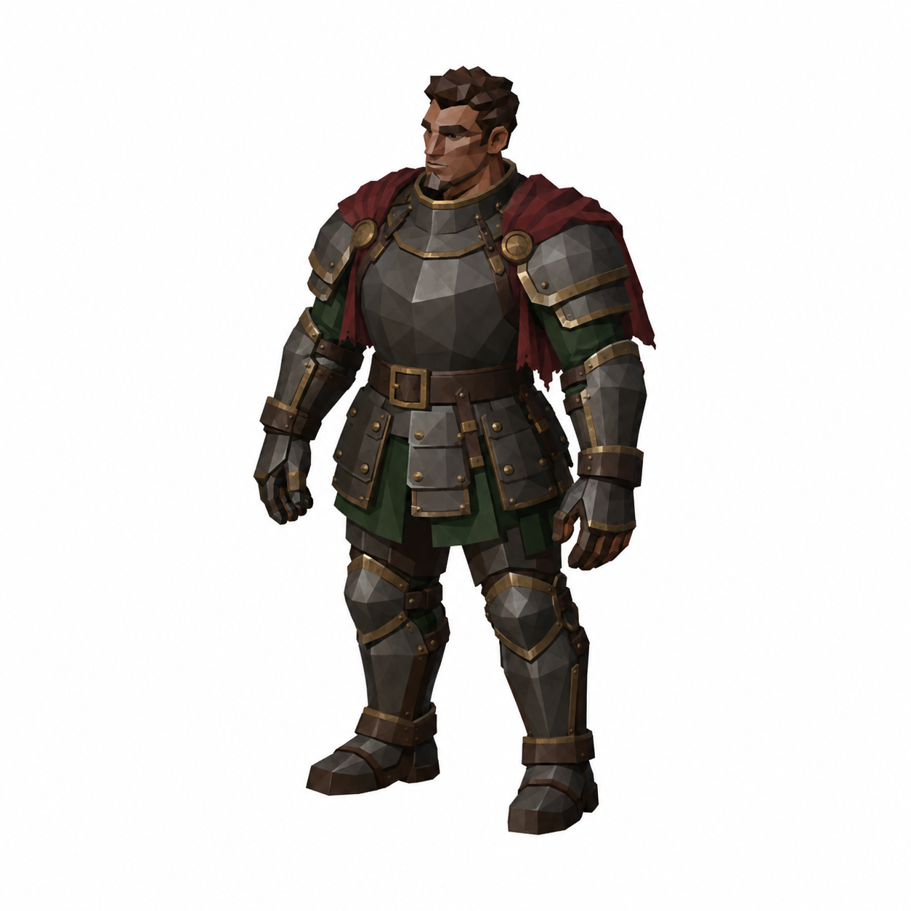
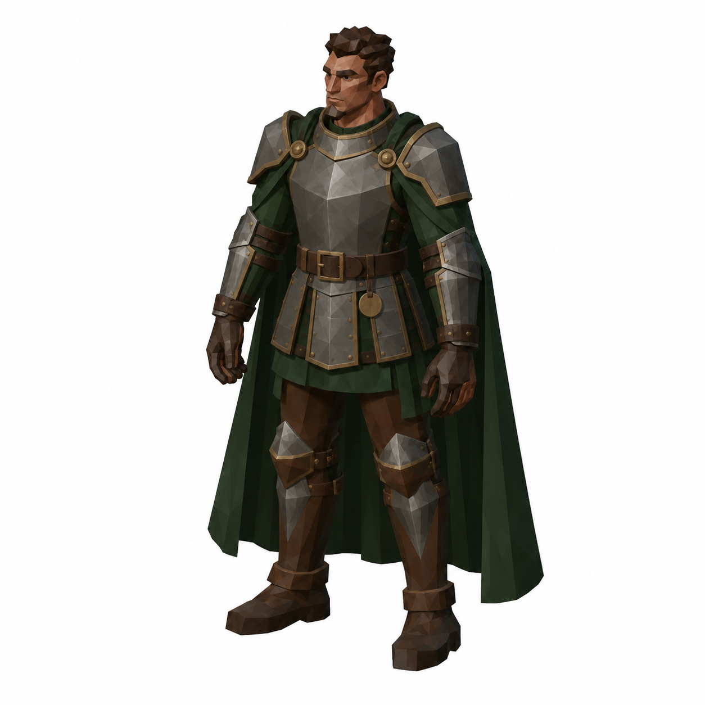

# BRAV-353 — Lazzaretto Knight armor set — 5 distinct silhouettes

User approved: 2026-10-05. Awaiting Mustafa design approval.

[Asset dimensions](../ASSET_SHEETS.md) · [Visual QA](../QA_NOTES.md)

## A01 — Warden Harness

Target: Knight1.59m F, shoulders0.59m P, belt0.89m F

## A02 — Surgical Duelist Harness

Target: body1.59m F, shoulders0.54m P, belt0.89m F

## A03 — Fumigator Mantle

Target: body1.59m F, shoulders0.62m P, mantle endsabovehip0.95m P, belt0.89m F

## A04 — Mortuary Plate

Target: body1.59m F, shoulders0.64m maxF, shortmantle endsatbelt0.89m, belt0.89m F

## A05 — Last Warden Plate

Target: body1.59m F SAMEunchangedbody, shoulders0.64m maxF, capeends0.15mabovefloor P, belt0.89m F

