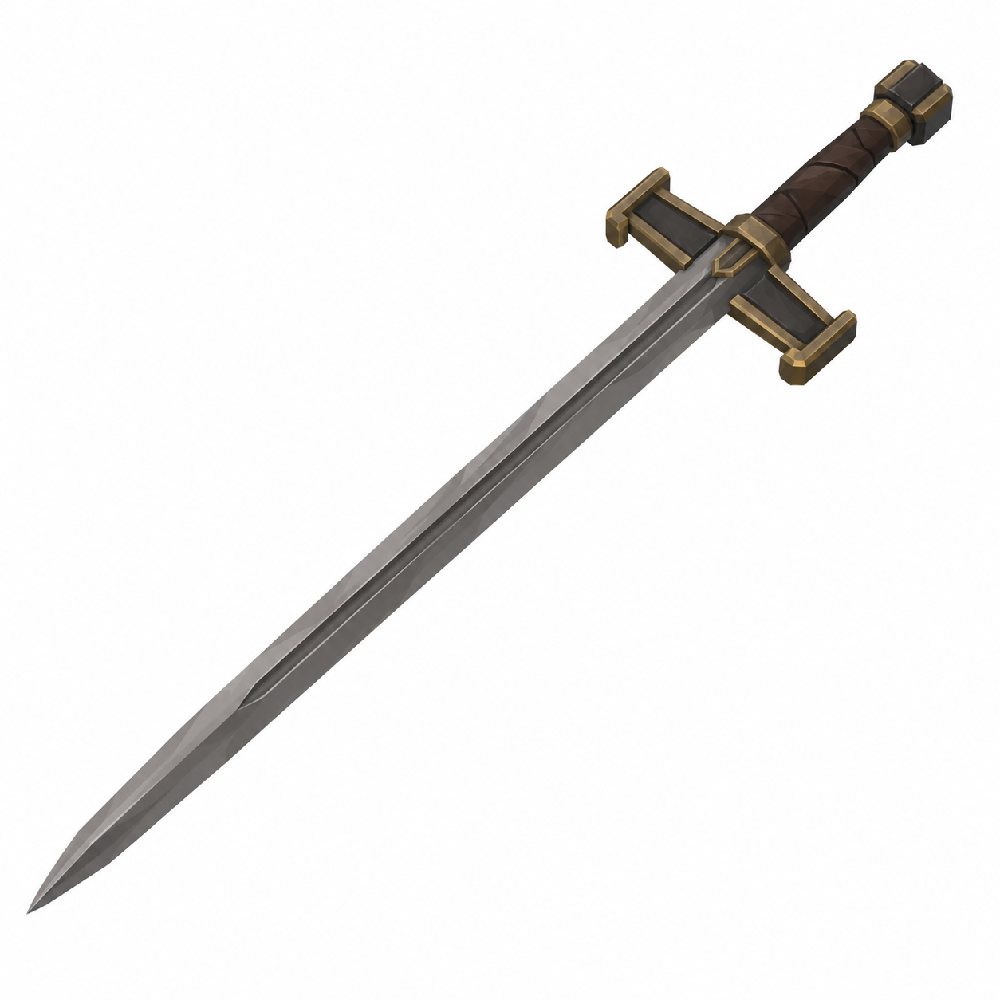
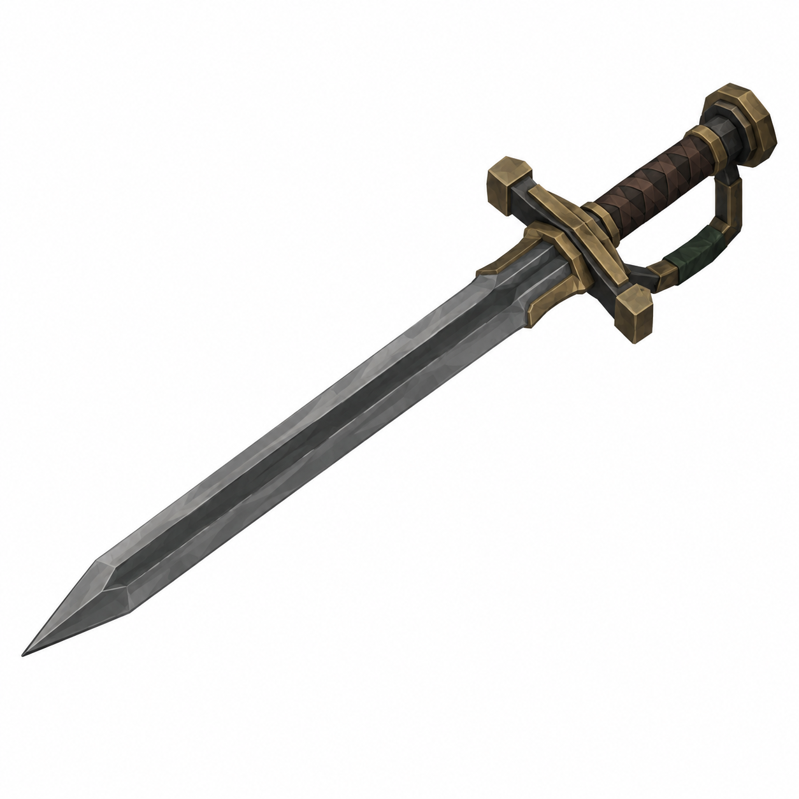
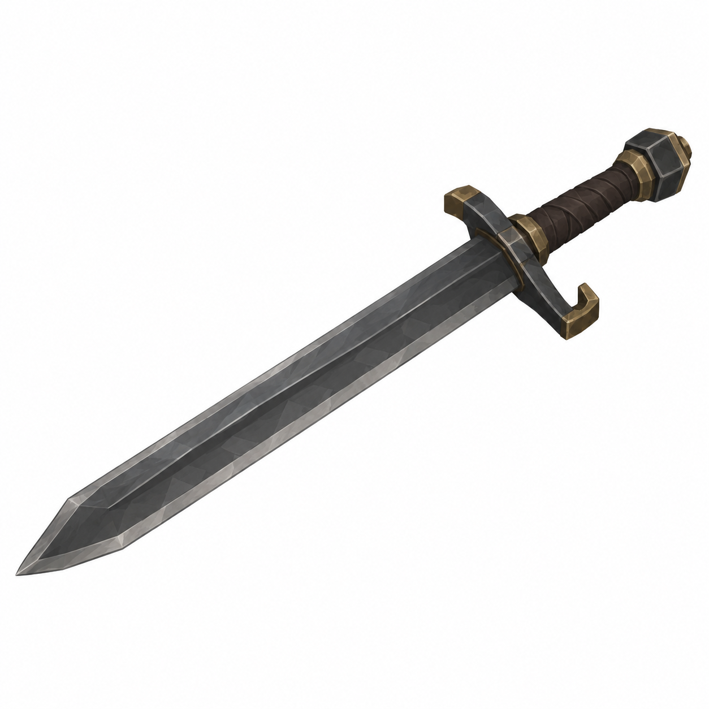
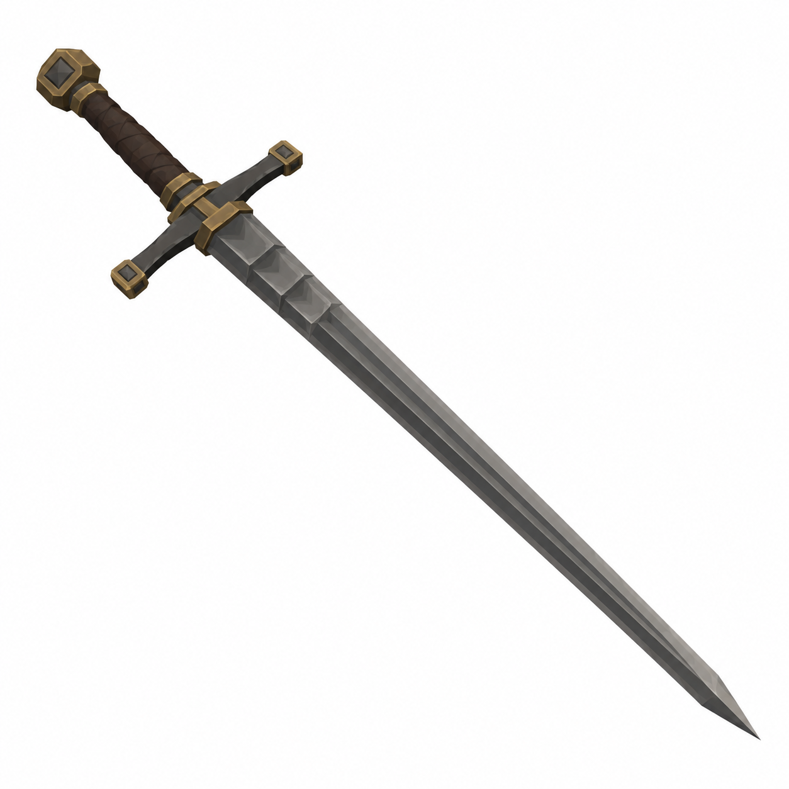

# BRAV-354 — Lazzaretto Knight longswords — 4 concept designs

User approved: 2026-10-05. Awaiting Mustafa design approval.

[Asset dimensions](../ASSET_SHEETS.md) · [Visual QA](../QA_NOTES.md)

## W01 — Quarantine Longsword

Target: totalL1.05m P, blade0.80m P, guardW0.20m P

## W02 — The Sealed Passage

Target: totalL1.05m P, blade0.79m P, guardW0.22m P

## W03 — Porter's Blade

Target: totalL1.00m P, blade0.75m P, guardW0.18m P

## W04 — Forty-Day Oath

Target: totalL1.10m P, blade0.83m P, guardW0.22m P

