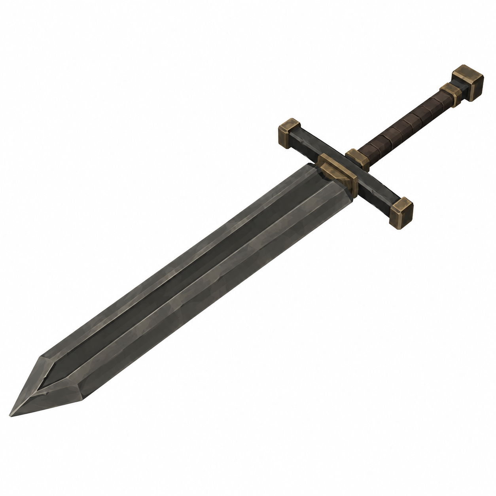
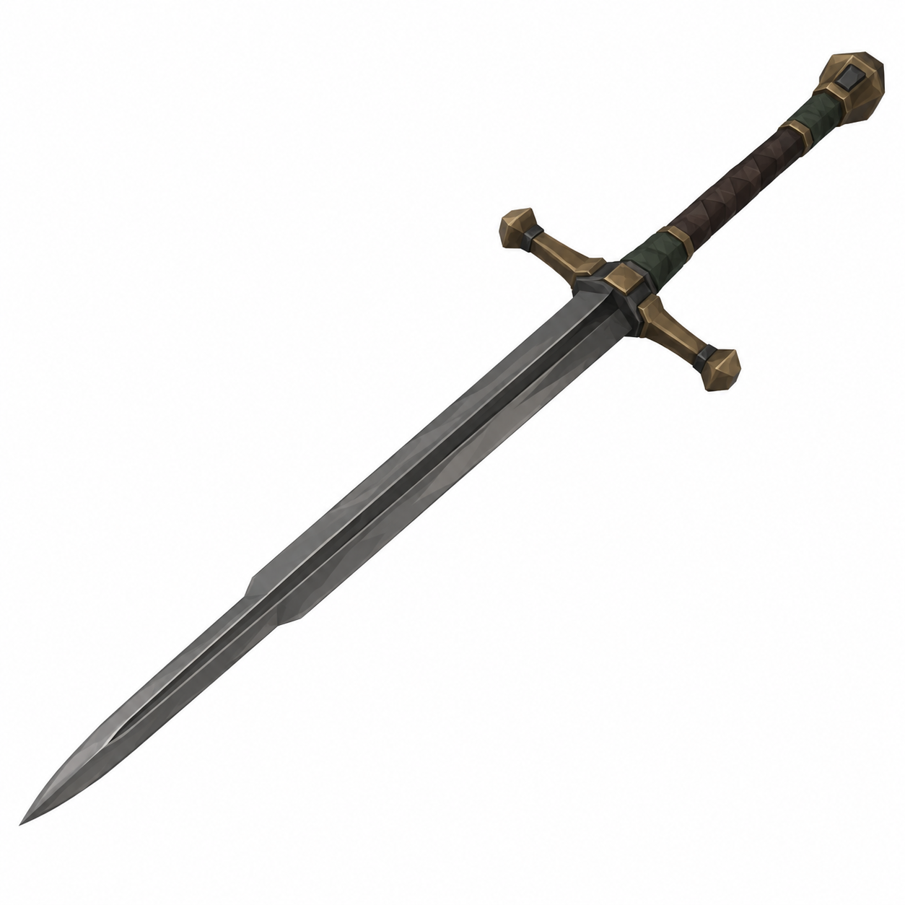
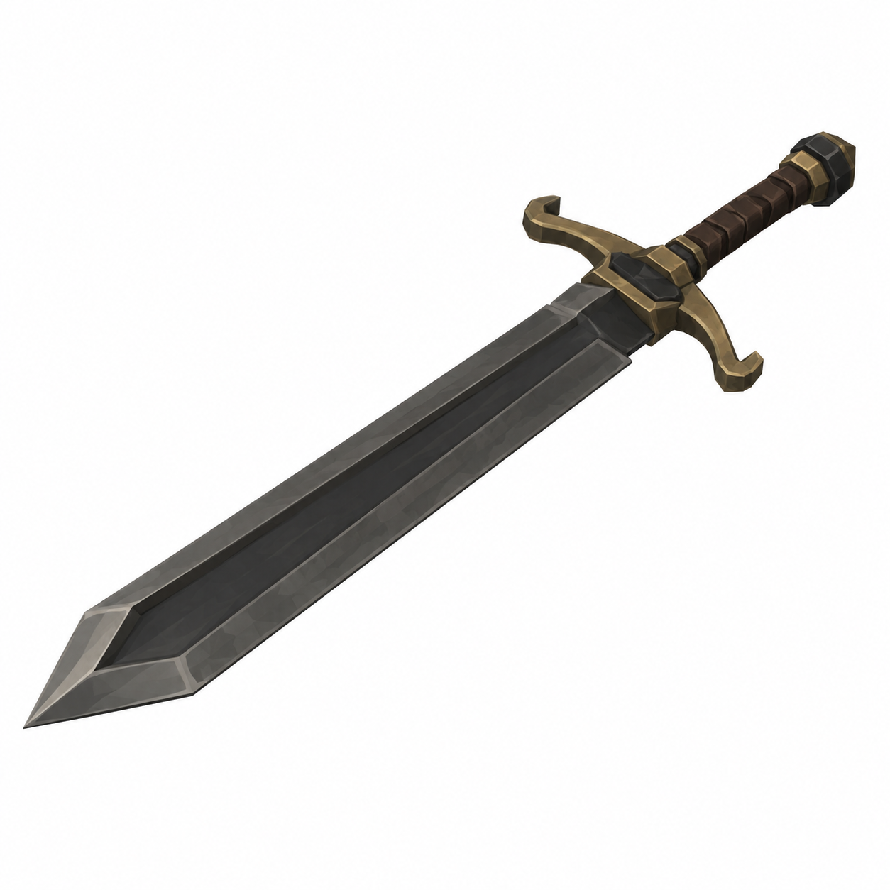

# BRAV-355 — Lazzaretto Knight greatswords — 3 concept designs

User approved: 2026-10-05. Awaiting Mustafa design approval.

[Asset dimensions](../ASSET_SHEETS.md) · [Visual QA](../QA_NOTES.md)

## W05 — Mortuary Greatsword

Target: totalL1.35m P, blade1.00m P, twohandgrip0.25m P, guard0.27m P

## W06 — The Second Cut

Target: totalL1.40m P, blade1.04m P, twohandgrip0.26m P, guard0.28m P

## W07 — The Last Cart

Target: totalL1.40m P, blade1.02m P, twohandgrip0.28m P, guard0.27m P

