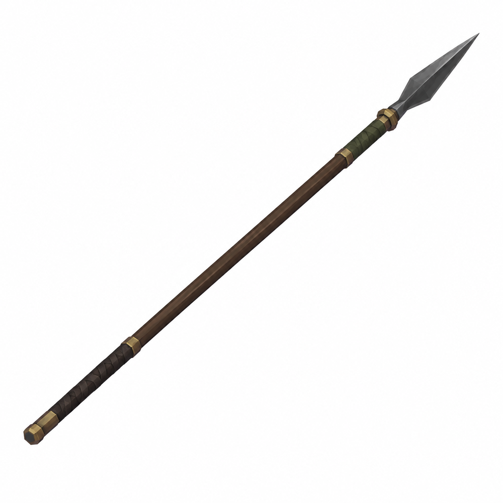
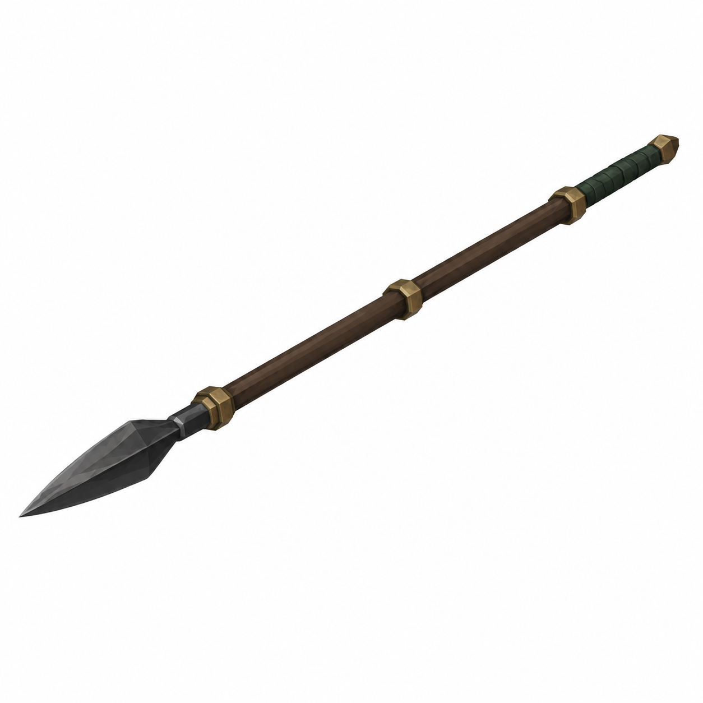
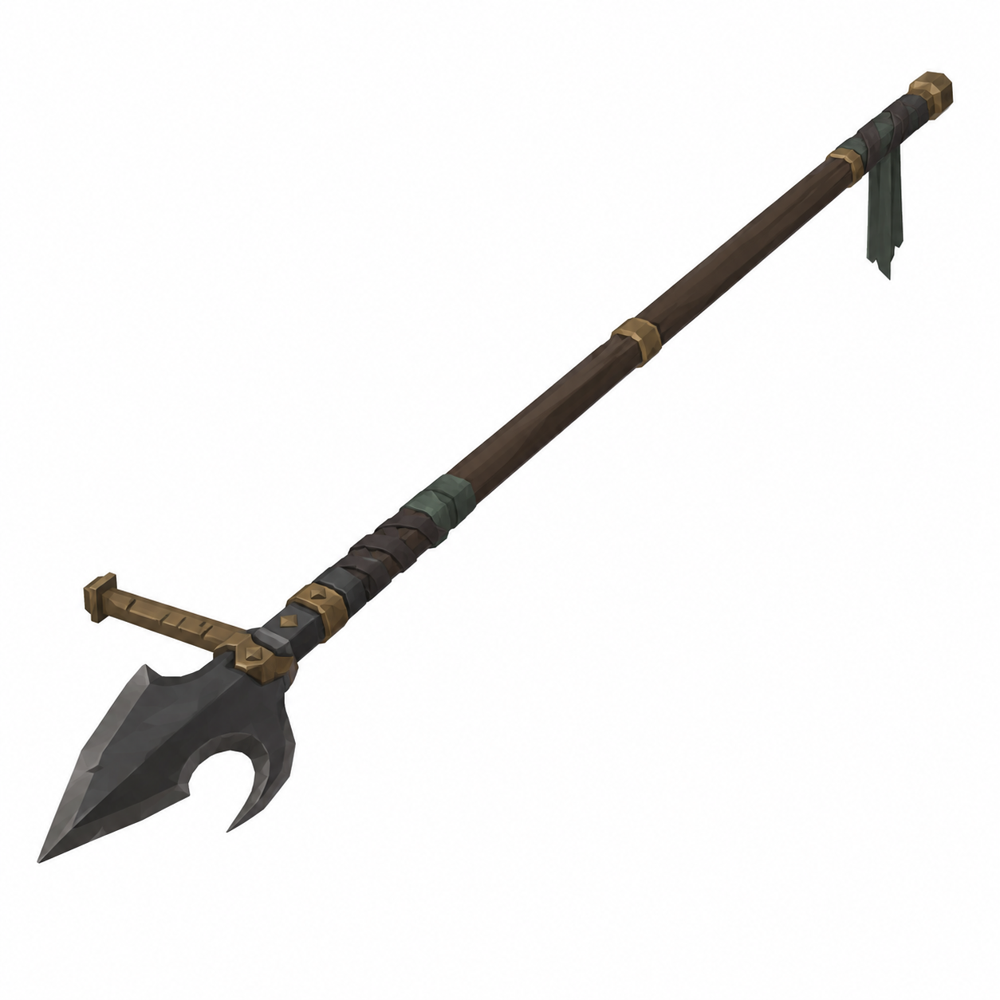

# BRAV-356 — Lazzaretto Knight spears & polearms — 3 concept designs

User approved: 2026-10-05. Awaiting Mustafa design approval.

[Asset dimensions](../ASSET_SHEETS.md) · [Visual QA](../QA_NOTES.md)

## W08 — Inspection Pike

Target: totalL2.10m P, slimhead0.32m P, shaftdiameter0.032m P

## W09 — Distance Keeper

Target: totalL2.05m P, head0.35m P, shaftdiameter0.032m P

## W10 — Grave Measure

Target: totalL1.95m P, head0.40m P, shaftdiameter0.035m P

