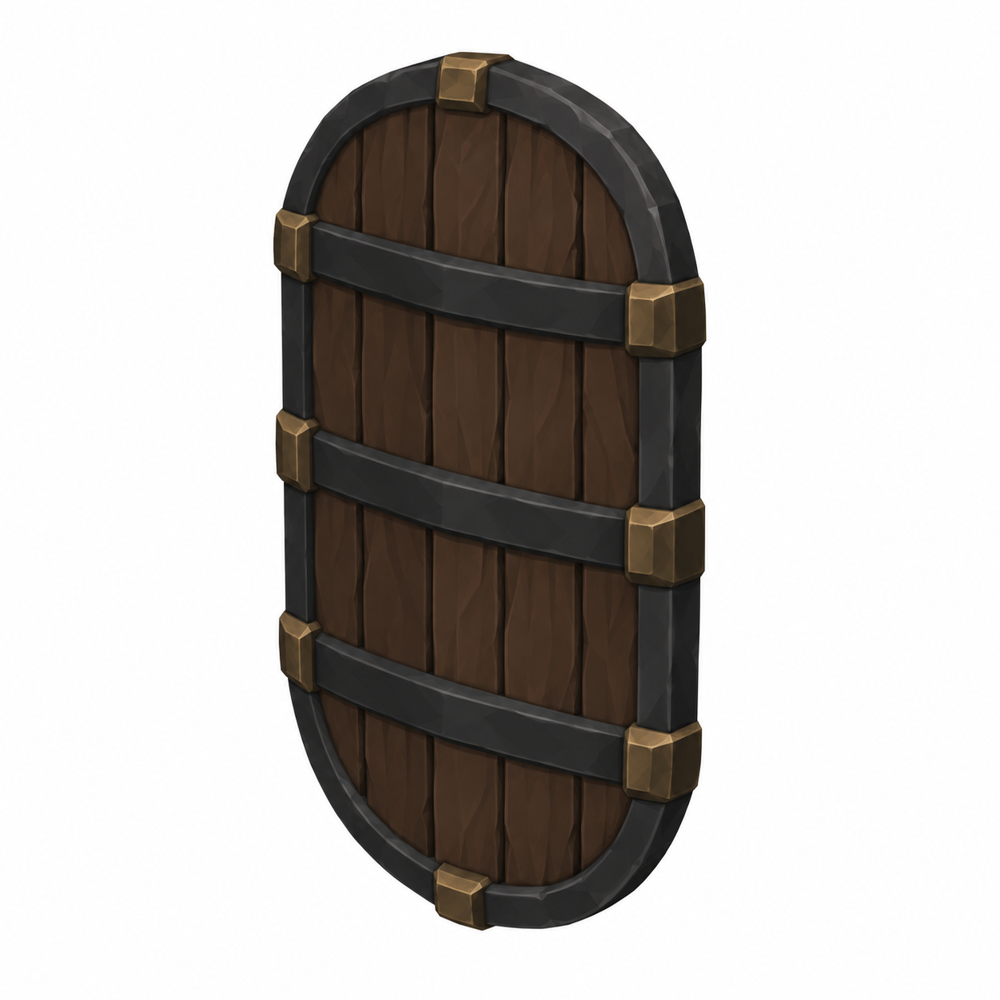
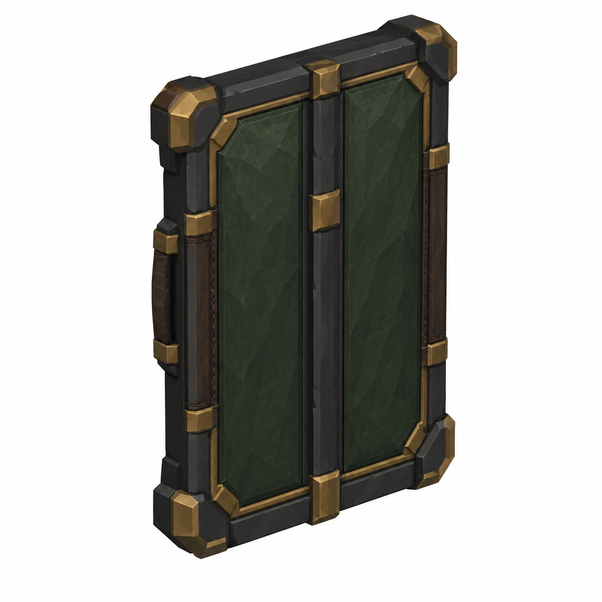
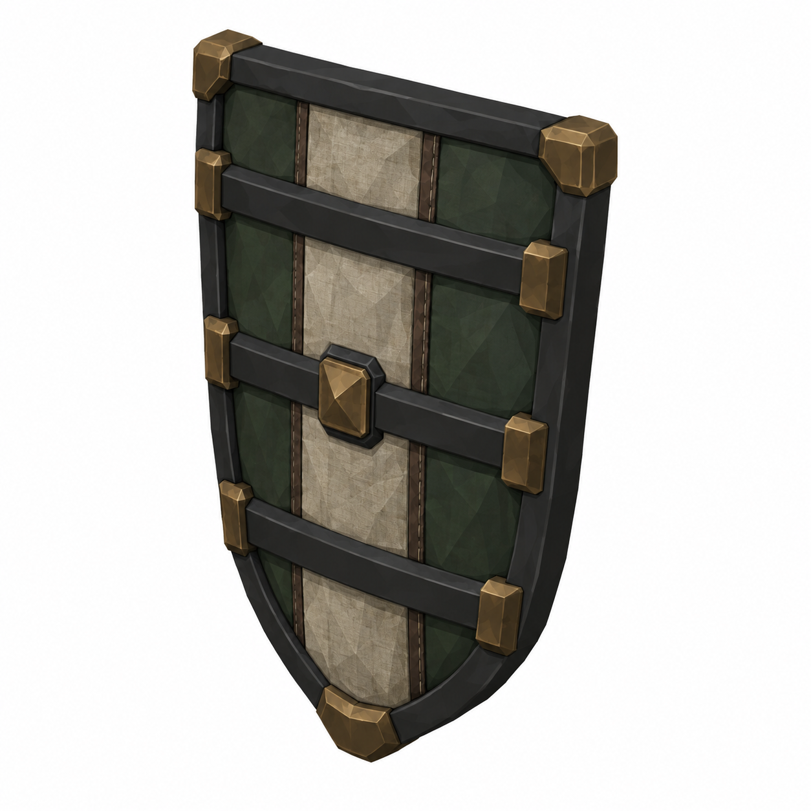
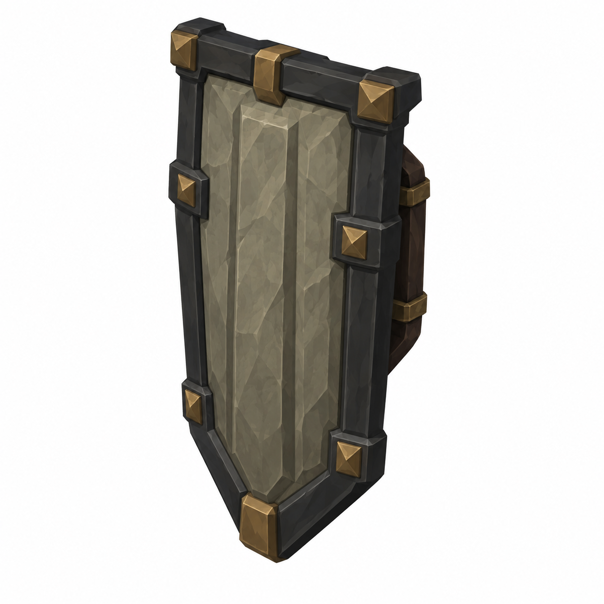

# BRAV-358 — Lazzaretto Knight shields — 4 concept designs

User approved: 2026-10-05. Awaiting Mustafa design approval.

[Asset dimensions](../ASSET_SHEETS.md) · [Visual QA](../QA_NOTES.md)

## S01 — Dock Warden Shield

Target: W0.48 D0.07 H0.64m P

## S02 — Closed Gate

Target: W0.52 D0.09 H0.76m P

## S03 — Theatre Guard

Target: W0.46 D0.07 H0.66m P

## S04 — Burial Door

Target: W0.54 D0.10 H0.84m P

