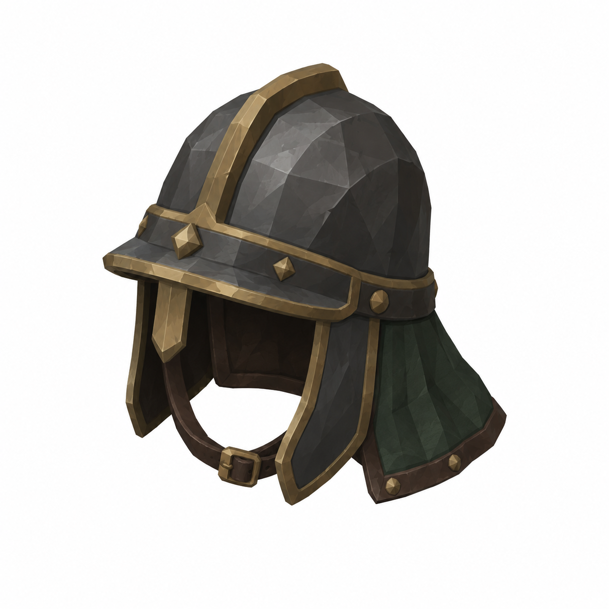
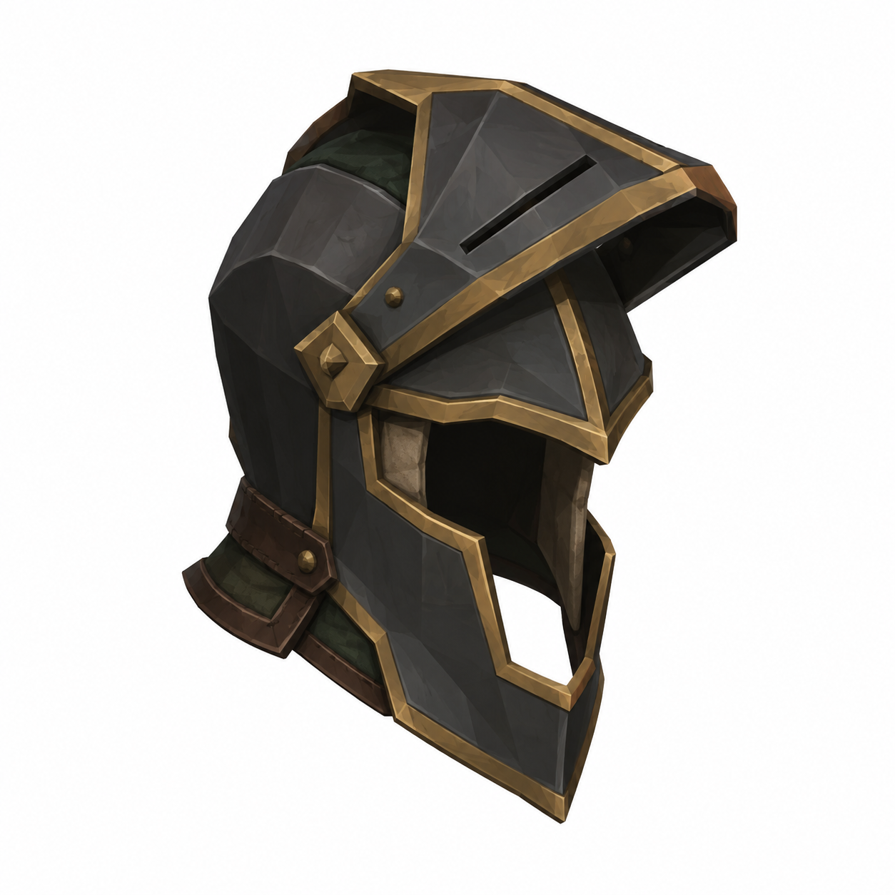
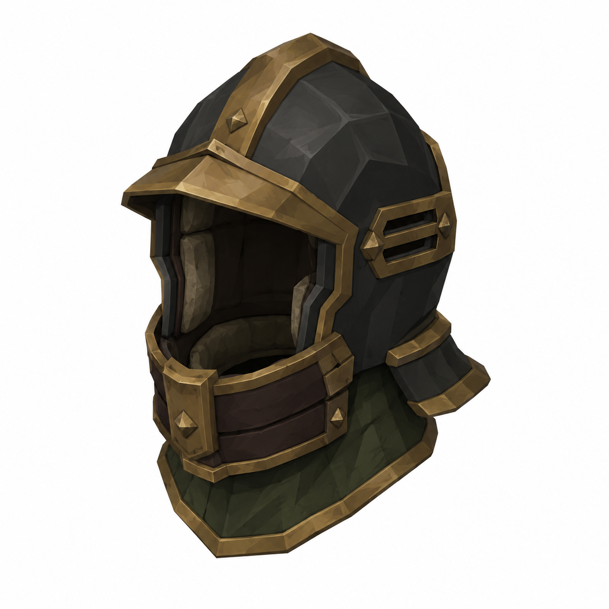
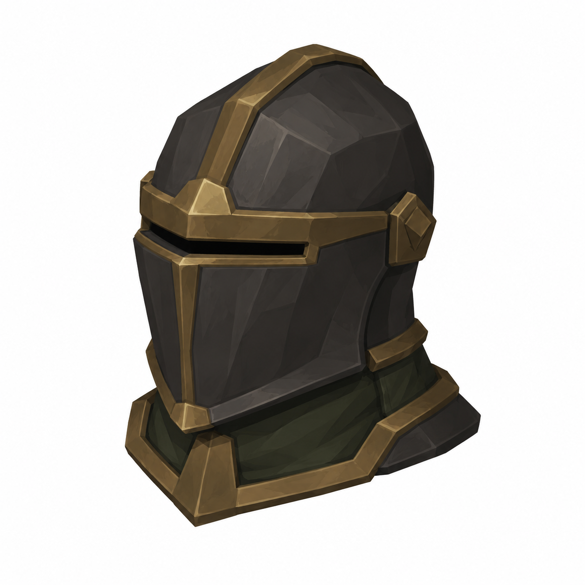

# BRAV-359 — Lazzaretto Knight helmets — 4 concept designs

User approved: 2026-10-05. Awaiting Mustafa design approval.

[Asset dimensions](../ASSET_SHEETS.md) · [Visual QA](../QA_NOTES.md)

## H01 — Port Warden Helm

Target: W0.24D0.26H0.28m P

## H02 — Lancet Visor

Target: W0.23D0.27H0.28m P

## H03 — Brass Lung Helm

Target: W0.25D0.29H0.30m P

## H04 — Burial Warden Helm

Target: W0.26D0.29H0.30m P

