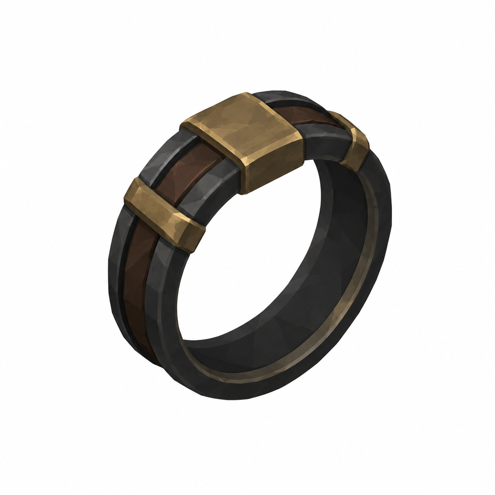
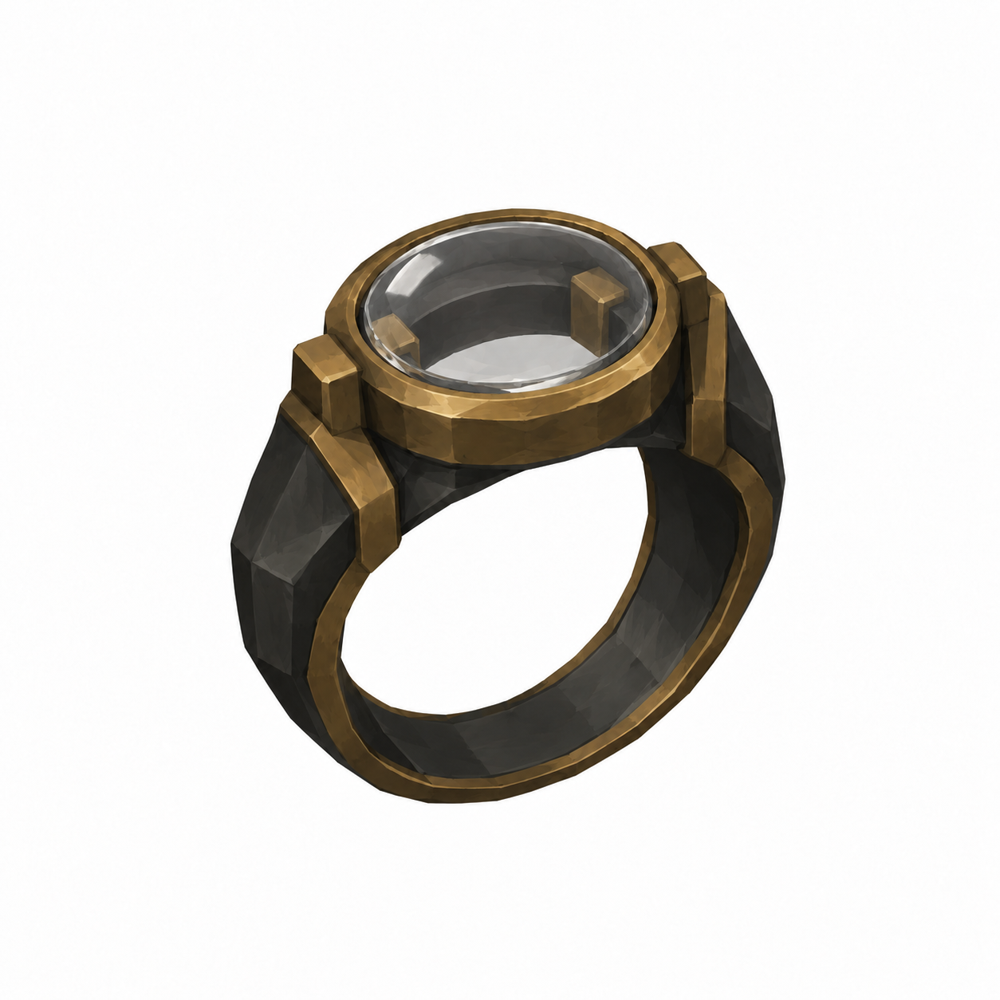
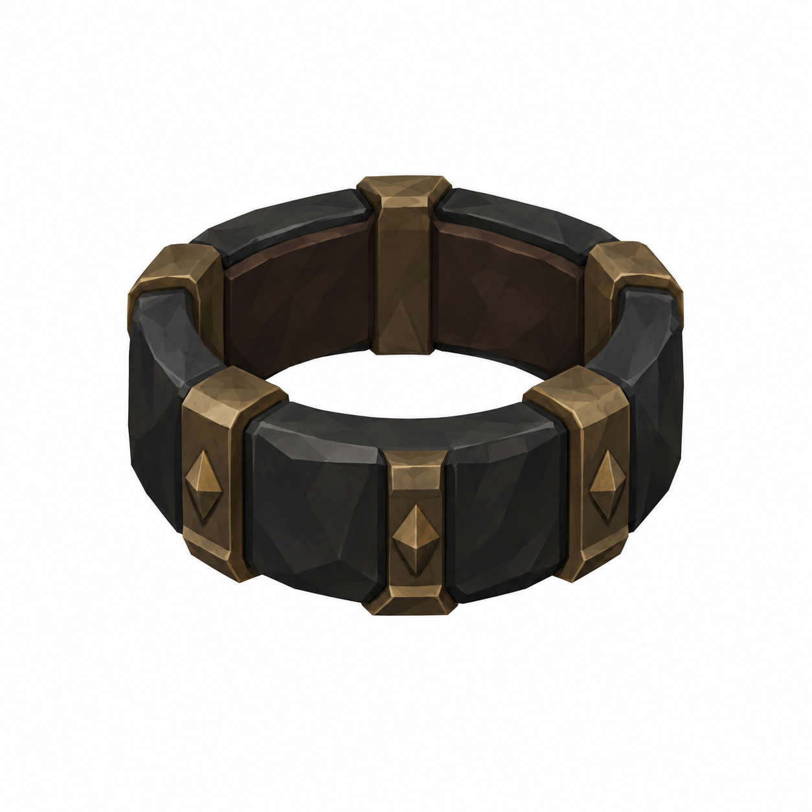
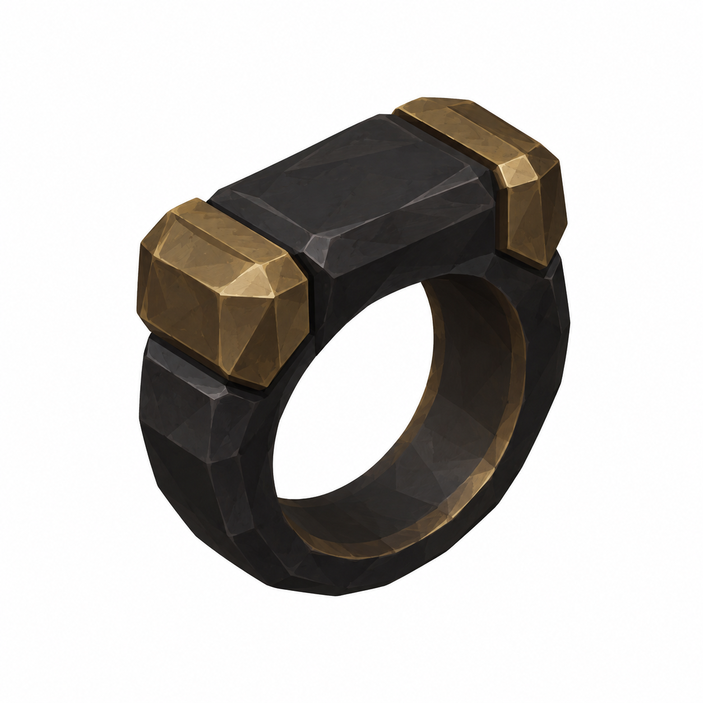
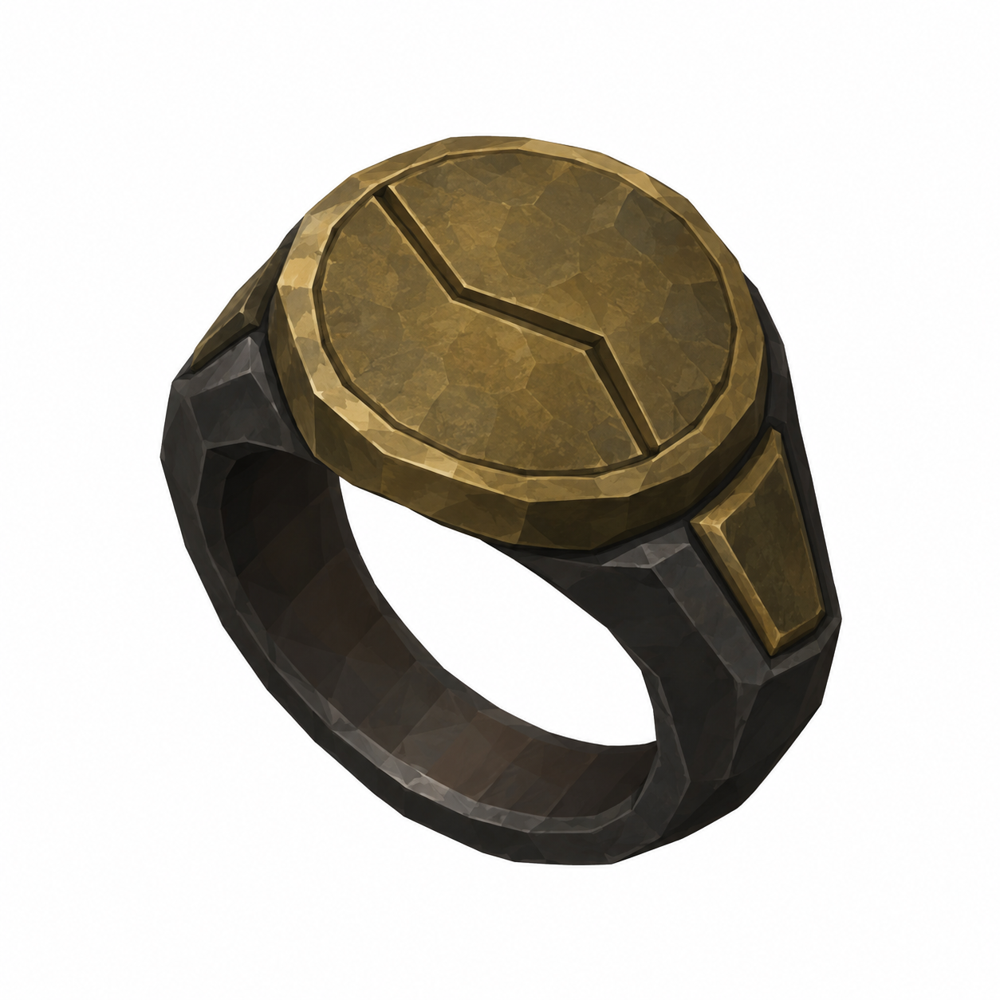

# BRAV-360 — Lazzaretto Knight rings — 5 concept designs

User approved: 2026-10-05. Awaiting Mustafa design approval.

[Asset dimensions](../ASSET_SHEETS.md) · [Visual QA](../QA_NOTES.md)

## R01 — Keeper's Measure

Target: insideØ0.020m P, outsideØ0.027m P, bandW0.006m P

## R02 — Glass Oath

Target: insideØ0.020m P, outsideØ0.028m P, glassface0.014×0.010m P

## R03 — Tempered Pulse

Target: insideØ0.020m P, outsideØ0.028m P, bandW0.007m P

## R04 — Iron Pulse

Target: insideØ0.020m P, outsideØ0.030m P, bandW0.010m P

## R05 — Dead Man's Coin

Target: insideØ0.020m P, coinfaceØ0.019m P

