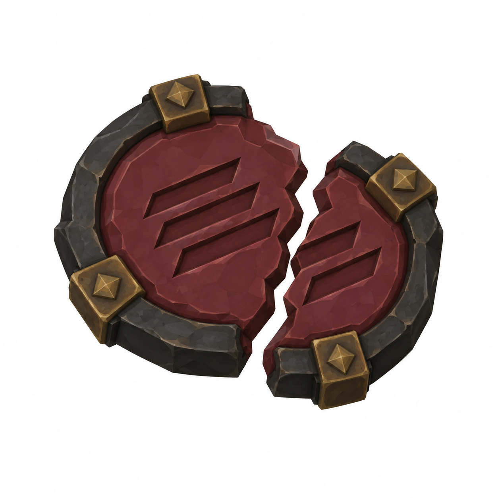

# BRAV-361 — Lazzaretto Knight relics — 2 concept designs

User approved: 2026-10-05. Awaiting Mustafa design approval.

[Asset dimensions](../ASSET_SHEETS.md) · [Visual QA](../QA_NOTES.md)

## RL01 — Broken Quarantine Seal

Target: pairedfragmentsassembledenvelopeW0.10D0.02H0.10m P

## RL02 — Bell Without a Tongue

Target: bellØ0.07 H0.12m P, missingclapper

